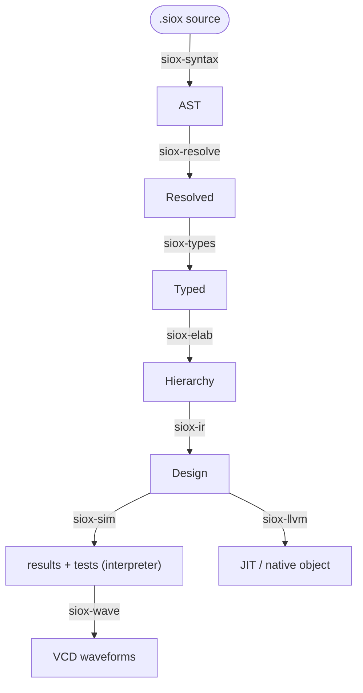

# siox documentation

`siox` ("silicon oxide") is a digital hardware description language and an
event-driven simulator for it, built as a Rust workspace. It is in **Phase 1:
simulation-first** — the compiler parses, resolves, type-checks, elaborates,
lowers to a digital IR, and runs a delta-cycle simulator with assertions and
VCD waveform output. There is no analogue, schematic, or synthesis layer yet
(those are Phase 2 and 3 — see [roadmap.md](roadmap.md)).

## Where to start

| Document | What it is |
| -------- | ---------- |
| [spec.md](spec.md) | The **Phase 1 language specification** — the authority for syntax and semantics. Kept current as the language evolves. |
| [std.md](std.md) | The **standard library reference** — every `std::` module, its VHDL analogue, and what is intrinsic vs. library source. |
| [architecture.md](architecture.md) | How the compiler is built: the crate pipeline, the data that flows between stages, and the cross-cutting conventions. |
| [implementation.md](implementation.md) | The **stage-by-stage plan and live build status** — what each crate must do, the acceptance criteria, and how far along it is. |
| [roadmap.md](roadmap.md) | The three-phase plan. Phases 2 (analogue) and 3 (schematic) are out of scope for current work; useful for knowing what *not* to build. |

If you are new: skim this page, then read [spec.md](spec.md) for the language
and [architecture.md](architecture.md) for the compiler.

## The compiler pipeline

Source flows top-to-bottom through one linear pipeline; each stage is a crate.



`siox-diag` (spans, diagnostics, source map) underpins every stage, and
`sioxc` is the binary that wires the stages together per subcommand.
`siox-llvm` (behind the `llvm` feature) is an alternative consumer of the same
`Design` IR — it JIT-runs or AOT-compiles designs to native code, verified
against the interpreter.

## Current status (summary)

The whole pipeline runs **end to end**: source → parse → resolve → typecheck →
elaborate → digital IR → delta-cycle simulation with `#[test]` discovery,
assertions, and VCD waveforms. The standard library loads from `std/` as real
source ([std.md](std.md)) — including operator overloading, literal suffixes
(`10ns`, `5i`), and four-value `Logic` truth tables defined as library code.
A **compiled backend** (`siox-llvm`, inkwell behind the `llvm` feature) also
JIT-runs designs and emits native object files, verified bit-for-bit against
the interpreter ([notes/llvm-backend.md](notes/llvm-backend.md)).
Remaining work is gap-filling: Stage 10 lints, vector operators in std, and
deeper coverage. See [implementation.md](implementation.md) per stage.

## Build and run

```bash
cargo build                       # build the workspace
cargo test                        # run all tests
cargo test -p siox-syntax         # tests for one crate

cargo run -p sioxc -- <cmd> <file>
```

CLI commands (run as `sioxc <cmd>`):

| Command | Status | Does |
| ------- | ------ | ---- |
| `tokens <file>` | ✅ | dump the raw lexer token stream |
| `parse <file>`  | ✅ | parse and print canonical source (`-v` traces the pipeline) |
| `ast <file>`    | ✅ | dump the debug AST |
| `check <file>`  | ✅ | parse → resolve → typecheck, report diagnostics |
| `tree <file>`   | ✅ | print the elaborated instance hierarchy |
| `sim <file>`    | ✅ | simulate; `--wave out.vcd` writes a waveform |
| `test <path>`   | ✅ | discover and run `#[test]` entities |
| `ir <file>`     | ✅ | print the normalized digital IR |

All commands take `--std <dir>` (default `./std`) for the standard library
root. Example programs live in [`../examples`](../examples) — counter,
register, mux, FSM, struct/array, four-value logic, and complex-arithmetic
tests, each a runnable `#[test]` entity.
