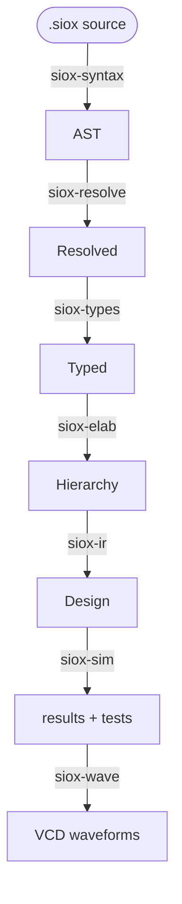

# siox documentation

`siox` ("silicon oxide") is a digital hardware description language and an
event-driven simulator for it, built as a Rust workspace. It is in **Phase 1:
simulation-first** — the compiler parses, resolves, type-checks, elaborates,
lowers to a digital IR, and runs a delta-cycle simulator with assertions and
VCD waveform output. There is no analogue, schematic, or synthesis layer yet
(those are Phase 2 and 3 — see [roadmap.md](roadmap.md)).

## Where to start

| Document | What it is |
| -------- | ---------- |
| [spec.md](spec.md) | The **frozen Phase 1 language specification** — the authority for syntax and semantics. Read this before changing language behaviour. |
| [architecture.md](architecture.md) | How the compiler is built: the crate pipeline, the data that flows between stages, and the cross-cutting conventions. |
| [implementation.md](implementation.md) | The **stage-by-stage plan and live build status** — what each crate must do, the acceptance criteria, and how far along it is. |
| [roadmap.md](roadmap.md) | The three-phase plan. Phases 2 (analogue) and 3 (schematic) are out of scope for current work; useful for knowing what *not* to build. |

If you are new: skim this page, then read [spec.md](spec.md) for the language
and [architecture.md](architecture.md) for the compiler.

## The compiler pipeline

Source flows top-to-bottom through one linear pipeline; each stage is a crate.



`siox-diag` (spans, diagnostics, source map) underpins every stage, and
`siox-cli` is the `siox` binary that wires the stages together per subcommand.

## Current status (summary)

Working today: the frontend through **elaboration** — lex, parse, pretty-print,
name resolution, a growing set of type/kind checks, and instance-hierarchy
elaboration. The simulator, IR, and waveform stages are still stubs. See
[implementation.md](implementation.md) for the per-stage detail.

## Build and run

```bash
cargo build                       # build the workspace
cargo test                        # run all tests
cargo test -p siox-syntax         # tests for one crate

cargo run -p siox-cli -- <cmd> <file>
```

CLI commands (run as `siox <cmd>`):

| Command | Status | Does |
| ------- | ------ | ---- |
| `tokens <file>` | ✅ | dump the raw lexer token stream |
| `parse <file>`  | ✅ | parse and print canonical source (`-v` traces the pipeline) |
| `ast <file>`    | ✅ | dump the debug AST |
| `check <file>`  | ✅ | parse → resolve → typecheck, report diagnostics |
| `tree <file>`   | ✅ | print the elaborated instance hierarchy |
| `sim <file>`    | ⏳ | elaborate → lower → simulate (later stages still stubs) |
| `test <path>`   | ⏳ | discover and run `#[test]` entities |
| `ir <file>`     | ⏳ | print the normalized digital IR |

Commands marked ⏳ run the pipeline as far as it currently goes and report which
stage is not yet implemented.

Example programs live in [`../examples`](../examples) (`counter.siox`,
`counter_tb.siox`).
