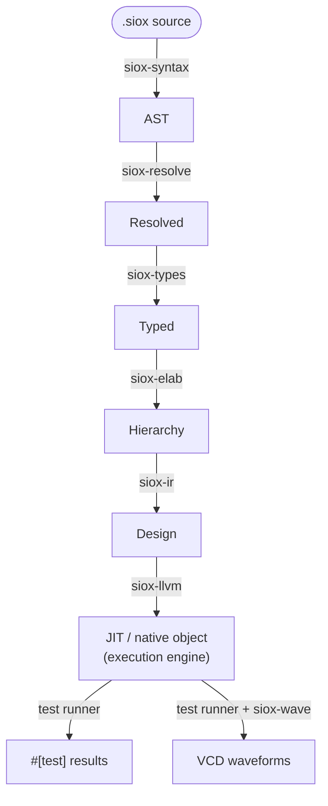

# siox documentation

`siox` ("silicon oxide") is a digital hardware description language and an
event-driven simulator for it, built as a Rust workspace. It is in **Phase 1:
simulation-first** — the compiler parses, resolves, type-checks, elaborates,
lowers to a digital IR, and runs a delta-cycle simulator with assertions and
VCD waveform output. There is no analogue, schematic, or synthesis layer yet
(those are Phase 2 and 3 — see [roadmap.md](roadmap.md)).

## Where to start

| Document | What it is |
| -------- | ---------- |
| [language.md](language.md) | The **Phase 1 language specification** — an at-a-glance tour up front, then the authority for syntax and semantics. Kept current as the language evolves. |
| [architecture.md](architecture.md) | How the compiler is built: the crate pipeline, the data that flows between stages, and the cross-cutting conventions. |
| [simulation.md](simulation.md) | **Simulation** — the delta-cycle model, the JIT / native engines, simulation time and `await`, and VCD waveforms. |
| [testing.md](testing.md) | **Testing** — `#[test]` testbenches, running them (`sioxc test`, `--no-run`), assertions, and how the compiler itself is tested. |
| [std.md](std.md) | The **standard library reference** — every `std::` module, its VHDL analogue, and what is intrinsic vs. library source. |
| [interoperability.md](interoperability.md) | **Interop** — `extern "C"` functions, file I/O, the `siox-lsp` editor server, and the planned cocotb integration. |
| [roadmap.md](roadmap.md) | The three-phase plan. Phases 2 (analogue) and 3 (schematic) are out of scope for current work; useful for knowing what *not* to build. |
| [proposals/](proposals/) | Forward-looking proposals not yet implemented: signal container sizing, the cocotb ABI, and the std library build-out. |
| [../TODO.md](../TODO.md) | The **outstanding-work list** — remaining Phase 1 gaps by area. |

If you are new: skim this page, then read [language.md](language.md) for the
language and [architecture.md](architecture.md) for the compiler.

## The compiler pipeline

Source flows top-to-bottom through one linear pipeline; each stage is a crate.



`siox-diag` (spans, diagnostics, source map) underpins every stage, and `sioxc`
is the binary that wires them together per subcommand. **`siox-llvm` (on by
default) is the execution engine** — it JIT-runs or AOT-compiles the `Design` to
native code; the engine-generic test runner drives it to produce `#[test]`
results and traced waveforms.

## Current status (summary)

The whole pipeline runs **end to end**: source → parse → resolve → typecheck →
elaborate → digital IR → simulation with `#[test]` discovery, `await`/`clock`
timing, assertions, and VCD waveforms. Structural **hierarchy** works — an
entity may instantiate sub-entities, each instance lowering into its own signals
with port connections wired as drivers.

The **compiled LLVM backend** (`siox-llvm`, inkwell) is the default execution
engine: `sioxc test` JIT-runs designs, `sioxc <file>` compiles the `#[top]`
design to a native object, and `sioxc test --no-run` links a standalone native
test binary. Simulation time is owned by the runner/kernel, so waveforms carry
real timestamps and multiple clocks interleave on one event wheel. The
conformance corpus runs through the compiled backend.

The standard library loads from `std/` as real source ([std.md](std.md)) —
operator overloading, literal suffixes (`10ns`, `5i`), and four-value `Logic`
truth tables defined as library code. See [../TODO.md](../TODO.md) for what's
left and the [CHANGELOG](../CHANGELOG.md) for what has landed.

## Build and run

```bash
cargo build                       # build the library + binaries (LLVM backend, default)
cargo test                        # run all tests (needs an LLVM toolchain)
cargo build --no-default-features # frontend only, no LLVM toolchain required

cargo run --bin sioxc -- <file>           # compile the #[top] design
cargo run --bin sioxc -- test <file>      # build + run #[test] entities (JIT)
```

A bare `sioxc <file>` compiles the `#[top]` design to a native object (like
`rustc foo.rs`). LLVM is the only backend; `--no-default-features` builds just
the frontend (parse/resolve/typecheck/elaborate/lower), where `siox test` has
no engine to run.

| Command | Does |
| ------- | ---- |
| `sioxc <file>` | compile the `#[top]` design to a native object (`--top` to pick) |
| `check <file>` | parse → resolve → typecheck, report diagnostics |
| `test <path> [--no-run]` | build + run `#[test]` entities (JIT); `--no-run` links a native test binary |
| `sim <file> [--wave out.vcd]` | simulate; write a VCD waveform |
| `ir` · `ast` · `tree` · `tokens` · `emit-llvm` | debug dumps of each stage |

All commands take `--std <dir>` (default `./std`) for the standard library root.
Runnable example programs live in the
[Siox-lang/siox-tests](https://github.com/Siox-lang/siox-tests) corpus. For a
usage-first walkthrough (get the compiler → write a circuit → run it → view
waveforms), see the [top-level README](../README.md).
