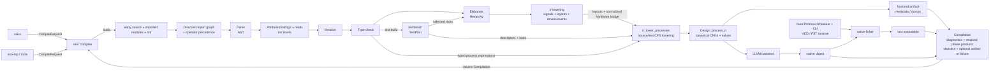

# siox documentation

`siox` ("silicon oxide") is a digital hardware description language and an
event-driven simulator for it, built as a regular Rust package. It is in **Phase 1:
simulation-first** — the compiler parses, resolves, type-checks, elaborates,
lowers to a digital IR, and emits native delta-cycle simulations with
assertions and direct VCD/FST output. There is no analogue, schematic, or
synthesis layer yet (those are Phase 2 and 3 — see
[roadmap.md](roadmap.md)).

## Where to start

| Document | What it is |
| -------- | ---------- |
| [language.md](language.md) | The **Phase 1 language specification** — an at-a-glance tour up front, then the authority for syntax and semantics. Kept current as the language evolves. |
| [language-design-review.md](language-design-review.md) | A candid assessment of which language choices are coherent, which remain confusing, and which decisions should be frozen before synthesis and project tooling. |
| [architecture.md](architecture.md) | How the compiler is built: the crate pipeline, the data that flows between stages, and the cross-cutting conventions. |
| [simulation.md](simulation.md) | **Simulation** — the delta-cycle model, native execution, simulation time and `await`, and VCD/FST waveforms. |
| [testing.md](testing.md) | **Testing** — compiling `#[test]` testbenches with `sioxc --test`, running the resulting executable, assertions, and compiler tests. |
| [std.md](std.md) | The **standard library reference** — every `std::` module, its VHDL analogue, and what is intrinsic vs. library source. |
| [interoperability.md](interoperability.md) | **Interop and embedding** — the public compiler API, `extern "C"` functions, file I/O, and the `siox-lsp` editor server. |
| [roadmap.md](roadmap.md) | The three-phase plan. Phases 2 (analogue) and 3 (schematic) are out of scope for current work; useful for knowing what *not* to build. |
| [proposals/](proposals/) | Designs that are **not** implemented yet. Once something lands, its record moves into the document it belongs to and the proposal goes away, so this folder only ever lists outstanding work. |
| [Entity methods](proposals/entity-methods.md) | `pub fn` members on entities whose calls elaborate into ports. Tier 1 (associated functions) is implemented; receiver methods remain proposed. |
| [Standard-library build-out](proposals/std-buildout.md) | The compiler/std boundary and the open std work tracked in TODO. |
| [Macros](proposals/macros.md) | Implemented (language §3.30), including the built-in macros as `core` declarations. Remaining: expansion identity for notes, language-server views. |
| [Format parameters](proposals/format-parameters.md) | Decided, being implemented: `float<W, M>` and `ufixed<W, F>`/`sfixed<W, F>` replace the VHDL index-range formats; a struct whose parameters shape its base's index range is that family over the range. |
| [`#[derive]`](proposals/derive.md) | Proposed generated `Eq`/`Ord`/`Resolve` implementations as a directive; `#[cfg]` stays rejected. |
| [`core` and `std`](proposals/core-std.md) | Slice 1 implemented: built-in `core` with the hooks, directives and built-in macros, found by lang items. Leaf-name lookups and new `std` content remain. |
| [Pipelined functions](proposals/pipelines.md) | Proposed `#[latched]` functions after Spade, with no new keywords: `#[latch]` marks each stage (a block or one statement), depth is checked in the body and at every call site, stages can be named and referenced, and `#[latch(enable = c)]` stalls. |
| [Compiler foundations](proposals/compiler-foundations.md) | Proposed rustc-style internals: UI tests for diagnostics, `--explain` and JSON output, one constant evaluator, a resolved tree with no name lookups after `resolve`, and std-declared lang items. |
| [Vendor-neutral RTL interchange](proposals/rtl-interface.md) | **Phase 3.** Proposed synthesis-facing RTL IR that SystemVerilog, VHDL and other backends serialize, instead of compiling to another HDL. |
| [../TODO.md](../TODO.md) | The **outstanding-work list** — post-baseline capability growth by compiler area. |

If you are new: skim this page, then read [language.md](language.md) for the
language and [architecture.md](architecture.md) for the compiler.

## The compiler pipeline

Source flows through explicit frontend products, a normalized digital IR, and
the LLVM/output layers. The standard library is parsed as ordinary source; API
consumers use frontend products without needing LLVM.


```mermaid
flowchart LR
    CLI["sioxc"] -->|CompileRequest| API["siox::compiler"]
    LSP["siox-lsp / tools"] -->|CompileRequest| API

    API -->|loads| SRC["entry source + imported modules + std"]
    SRC --> DISC["Discover import graph<br/>+ operator precedence"]
    DISC --> AST["Parse<br/>AST"]
    AST --> ATTRS["Attribute bindings + reads<br/>lint levels"]
    ATTRS --> RES["Resolve"]
    RES --> TYPE["Type-check"]
    TYPE --> ELAB["Elaborate<br/>Hierarchy"]
    TYPE -->|test build| PLAN["testbench<br/>TestPlan"]
    PLAN -->|selected roots| ELAB
    ELAB --> DIGITAL["ir lowering<br/>signals + layouts + drivers/events"]
    TYPE -->|typed process expressions| PROCESS_LOWER["ir::lower_processes<br/>source/test CFG lowering"]
    PLAN -->|descriptors + roots| PROCESS_LOWER
    DIGITAL -->|layouts + normalized hardware bridge| PROCESS_LOWER
    PROCESS_LOWER --> PROCESS["Design::process_ir<br/>canonical CFGs + values"]

    PROCESS --> FRONT["frontend artifact<br/>metadata / dumps"]
    PROCESS --> LLVM["LLVM backend"]
    LLVM --> OBJ["native object"]
    OBJ --> LINK["native linker"]
    FIXED["fixed Process scheduler + CLI<br/>VCD / FST runtime"] --> LINK
    LINK --> TEST["test executable"]

    FRONT --> RESULT["Compilation<br/>diagnostics + retained phase products<br/>statistics + optional artifact or failure"]
    OBJ --> RESULT
    TEST --> RESULT
    RESULT -->|returns Compilation| API
```

This diagram is the current implementation. There is one execution track after
canonical Process IR: LLVM emits the process entries and native tests link them
to one fixed scheduler/CLI without generating design-specific C. VCD/FST,
source-located diagnostics, and host services consume descriptors and metadata
emitted in the design object.

Typed source/test expressions now lower through the IR-owned
`ir/lower/source_processes.rs` entry directly into the `ProcessIr` owned by
`ir::Design`; the transitional public `test_ir` module is gone. The input side
is not completely straight-line yet because normalized hardware still enters
through `ir/lower/hardware_processes.rs`. The Phase 1 endpoint derives those
optimized digital scheduler forms from Process IR instead. See
[the current Process IR ingress boundary](architecture.md#current-process-ir-ingress-boundary).

The arrows through parse, resolve, type-check, elaboration, and IR are compiler
work. The final arrow back to `siox::compiler` is the function return, not
another compiler stage: callers receive one `Compilation` containing the
diagnostics and every completed phase product, plus statistics and an optional
artifact or host failure.

`diag` (spans, diagnostics, source map) underpins every stage, and
`siox::compiler` wires them together behind a disk/in-memory request/result
API. **`siox::llvm` is the native backend**; `sioxc` is a thin CLI over that
same API, including native `#[test]` executable generation.
The separate `siox-lsp` repository uses the core through Cargo Git and therefore
builds without LLVM.

## Current status (summary)

The whole pipeline runs **end to end**: source → parse → resolve → typecheck →
elaborate → digital IR → simulation with `#[test]` discovery, `await`/`clock`
timing, assertions, and VCD/FST waveforms. Structural **hierarchy** works — an
entity may instantiate sub-entities, each instance lowering into its own signals
with port connections wired as drivers.

The **compiled LLVM backend** (`siox::llvm`, inkwell) is the default execution
backend: `sioxc --test <file>` compiles a native test executable and `sioxc
<file>` compiles its sole structural root to a native object. Execution and corpus
orchestration live outside the compiler.

The standard library loads from `std/` as real source ([std.md](std.md)) —
operator overloading, literal suffixes (`10ns`, `5i`), and nine-value `Logic`
truth tables defined as library code. See [../TODO.md](../TODO.md) for what's
left and the [CHANGELOG](../CHANGELOG.md) for what has landed.

## Build and run

```bash
cargo build                       # library + sioxc (Rust 1.90, LLVM 22)
cargo test                        # run all tests
cargo check --no-default-features --lib # frontend/API only; no LLVM

cargo run --bin sioxc -- <file>           # compile the sole structural root
cargo run --bin sioxc -- --test <file> -o tests # compile native #[test] executable
```

A bare `sioxc <file>` compiles the sole uninstantiated entity to a native
object (like `rustc foo.rs`); multiple structural roots require
`--top <qualified-entity>`. LLVM 22 is the selected native backend. Creating a
native `#[test]` executable normally invokes Clang only as a linker for the LLVM
design object and the prebuilt, design-independent Process scheduler, CLI, and
FST runtime objects plus zlib. If host precompilation was unavailable, Clang
compiles the same fixed runtime sources as a fallback. A frontend-only API/LSP
build with `default-features = false` needs neither LLVM nor these native-output
tools.

| Command | Does |
| ------- | ---- |
| `sioxc <file>` | compile the sole structural root to a native object (`--top` selects when ambiguous) |
| `sioxc <file> --emit metadata` | parse → resolve → typecheck/elaborate, report diagnostics |
| `sioxc --test <file> [-o bin]` | compile a native `#[test]` executable |
| `--emit source\|tokens\|ast\|tree\|ir\|llvm-ir` | inspect a compiler artifact |
| `-A`/`-W`/`-D`/`-F <lint>` | allow, warn, deny or forbid a lint for the whole compilation, as rustc (`-D warnings` fails on any warning) |

All commands take `--std <dir>` (default `./std`) for the standard library root.
Runnable example programs live in the
[Siox-lang/siox-tests](https://github.com/Siox-lang/siox-tests) corpus. For a
usage-first walkthrough (get the compiler → write a circuit → run it → view
waveforms), see the [top-level README](../README.md).
