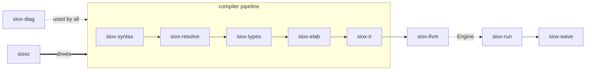
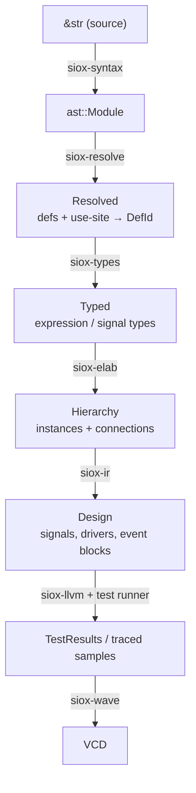

# Architecture

The siox compiler is a Cargo workspace arranged as **one strict top-to-bottom
pipeline**. Each crate consumes the output of the crate above it and produces
the input to the crate below. The only crate everything may depend on is
`siox-diag`.

`siox-run` is the engine-agnostic **kernel**: it discovers `#[test]`s, runs the
stimulus + `await`/`clock` scheduler, owns simulation time, and records
waveforms — driving whatever `Engine` it's handed. `siox-llvm` (the `llvm`
feature, on by default) is that `Engine` — it emits LLVM, JIT-runs, or
AOT-compiles the `Design` to native code (`sioxc test` JIT-runs, `sim --wave`
JIT-traces). It is the only engine; the frontend still builds without an LLVM
toolchain (`--no-default-features`), but then `siox test` has nothing to run.

**Layering rule:** a crate may depend only on the crates above it in this list
(plus `siox-diag`). Do not introduce upward or sideways dependencies.

## Crates

| Crate | Spec stage(s) | Role |
| ----- | ------------- | ---- |
| `siox-diag`    | 10   | Foundation: `Span`, `SourceMap`, `Diagnostic`, `DiagnosticSink`, and the stable error/warning code catalogue (`codes`). |
| `siox-syntax`  | 1–2  | Lexer, tokens, AST, recursive-descent + Pratt parser, pretty-printer. `parse_module` is the entry point. |
| `siox-resolve` | 3    | Name resolution: top-level definitions and `DefId`s, `using` imports/aliases, `::` paths, enum-associated items, attribute names. Produces `Resolved` (definition table + use-site → `DefId` map). |
| `siox-types`   | 4    | Type and kind checking; a light type-inference core (annotation → `Ty`, per-impl symbol table, `type_of`); rejects Phase-2 syntax (`::ddt`). Produces `Typed`. |
| `siox-elab`    | 5    | Elaboration: const-evaluate parameters, build the instance hierarchy from `#[top]`/`#[test]` roots, resolve port connections, expand bus modes. Produces `Hierarchy`. |
| `siox-ir`      | 6    | Lowers to digital simulation IR: combinational `Driver`s vs. sequential `EventBlock`s; `::event`/`::old` become first-class IR ops. Produces `Design`. |
| `siox-run`     | 7–8  | The simulation **kernel / test runner** (engine-agnostic): the `Engine` trait, `#[test]` discovery, stimulus, the `await`/`clock` scheduler + event wheel, simulation time, assertions, waveform sample recording. Whatever supplies an `Engine` (the JIT) is driven by this. |
| `siox-wave`    | 9    | `Trace` recording + VCD export (FST later). |
| `siox-llvm`    | B    | LLVM/inkwell backend (`llvm` feature, **on by default**) — the **execution engine**: emit `.ll`, JIT-run, AOT native object. Consumes `siox-ir::Design`; driven by `siox-run`. |
| `sioxc`     | 12   | The `sioxc` binary; runs the pipeline up to the stage each subcommand needs and renders diagnostics. |

Each crate's `lib.rs` opens with a doc-comment summarising its responsibility
and the spec acceptance criteria — read it first when entering a crate.

## Data that flows between stages

`siox-diag::Span` (a byte range plus `FileId`) is attached to AST nodes and most
later-stage data, and is used both for diagnostics and as the key that links a
name-use site to the declaration it resolves to.

## Cross-cutting conventions

- **Spans everywhere.** Every AST node — and most later-stage data — carries a
  `siox_diag::Span`. New node/data types should too; diagnostics depend on it.

- **Diagnostics flow through `DiagnosticSink`.** Stages take `&mut
  DiagnosticSink`, `emit` into it, and the CLI renders/counts at the end. Use
  the stable codes in `siox_diag::codes` (e.g. `WRITE_TO_INPUT_PORT`); add new
  codes to that catalogue rather than scattering string literals.

- **Best-effort, keep going.** A stage returns a usable result even on error
  (e.g. `parse_module` returns a partial AST, the parser guarantees forward
  progress, resolve/types never bail on the first error) so later stages still
  run and surface more diagnostics in one pass.

- **No false positives over completeness.** Where a stage cannot yet decide
  something soundly (e.g. value identifiers before full scoping, or widths
  before elaboration), it stays silent rather than emitting a wrong error. The
  strict checks are the ones that are correct today.

- **The IR distinction is central.** Combinational `Driver(target, cond, expr)`
  and sequential `OnEvent(cond): next(target) = expr` are kept separate; e.g.
  `clk.rising()` lowers to `Event(clk) && Old(clk)=='0' && Current(clk)=='1'`.
  Preserve this split when working in `siox-ir`/`siox-llvm`.

- **Reject Phase-2 syntax, don't implement it.** Analogue constructs (`domain`,
  `across`/`through`, `::ddt`, layout attrs) must produce errors
  (`codes::PHASE2_SYNTAX`), not silent acceptance.

## The type kernel and the std shim

The kernel's base types are **`integer` and `real`** only — and only they have
built-in operators. `Bit`, `Logic`, `Bool` are canonical `enum`
declarations in `std/logic.siox`; **`uint`/`int` are ordinary `struct
uint : Logic[]` / `struct int : Logic[]` declarations in `std/bits.siox`** —
no longer seeded compiler names. The compiler recognizes any array-derived
Logic family (`struct F : Logic[]`) as a numeric vector and reads
`impl Signed` for the interpretation, so uint/int and future fixed-point
families share one mechanism. They accept `integer` on assignment (spec,
"type kernel") and get their operators from `std/bits.siox` as Rust-style
trait impls — including
`int`'s sign-aware `Ord` (signed comparison is library source, not compiler
code). The CLI loads `std::` modules transitively from `--std <dir>` (default
`./std`); the **prelude** (`std/prelude.siox`) is auto-loaded into every
compile, so the core types always carry their std semantics — the kernel
word fallback only applies when the std root has no prelude at all. `siox-resolve` still seeds the scalar names (`Bit`, `Logic`, `integer`,
...), but **not `uint`/`int`** — those come from their std declarations. The
efficient internal `UInt(w)/Int(w)` encoding remains, but it is now populated
from the declaration (family shape + `Signed`), not triggered by a magic
name. Residual name-recognition survives in a few structural spots
(array-vs-vector, conversion syntax, elab width) and could be generalized to
the family set later; it is harmless (the compiler knowing its stdlib's
vector shapes).

## Signal widths

The JIT engine represents each signal value in a 64-bit word, so a design is
JIT-able only when every signal is ≤ 64 bits wide; a wider signal is a clean
error rather than a silent truncation (`siox test` reports it and runs nothing).
Widening the engine past 64 bits is future work.

Floats are f64: no mainstream CPU has scalar f128/f256 hardware (AVX widths are
SIMD lanes, not precision), so wider floats would mean software emulation —
deferred until something needs precision beyond f64.

## The CLI as the pipeline driver

`sioxc` is where the stages are composed. It loads a file into a
`SourceMap`, runs the stages a subcommand needs on a shared `DiagnosticSink`,
narrates each stage to stderr (more with `-v`), prints the requested artifact to
stdout, and exits non-zero if any errors were reported. This makes the CLI the
practical place to watch data move through the compiler — see the `tokens`,
`parse -v`, `check`, and `tree` commands.
