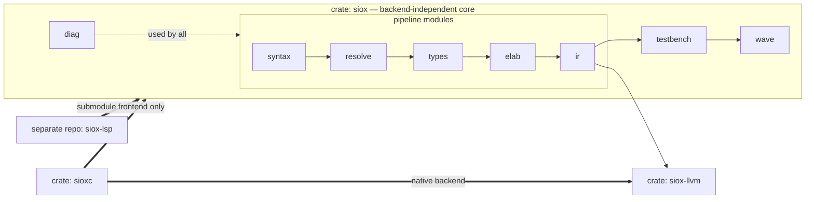
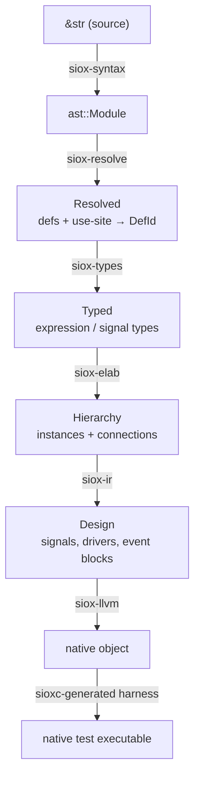

# Architecture

The siox compiler is a small **workspace of three crates**. The root crate
`siox` is the **backend-independent core**: the whole compiler pipeline as
modules (`src/*.rs`) forming **one strict top-to-bottom pipeline** — each
module consumes the output of the module above it, the only module everything
may use is `diag` — plus shared testbench and waveform data. It links no
LLVM toolchain. Around it:

- **`siox`** (root) — the core: `diag` → `syntax` → `resolve` → `types` →
  `elab` → `ir`, plus `testbench` and `wave`.
- **`crates/siox-llvm`** — the LLVM native AOT backend
  (inkwell); depends on `siox`.
- **`crates/sioxc`** — the compiler CLI; depends on `siox` + `siox-llvm`.

The separate `Siox-lang/siox-lsp` repository includes this compiler repository
as its `sioxc` submodule and depends only on the backend-independent `siox`
crate.

```mermaid
flowchart LR
    subgraph core [crate: siox — backend-independent core]
        subgraph pipeline [pipeline modules]
            direction LR
            SY[syntax] --> RE[resolve] --> TY[types] --> EL[elab] --> IR[ir]
        end
        IR --> TB[testbench]
        TB --> WA[wave]
        DIAG[diag] -. used by all .-> pipeline
    end
    IR --> LL[crate: siox-llvm]
    CLI[crate: sioxc] == drives ==> core
    CLI == native backend ==> LL
    LSP[separate repo: siox-lsp] == submodule frontend only ==> core
```

`siox-llvm` emits LLVM and compiles the `Design` ahead of time to native code.
`sioxc` discovers `#[test]` entities and generates a C harness containing the
stimulus, scheduler, assertions, and reporting; it links that harness with the
native design object. Therefore *`sioxc`* needs an LLVM toolchain to build; the
core and language server do not.

**Layering rule:** a module may use only the modules above it in this list
(plus `diag`). Inside the `siox` crate the layering is a **convention** (the
old per-stage crate boundaries are gone); across crates it is real — `siox-llvm`
depends on `siox`, never the reverse. Do not introduce upward or sideways `use`s.

## Modules

The core `siox` crate lives in `src/`, one file (or directory) per module below.
The backend is `crates/siox-llvm/`, and the compiler binary is `crates/sioxc/`.

| Module | Spec stage(s) | Role |
| ------ | ------------- | ---- |
| `diag`    | 10   | Foundation: `Span`, `SourceMap`, `Diagnostic`, `DiagnosticSink`, and the stable error/warning code catalogue (`codes`). |
| `syntax`  | 1–2  | Lexer, tokens, AST, recursive-descent + Pratt parser, pretty-printer. `parse_module` is the entry point. |
| `resolve` | 3    | Name resolution: top-level definitions and `DefId`s, `using` imports/aliases, `::` paths, enum-associated items, attribute names. Produces `Resolved` (definition table + use-site → `DefId` map). |
| `types`   | 4    | Type and kind checking; a light type-inference core (annotation → `Ty`, per-impl symbol table, `type_of`); rejects Phase-2 syntax (`'ddt`). Produces `Typed`. |
| `elab`    | 5    | Elaboration: const-evaluate parameters, build the instance hierarchy from `#[top]`/`#[test]` roots, resolve port connections, expand bus modes. Produces `Hierarchy`. |
| `ir`      | 6    | Lowers to digital simulation IR: combinational `Driver`s vs. sequential `EventBlock`s; `'event`/`'old` become first-class IR ops. Produces `Design`. |
| `testbench` | 7–8 | Shared testbench value/format definitions. Native test discovery, scheduling, and assertion emission live in `sioxc::build`. |
| `wave`    | 9    | `Trace` recording + VCD export (FST later). |

The three sibling crates:

| Crate | Spec stage(s) | Role |
| ----- | ------------- | ---- |
| `siox-llvm` | B  | LLVM/inkwell native backend — emit `.ll` or an AOT native object. Consumes `siox::ir::Design`. |
| `sioxc`     | 12 | The `sioxc` binary; runs the pipeline up to the stage each subcommand needs and renders diagnostics. Its native AOT emitter is the crate-local `build` module. Depends on `siox` + `siox-llvm`. |

## rustc-shaped compiler boundary

The compiler follows rustc's separation of responsibilities:

| rustc concept | siox counterpart |
| --- | --- |
| `rustc` executable | `sioxc`'s minimal `main.rs`, which delegates one invocation |
| `rustc_driver` / `rustc_interface` | `sioxc::driver`, which parses compiler options and composes the pipeline; extractable as a library crate when another tool needs to embed compilation |
| frontend queries and MIR | `siox::{syntax, resolve, types, elab, ir}` |
| codegen backend | `siox-llvm`, consuming only `siox::ir::Design` |
| synthesized libtest harness | `sioxc --test`, which emits a native executable |
| Cargo | a future project tool for dependency graphs, caching, compiling many inputs, running tests, simulation, and waveform workflows |

The command line therefore has no phase subcommands. `sioxc input.siox`
performs one compilation; `--emit object|metadata|source|tokens|ast|tree|ir|
llvm-ir` chooses the requested artifact, while `--test` changes the generated
artifact into a test executable. The compiler never executes that artifact.

SIOX remains pass-oriented today. Rustc's memoized, demand-driven query system
is a useful direction once incremental compilation or multiple consumers need
it, but copying that machinery before persistent typed results exist would add
coordination cost without improving semantics. The immediate architectural
step is to keep phase products explicit and make the driver depend only on
stable compiler interfaces; query caching can then replace individual phase
calls without changing `sioxc` or the backend boundary.

`src/lib.rs` opens with the module map, and each module's own file opens with a
doc-comment summarising its responsibility and spec acceptance criteria — read
it first when entering a module. Within the `siox` crate, refer to other modules
as `crate::<module>`; the sibling crates use `siox::<module>` and `siox_llvm::`.

## Data that flows between stages

```mermaid
flowchart TD
    A["&str (source)"] -->|siox-syntax| B["ast::Module"]
    B -->|siox-resolve| C["Resolved<br/>defs + use-site → DefId"]
    C -->|siox-types| D["Typed<br/>expression / signal types"]
    D -->|siox-elab| E["Hierarchy<br/>instances + connections"]
    E -->|siox-ir| F["Design<br/>signals, drivers, event blocks"]
    F -->|"siox-llvm"| G["native object"]
    G -->|"sioxc-generated harness"| H["native test executable"]
```

`siox-diag::Span` (a byte range plus `FileId`) is attached to AST nodes and most
later-stage data, and is used both for diagnostics and as the key that links a
name-use site to the declaration it resolves to.

## Cross-cutting conventions

- **Spans everywhere.** Every AST node — and most later-stage data — carries a
  `siox_diag::Span`. New node/data types should too; diagnostics depend on it.

- **Diagnostics flow through `DiagnosticSink`.** Stages take `&mut
  DiagnosticSink`, `emit` into it, and the CLI renders/counts at the end. Use
  the stable codes in `siox_diag::codes` (e.g. `WRITE_TO_INPUT_PORT`); add new
  codes to that catalogue rather than scattering string literals.

- **Best-effort, keep going.** A stage returns a usable result even on error
  (e.g. `parse_module` returns a partial AST, the parser guarantees forward
  progress, resolve/types never bail on the first error) so later stages still
  run and surface more diagnostics in one pass.

- **No false positives over completeness.** Where a stage cannot yet decide
  something soundly (e.g. value identifiers before full scoping, or widths
  before elaboration), it stays silent rather than emitting a wrong error. The
  strict checks are the ones that are correct today.

- **The IR distinction is central.** Combinational `Driver(target, cond, expr)`
  and sequential `OnEvent(cond): next(target) = expr` are kept separate; e.g.
  `clk.rising()` lowers to `Event(clk) && Old(clk)=='0' && Current(clk)=='1'`.
  Preserve this split when working in `siox-ir`/`siox-llvm`.

- **Reject Phase-2 syntax, don't implement it.** Analogue constructs (`domain`,
  `across`/`through`, `'ddt`, layout attrs) must produce errors
  (`codes::PHASE2_SYNTAX`), not silent acceptance.

## The type kernel and the std shim

The kernel's base types are **`integer` and `real`** only — and only they have
built-in operators. `Bit`, `Logic`, `Bool` are canonical `enum`
declarations in `std/logic.siox`; **`unsigned`/`signed` are ordinary `struct
unsigned : Logic[]` / `struct signed(Logic[])` declarations in `std/bits.siox`** —
no longer seeded compiler names. The compiler recognizes any array-derived
Logic family (`struct F(Logic[])`) as a numeric vector and reads
`impl Signed` for the interpretation, so unsigned/signed and future fixed-point
families share one mechanism. They accept `integer` on assignment (spec,
"type kernel") and get their operators from `std/bits.siox` as Rust-style
`Operator` impls — including
`signed`'s sign-aware `<=>` (signed comparison is library source, not compiler
code). The CLI loads `std::` modules transitively from `--std <dir>` (default
`./std`); the **prelude** (`std/prelude.siox`) is auto-loaded into every
compile, so the core types always carry their std semantics — the kernel
word fallback only applies when the std root has no prelude at all. `siox-resolve` still seeds the scalar names (`Bit`, `Logic`, `integer`,
...), but **not `unsigned`/`signed`** — those come from their std declarations. The
efficient internal `UInt(w)/Int(w)` encoding remains, but it is now populated
from the declaration (family shape + `Signed`), not triggered by a magic
name. Residual name-recognition survives in a few structural spots
(array-vs-vector, conversion syntax, elab width) and could be generalized to
the family set later; it is harmless (the compiler knowing its stdlib's
vector shapes).

## Signal widths

LLVM represents each value at its own semantic bit width. The native harness
ABI exchanges wider values as low-word-first 64-bit chunks; `unsigned[128]`,
for example, occupies two ABI words without widening unrelated values.

Floats are f64: no mainstream CPU has scalar f128/f256 hardware (AVX widths are
SIMD lanes, not precision), so wider floats would mean software emulation —
deferred until something needs precision beyond f64.

## The CLI as the pipeline driver

`sioxc` is where the stages are composed. It loads a file into a
`SourceMap`, runs the stages a subcommand needs on a shared `DiagnosticSink`,
narrates each stage to stderr (more with `-v`), prints the requested artifact to
stdout, and exits non-zero if any errors were reported. This makes the CLI the
practical place to watch data move through the compiler. Like `rustc`, it takes
one input per invocation: `--emit` selects the artifact and `--test` selects
test-harness compilation. Project graphs, directory traversal, execution, and
simulation tooling are deliberately outside the compiler.
