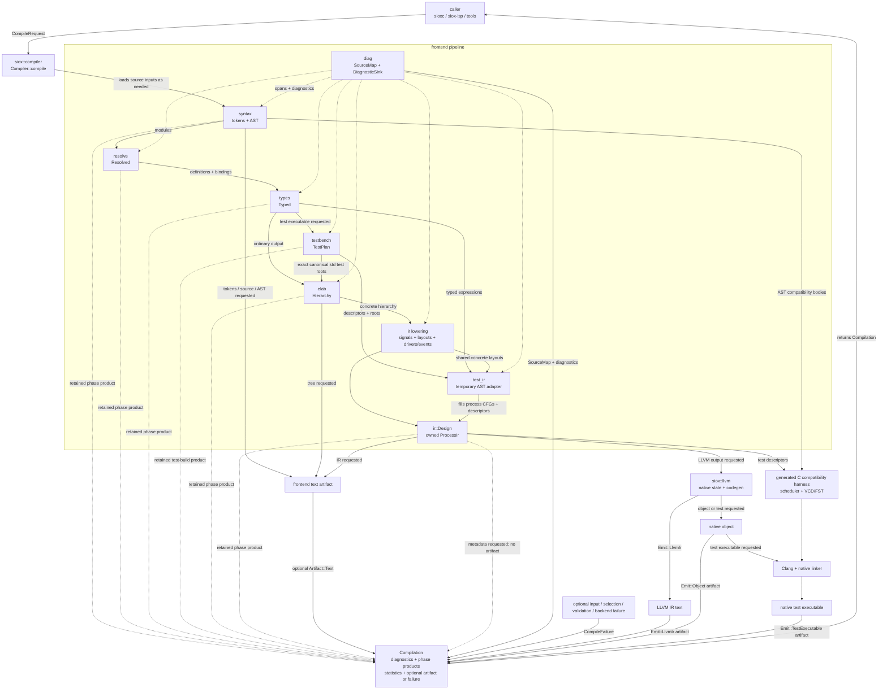
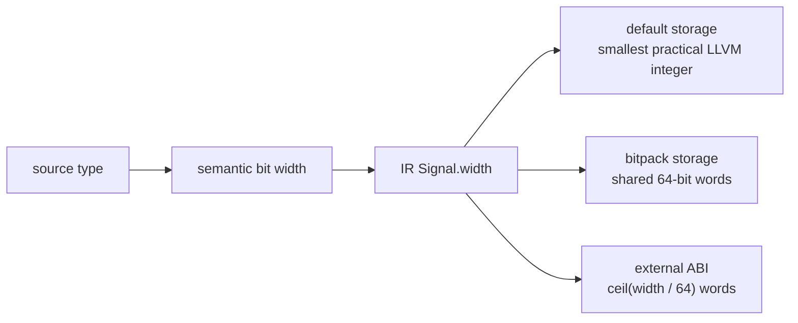

# Architecture

The siox compiler is one regular Cargo package with a library target (`siox`)
and compiler binary (`sioxc`). The library contains the compiler pipeline as
modules (`src/*.rs`) forming **one strict top-to-bottom pipeline** — each
module consumes the output of the module above it, the only module everything
may use is `diag` — plus the LLVM backend:

- **`siox`** (root) — the core: `diag` → `syntax` → `resolve` → `types` →
  `elab` → `ir`.
- **`siox::compiler`** — the embedding interface that loads one source input,
  composes the passes, and returns diagnostics, partial phase products, and an
  optional artifact without printing or executing it.
- **`siox::llvm`** — the LLVM native AOT backend (inkwell).
- **`siox::testbench`** — canonical native-test selection metadata.
- **`siox::test_ir`** — the temporary Siox-AST adapter that fills the canonical
  `ir::Design::process_ir`; it owns no phase product or backend input.
- **`sioxc`** — the root package's thin command-line adapter.

The separate `Siox-lang/siox-lsp` repository references this compiler through
Cargo Git and depends only on the backend-independent `siox` crate.

The following diagram describes the current transitional implementation. The
process product now has one owner; the temporary AST adapter and generated-C
statement translator are the remaining split to remove.

```mermaid
flowchart TB
    CALL["caller<br/>sioxc / siox-lsp / tools"] -->|CompileRequest| API["siox::compiler<br/>Compiler::compile"]
    API -->|loads source inputs as needed| SY

    subgraph FRONTEND["frontend pipeline"]
        SY["syntax<br/>tokens + AST"] -->|modules| RE["resolve<br/>Resolved"]
        RE -->|definitions + bindings| TY["types<br/>Typed"]
        TY -->|ordinary output| EL["elab<br/>Hierarchy"]
        TY -->|test executable requested| TESTPLAN["testbench<br/>TestPlan"]
        TESTPLAN -->|exact canonical std test roots| EL
        EL -->|concrete hierarchy| DIGITAL["ir lowering<br/>signals + layouts + drivers/events"]
        DIGITAL --> DESIGN["ir::Design<br/>owned ProcessIr"]
        TESTPLAN -->|descriptors + roots| TESTIR["test_ir<br/>temporary AST adapter"]
        TY -->|typed expressions| TESTIR
        DIGITAL -->|shared concrete layouts| TESTIR
        TESTIR -->|fills process CFGs + descriptors| DESIGN

        DIAG["diag<br/>SourceMap + DiagnosticSink"] -. spans + diagnostics .-> SY
        DIAG -.-> RE
        DIAG -.-> TY
        DIAG -.-> TESTPLAN
        DIAG -.-> EL
        DIAG -.-> DIGITAL
        DIAG -.-> TESTIR
    end

    DESIGN -->|LLVM output requested| LL["siox::llvm<br/>native state + codegen"]
    DESIGN -->|test descriptors| HARNESS["generated C compatibility harness<br/>scheduler + VCD/FST"]
    SY -->|AST compatibility bodies| HARNESS
    LL -->|Emit::LlvmIr| LLVM_TEXT["LLVM IR text"]
    LL -->|object or test requested| OBJ["native object"]
    OBJ -->|test executable requested| LINK["Clang + native linker"]
    HARNESS --> LINK
    LINK --> TEST["native test executable"]

    SY -->|tokens / source / AST requested| FRONT_TEXT["frontend text artifact"]
    EL -->|tree requested| FRONT_TEXT
    DESIGN -->|IR requested| FRONT_TEXT

    SY -. retained phase product .-> RESULT
    RE -. retained phase product .-> RESULT
    TY -. retained phase product .-> RESULT
    TESTPLAN -. retained test-build product .-> RESULT
    EL -. retained phase product .-> RESULT
    DESIGN -. retained phase product .-> RESULT
    FRONT_TEXT -->|optional Artifact::Text| RESULT["Compilation<br/>diagnostics + phase products<br/>statistics + optional artifact or failure"]
    DESIGN -. metadata requested; no artifact .-> RESULT
    DIAG -->|SourceMap + diagnostics| RESULT
    FAILURE["optional input / selection / validation / backend failure"] -->|CompileFailure| RESULT
    LLVM_TEXT -->|Emit::LlvmIr artifact| RESULT
    OBJ -->|Emit::Object artifact| RESULT
    TEST -->|Emit::TestExecutable artifact| RESULT
    RESULT -->|returns Compilation| CALL
```

Solid arrows show work or values moving to another compiler/output stage.
Dotted arrows do not invoke another stage: `Compilation` retains each product
that completed. `CompileRequest` enters through `Compiler::compile`; the final
`Compilation` return carries diagnostics even when a later phase or backend
fails. A request stops once its selected output is ready—for example, AST and
tree requests do not continue through IR. Frontend-only requests stop before
`siox::llvm` and harness generation.

`siox::llvm` emits LLVM and compiles the `Design` ahead of time to native code.
For a test build, `siox::testbench` resolves enabled uses of the canonical
`std::attrs::test` declaration once, elaborates exactly those roots, and binds
them into a `TestPlan`. The temporary `siox::test_ir` adapter fills the
canonical `Design::process_ir` with validated descriptors and CFGs; the
compiler no longer retains a second software program. Branch, suspend/resume,
structured match/for control, termination, local/signal assignment semantics,
activation, labels, and spans already live there. Operands are arena-owned once
and referenced from CFG nodes by stable `ProcessValueId`. The current C
compatibility harness consumes descriptors
from the design but still translates test statements from AST. The harness
contains the stimulus, scheduler, assertions, and reporting; it
links with the native design object when `Emit::TestExecutable` is requested.
The harness contains the VCD writer, and the resulting executable incorporates
the pinned libfst sources, so this artifact also needs Clang and zlib at
build/link time but neither GTKWave nor an installed libfst. Therefore the
`sioxc` feature set needs an LLVM toolchain; a
`default-features = false` editor build does not need the native backend or
harness toolchain.

## Planned unified process pipeline

`process [name] { ... }` supplies the common scheduling boundary that the
earlier architecture lacked. Explicit hardware processes, implicit reactive
processes created for concurrent statements, clocks, and test stimulus can all
lower once into one CFG-capable Process IR. `#[test]` contributes root and
descriptor metadata; it does not select another IR.

```mermaid
flowchart LR
    SOURCE["source + std"] --> AST["syntax<br/>AST"]
    AST --> RESOLVED["resolve<br/>Resolved"]
    RESOLVED --> TYPED["types<br/>Typed"]
    TYPED --> HIERARCHY["elab<br/>Hierarchy + selected roots"]
    HIERARCHY --> PROCESSIR["ir<br/>Design + process CFGs"]
    PROCESSIR --> VALIDATE["target validation<br/>simulation / elaboration"]
    VALIDATE --> OPTIMIZE["process + value optimization"]
    OPTIMIZE --> OUTPUT["output backend"]
    OUTPUT --> ARTIFACT["object / test executable / RTL / dump"]
```

This is one semantic track even though frontend-only requests may stop early
and the final output format is selectable. Functions and methods are sequential
subroutines within a caller; only a process creates an independently scheduled
context. The current `Driver` and `EventBlock` forms become derived
optimizations of Process IR rather than a separate hardware input path.

The staged migration and acceptance criteria live in
[the unified process pipeline plan](proposals/testbench-software-ir.md).

**Layering rule:** a module may use only the modules above it in this list
(plus `diag`). The layering is a convention enforced by module discipline; do
not introduce upward or sideways `use`s.

## Modules

The core `siox` crate lives in `src/`, one file (or directory) per module below.
The backend is `src/llvm/`; the compiler entry and driver are `src/main.rs` and
`src/driver/`.

| Module | Layer | Role |
| ------ | ----- | ---- |
| `diag` | shared | `Span`, `SourceMap`, diagnostics, and stable codes. |
| `syntax` | AST | Lexer, tokens, AST, parser, canonical printer, and named/anonymous process blocks. |
| `resolve` | AST | Definitions, visibility, imports, paths, and use-site → `DefId`. |
| `types` | AST | Type/kind/operator checking and persistent expression `Ty` facts. |
| `elab` | AST | Parameters, roots, instances, connections, concrete instance-array build facts, and `Hierarchy`. |
| `testbench` | AST/plan | Canonical std test discovery, exact test-root elaboration, and backend-neutral `TestPlan`. |
| `ir` | IR | Signals, layouts, canonical process CFGs/test descriptors, compatibility drivers/event blocks, initializers, validation, and semantic lints. |
| `test_ir` | temporary adapter | Lowers test AST into `Design::process_ir`; removed once all source processes share the main IR lowering entry point. |
| `compiler` | API | `Compiler`, disk/in-memory `SourceInput`, `CompileRequest`, retained `Compilation` phase products, structured failures, and artifacts. |

Resolution is the owner of nominal identity. Both declaration sites and use
sites map to `DefId`; type checking uses those IDs (or a qualified key derived
from one) for semantic registries. A leaf spelling is only presentation, not a
safe lookup key. Hierarchy instances carry both a display name and their entity
`DefId`; elaboration and recursive IR lowering use the ID, while tree output and
signal paths retain concise source names. When separate modules contribute
equal-named roots to one compilation, `Hierarchy::root_path` qualifies only
those roots; IR paths, tree output, waveform scopes, and native test lookup all
share that collision-free spelling. Native C test functions use a separate
injective symbol, and explicit compiler root selection requires a qualified
name when a bare entity leaf is ambiguous. A vendor `top` attribute remains
ordinary metadata and never participates in this selection. Module constants follow the same rule:
their declared types, folded values, range/array/struct entries, and native
expressions use a qualified key derived from the resolver, while constants local
to an `impl` remain lexical leaf bindings. Struct declarations likewise carry
the selected identity through field/privacy tables, recursive layouts and
defaults, constructors, methods, constants, flattened paths, and native
aggregate storage. A standard-library vector struct keeps its canonical short
IR key when user code declares a namesake; the user declaration receives a
qualified key. Applied views carry the resolved view declaration together with
the resolved backing type through direction layouts, inherent/trait ownership,
and native lowering. Views with the same leaf may overload by backing type in
one module, and equal view leaves in separate modules qualify at the IR/output
boundary when needed. Custom trait contracts, defaults, implementations, and
operator operand types use resolver-selected identity as well. The exact
builtin and `std::ops` hook declarations such as `Operator` are the deliberate
exception: they keep one canonical language key while their user-defined
operand types remain identity-preserving. A same-named trait declared in any
other module is an ordinary qualified contract and never enters hook tables.

Package components:

| Component | Layer | Role |
| --------- | ----- | ---- |
| `siox::llvm` | LLVM | LLVM lowering, optimization, native state, and word ABI. |
| `sioxc` | CLI | Parses command-line options and renders one `siox::compiler` result. |

## rustc-shaped compiler boundary

The compiler follows rustc's separation of responsibilities:

| rustc concept | siox counterpart |
| --- | --- |
| `rustc` executable | `sioxc`'s minimal `main.rs`, which delegates one invocation |
| `rustc_driver` / `rustc_interface` | `siox::compiler`, the library-owned request/result boundary used by every host |
| frontend queries and MIR | `siox::{syntax, resolve, types, elab, ir}` |
| codegen backend | `siox::llvm`, consuming only `siox::ir::Design` |
| synthesized libtest harness | `sioxc --test`, which emits a native executable |
| Cargo | a future project tool for dependency graphs, caching, compiling many inputs, running tests, simulation, and waveform workflows |

The command line therefore has no phase subcommands. `sioxc input.siox`
performs one compilation; `--emit object|metadata|source|tokens|ast|tree|ir|
llvm-ir` chooses the requested artifact, while `--test` changes the generated
artifact into a test executable. The compiler never executes that artifact.

SIOX remains pass-oriented internally. Rustc's memoized, demand-driven query
system is a useful direction once incremental compilation needs it. Consumers
already use one stable orchestration boundary: `Compiler::compile` accepts a
disk or in-memory source and an explicit `Emit`, then returns a `Compilation`
with its `SourceMap`, entry tokens/modules, `Resolved`, `Typed`, `Hierarchy`,
`Design`, structured diagnostics, host failure, statistics, and artifact. A
failed source keeps every product completed before the failure.

`src/lib.rs` opens with the module map, and each module's own file opens with a
doc-comment summarising its responsibility and spec acceptance criteria — read
it first when entering a module. Within the `siox` crate, refer to other modules
as `crate::<module>`; the binary imports the library as `siox::<module>`.

## Data that flows between stages today

This diagram records the current values while the unified-process migration is
in progress. The standalone `test_ir::Program` is already gone; the planned
endpoint above removes the temporary AST adapter and AST-to-C harness branch.

```mermaid
flowchart LR
    SOURCE["source text"] --> TOKENS["Vec&lt;Token&gt;"]
    TOKENS --> MODULES["Vec&lt;ast::Module&gt;"]
    MODULES --> RESOLVED["Resolved"]
    RESOLVED --> TYPED["Typed"]
    TYPED -->|ordinary output| HIERARCHY["Hierarchy"]
    TYPED -->|test build| TESTPLAN["TestPlan<br/>canonical std tests + bound roots"]
    TESTPLAN --> HIERARCHY
    HIERARCHY --> DIGITAL["digital IR lowering"]
    DIGITAL --> DESIGN["ir::Design<br/>signals + ProcessIr"]
    TESTPLAN --> TESTIR["test_ir AST adapter"]
    TYPED --> TESTIR
    DIGITAL -->|shared layouts| TESTIR
    TESTIR -->|fills owned ProcessIr| DESIGN

    TOKENS -->|Emit::Tokens| TEXT["Artifact::Text"]
    MODULES -->|Emit::Source / Ast| TEXT
    HIERARCHY -->|Emit::Tree| TEXT
    DESIGN -->|Emit::Ir| TEXT
    DESIGN -->|LLVM output requested| BACKEND["siox::llvm"]
    BACKEND -->|Emit::LlvmIr| LLVM_TEXT["Artifact::Text<br/>LLVM IR"]
    BACKEND -->|object or test requested| OBJECT["native object"]
    DESIGN -->|test descriptors| HARNESS["generated C compatibility harness"]
    MODULES -->|AST compatibility bodies| HARNESS
    OBJECT -->|Emit::TestExecutable| LINK["Clang + native linker"]
    HARNESS --> LINK
    LINK --> EXECUTABLE["Artifact::File<br/>test executable"]

    TEXT --> ARTIFACT["optional Artifact"]
    LLVM_TEXT --> ARTIFACT
    OBJECT -->|Emit::Object| ARTIFACT
    EXECUTABLE --> ARTIFACT
    TOKENS -.-> PRODUCTS["completed phase products"]
    MODULES -.-> PRODUCTS
    RESOLVED -.-> PRODUCTS
    TYPED -.-> PRODUCTS
    TESTPLAN -.-> PRODUCTS
    HIERARCHY -.-> PRODUCTS
    DESIGN -.-> PRODUCTS
    PRODUCTS -. retained .-> COMPILATION["Compilation<br/>products + diagnostics + statistics<br/>optional artifact + failure"]
    DESIGN -. Emit::Metadata; no Artifact .-> COMPILATION
    DIAGNOSTICS["SourceMap + diagnostics"] --> COMPILATION
    FAILURE["optional CompileFailure"] --> COMPILATION
    ARTIFACT --> COMPILATION
    COMPILATION -->|returned by Compiler::compile| CALLER["sioxc / siox-lsp / tools"]
```

This diagram names the concrete values rather than control flow. A request may
stop after any requested text product, after metadata analysis (with no
artifact), or after native output. `Compilation` is the envelope returned in
all cases: completed products remain available independently of whether its
optional artifact was produced or a `CompileFailure` occurred.

`diag::Span` (a byte range plus `FileId`) is attached to AST nodes and most
later-stage data, and is used both for diagnostics and as the key that links a
name-use site to the declaration it resolves to. `Hierarchy` also carries each
concrete parent instance's declared and built entity-array slots into IR, so a
reference to a conditionally omitted child can name both the slot and its
declaration instead of becoming an anonymous unknown expression. Every scalar
`ir::Signal` retains its owning port or `let` declaration span; flattened
aggregate leaves and synthetic metavalue companions inherit that same anchor,
so normalized-design lints do not lose their source location. Aggregate roots
do not have storage signals, so `Design::source_layouts` separately preserves
their complete concrete shape. Its language-neutral `SourceLayout` tree stores
struct/applied-view identity and view-field directions, ordered recursively-substituted
fields, ordinary versus packed arrays, written range direction, scalar domains,
value constraints, and source spans. IR signal flattening traverses this
tree rather than reconstructing shape from AST declarations; checked recursive
width and leaf-count queries define the same boundary for native consumers.
Testbench locals retain layouts without becoming hardware signals, so the
generated harness uses the already-specialized tree for flattened C storage
and positional aggregate writes. LLVM obtains flattened signal widths through
the corresponding leaf layouts; IR validation rejects a stale duplicated
signal width or an aggregate layout attached directly to a leaf signal. A
names-only nominal field-order index remains for positional syntax in constants
and synthetic inlined expressions that have no concrete value path; it is not
a storage or sizing model.

File inputs follow the phase that owns their storage. Hardware/top
initializers are elaboration-time ROM images in `Design::Signal::init`;
`#[test]` locals are excluded from hardware IR and the generated native harness
owns their runtime byte/code-point buffers. Both resolve relative paths against
the source directory recorded in `Design::base_dir`. The single `read<T>`
construct selects UTF-8 for `string`; numeric types share the raw integer path
and then use their normal integer representation/conversion.

## Cross-cutting conventions

- **Spans everywhere.** Every AST node—and increasingly later-stage
  metadata—carries a `diag::Span`. New semantic data should retain its source
  span so IR/output diagnostics can point back to code.

- **Diagnostics flow through `DiagnosticSink`.** Stages take `&mut
  DiagnosticSink`, `emit` into it, and the CLI renders/counts at the end. Use
  the stable codes in `diag::codes` (e.g. `WRITE_TO_INPUT_PORT`); add new
  codes to that catalogue rather than scattering string literals.

- **Best-effort, keep going.** A stage returns a usable result even on error
  (e.g. `parse_module` returns a partial AST, the parser guarantees forward
  progress, resolve/types never bail on the first error) so later stages still
  run and surface more diagnostics in one pass.

- **No false positives over completeness.** Where a stage cannot yet decide
  something soundly (e.g. value identifiers before full scoping, or widths
  before elaboration), it stays silent rather than emitting a wrong error. The
  strict checks are the ones that are correct today.

- **Process is the canonical execution boundary.** Statements inside one source
  `process` preserve source-order priority; separate processes and implicit
  processes created for concurrent statements resolve and run in parallel.
  Process IDs, optional instance-qualified labels, activation conditions,
  locals, staged signal writes, suspension points, and source spans must
  survive lowering. Today combinational `Driver` and sequential `EventBlock`
  forms are lowered directly; the unified pipeline derives those optimized
  forms from Process IR instead of treating them as another semantic path.

- **Reject Phase-2 syntax, don't implement it.** Analogue constructs (`domain`,
  `across`/`through`, `'ddt`, layout attrs) must produce errors
  (`codes::PHASE2_SYNTAX`), not silent acceptance.

## The type kernel and the std shim

The kernel's base types are **`integer` and `real`** only — and only they have
built-in operators. `Bit`, `Logic`, `Bool` are canonical `enum`
declarations in `std/logic.siox`; **`unsigned`/`signed` are ordinary `struct
unsigned(Logic[])` / `struct signed(Logic[])` declarations in `std/bits.siox`** —
no longer seeded compiler names. Their nominal array representation follows
directly from the `Logic[]` base; derived families inherit that representation
without a marker trait.
Signed interpretation is not compiler metadata: it comes from the type's
operator implementations. Constrained `impl<T: Trait> Trait for T[]`
declarations are forwarded through a packed family's array representation only
when its element satisfies the constraint; direct nominal impls override them.
This supplies element-wise Logic resolution and core logical operators without
general trait inheritance. They accept `integer` on assignment (spec,
"type kernel") and get their operators from `std/bits.siox` as Rust-style
`Operator` impls — including
`signed`'s sign-aware `<=>` (signed comparison is library source, not compiler
code). The CLI loads ordinary modules transitively relative to the entry file
and loads `std::` modules from `--std <dir>` (default
`./std`); the **prelude** (`std/prelude.siox`) is auto-loaded into every
compile, so the core types always carry their std semantics — the kernel
word fallback only applies when the std root has no prelude at all. `resolve`
seeds only the kernel scalars (`integer`, `real`, and Unicode `Char`);
`Bit`, `Logic`, `Bool`, `unsigned`, and `signed` come from std declarations.
Before the full Pratt parse, `compiler` lexically follows that exact transitive
import graph and collects every `#[precedence]` operator declaration. Imported
operators therefore group expressions correctly in their users, while an
unrelated `.siox` file cannot alter the active grammar.
The resolver additionally bootstraps the `Operator`, `Prefix`, `Suffix`, and
`LogicEncoding` hook identities plus syntax-level attributes; their canonical
contracts and values remain declarations in `std::ops`, `std::logic`, and
`std::attrs`. Hook selection follows the resolved canonical declaration, so a
same-leaf user trait remains an ordinary namespaced trait.
Stage-4 typing represents all indexed collections with one `Ty::Array` shape.
Array-derived newtypes retain their family name for trait dispatch, but there
is no separate semantic vector type or `Vector` trait.

Multi-valued packed logic is source-directed as well. Elaboration evaluates
the canonical `std::logic::LogicEncoding` impl over every enum variant and
evaluates scalar logical `Operator` impls over every operand pair. The resulting
value-bit, binary/metavalue, high-impedance, X01, and operator tables live in
`Design::logic_encodings`; IR and native output consume them instead of testing
enum positions or duplicating `std_logic_1164` tables.

IR signals retain kernel scalar identity independently from packed-family
signedness: `real`, `integer`, `Char`, and enum identity survive flattening.
The `integer` marker lets native consumers sign-extend a constrained value from
its actual storage width before signed comparison, division, shifting, or
formatting. IR also carries signed arithmetic, division,
arithmetic-right-shift, and ordering operations so LLVM cannot reinterpret an
elaborated kernel integer—or a nested select/arithmetic result—as an unsigned
bit pattern. Integer-valued driver and event-update targets recursively
sign-extend constrained inputs to their destination width. This does not make
`std::bits::signed` compiler-special; that family's behavior still comes from
its std operator implementations, and lowering keeps those library vector
operations separate.

Range polarity determines extension from storage: a negative-capable range
uses two's-complement sign extension, while `integer<0..N>` zero-extends its
full magnitude bits. Signed kernel operations use an extra compute guard bit,
so the top value of a nonnegative range cannot become negative. Ranged
assignments are also compared against their bounds before destination
truncation; LLVM latches the first violating signal id and the native scheduler
checks it after every settle, preventing both wrapped and transient violations
from disappearing. The same pre-truncation hook is used by the public
`sx_set`/`sx_set_word` stimulus ABI, so a wider testbench value cannot wrap
while entering a constrained input port.

Dynamic packed and aggregate indices carry a `CheckedIndex` IR node containing
the value, its declared-domain predicate, written range direction, and source
span. LLVM latches the first active violation before evaluating the mux's
internal recovery arm. Check activation follows source control flow, so an
access in an untaken conditional branch is not reported. The native harness
uses the same failure wording and source contract for testbench locals and
runtime-sized strings.

Foreign C calls retain ABI kind metadata independently for each parameter and
the return value. Kernel `integer` crosses as signed `int64_t`, `real` as C
`double`, and packed values as unsigned words; aliases are resolved before this
classification. LLVM call results are always fitted to the requested expression
width, including inside staged clocked updates.

Exact `using` aliases are resolved transitively and cycle-safely before IR
signal flattening. The terminal type therefore supplies storage width, numeric
range, scalar identity, vector family, struct layout, and array element shape;
a multi-hop alias cannot degrade into an unknown-width signal. Alias tables and
cycle edges use resolver-selected declaration identity, so equal alias leaves
in separate modules remain distinct through IR, native execution, and foreign
ABI classification.

Enum declarations use the same resolver identity for inheritance,
discriminants, representation widths, first-variant defaults, match lowering,
and native/waveform symbol tables. Ordinary unique enum names stay short in IR
and output metadata; when separate modules declare the same leaf, their keys
become qualified so consumers cannot merge the two symbol domains.
Compiler-created scalar results select the canonical standard declaration by
identity, so an unrelated user enum named `Bool`, `Logic`, or `Ordering` cannot
retarget standard-library expressions.

## Signal widths

LLVM represents each value at its own semantic bit width. The ABI exchanges
wider values as low-word-first machine-word chunks, with the required word
count derived from that type. There is no global maximum word count:
`unsigned[128]` uses two 64-bit ABI words and `unsigned[512]` uses eight,
without widening unrelated values. Native state also keeps the exact semantic
width (`i65` stays `i65`; it is not rounded to `i128`).

The current LLVM output backend accepts LLVM integer widths through
`IntegerType::MAX_INT_BITS` (8,388,608 bits). This is an LLVM capability, not
a word-ABI or language limit: a design beyond it receives a normal codegen
error and can be consumed by a future backend with a different value model.

Integer literals and match-pattern masks use the same low-word-first
arbitrary-width representation. The native test harness chooses its C
`_BitInt` width from the widest type or nested expression in that design and
exchanges every ABI word. Generated native test executables write requested VCD
and compressed FST changes directly while scheduling; waveform values do not
round-trip through the compiler. Both writers observe the same settle points.
Structural inheritance walks terminate by detecting actual cycles, so a valid
deep type hierarchy is not rejected at an arbitrary depth.

Floats are f64: no mainstream CPU has scalar f128/f256 hardware (AVX widths are
SIMD lanes, not precision), so wider floats would mean software emulation —
deferred until something needs precision beyond f64.

### Storage layout

Logical width belongs to each signal and type, never to the whole design.

```mermaid
flowchart LR
    TY["source type"] --> BITS["semantic bit width"]
    BITS --> IR["IR Signal.width"]
    IR --> DEF["default storage<br/>smallest practical LLVM integer"]
    IR --> PACK["bitpack storage<br/>shared 64-bit words"]
    IR --> ABI["external ABI<br/>ceil(width / 64) words"]
```

- Default LLVM state uses width-sized integer fields (`i8`, `i16`, `i32`,
  `i64`, then LLVM `iN` for wider values).
- `bitpack` packs sub-word signals into shared 64-bit words without letting a
  field straddle a word. Wide values are word-aligned and reserve consecutive
  words. Event flags become a separate one-bit-per-signal bitset, so their
  storage is independent of value width.
- Enums use enough bits for their actual discriminants, including explicit
  non-dense values.
- Structs and hardware arrays flatten into leaf signals, so each leaf gets its
  own minimal representation. `Design::source_layouts` retains the
  pre-flattening recursive shape: `SourceLayout` distinguishes scalar, packed,
  array, struct/view and unresolved shapes, preserves view directions, written
  ranges and spans, and computes aggregate width and leaf count with checked
  arithmetic. Testbench locals keep layouts without becoming hardware signals.

**Storage is unobservable.** Packing may not change a value, delta ordering,
event detection, initialization, or waveform output — which is why the default
and `bitpack` builds run the same semantic tests, including arbitrary-width and
X/Z cases, rather than a reduced set.

Cargo features name implemented build boundaries only: `cli`/`llvm` select the
compiler executable and LLVM dependency, `simd` targets the build host's CPU
features, and `bitpack` selects the alternate packed state layout. Arbitrary-
width integers are part of the normal compiler and need no `wide` flag. Quad
precision has no `f128` flag until its lowering, ABI, formatting, and fallback
runtime all exist.

## Compiler API and CLI

`siox::compiler` composes the stages. It accepts one `CompileRequest`, loads a
disk `SourceInput` or uses an editor-provided in-memory buffer, and returns a
`Compilation`; it never prints and never runs generated code. Textual outputs
are returned as `Artifact::Text`, while objects and test executables are
reported as typed file artifacts. Language errors remain source-anchored
diagnostics; input, selection, validation, and backend failures are separate
`CompileFailure` values.

`sioxc` parses flags, constructs that request, renders the result, and chooses
an exit status. Like `rustc`, it takes one input per invocation: `--emit`
selects the artifact and `--test` selects test-harness compilation. Project
graphs, directory traversal, execution, and simulation tooling remain outside
the compiler.
