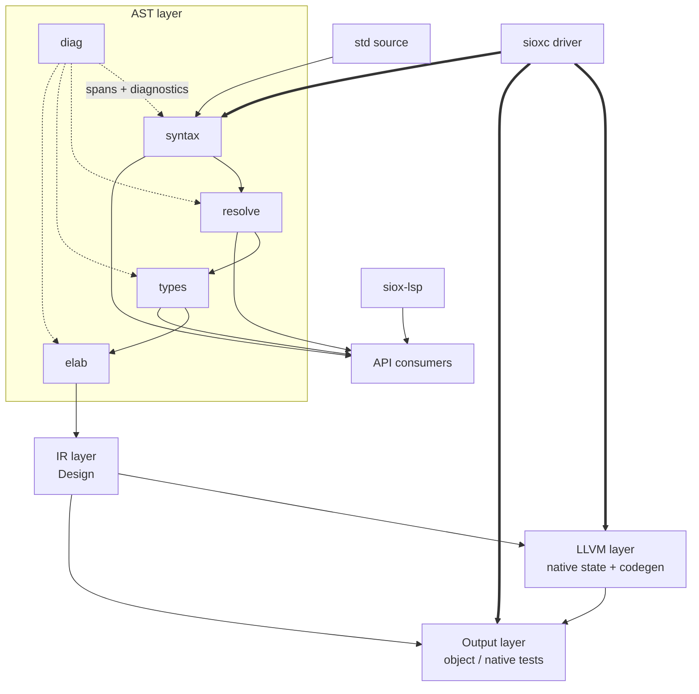
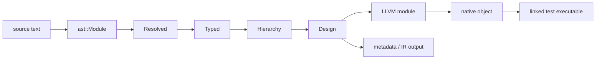

# Architecture

The siox compiler is one regular Cargo package with a library target (`siox`)
and compiler binary (`sioxc`). The library contains the compiler pipeline as
modules (`src/*.rs`) forming **one strict top-to-bottom pipeline** — each
module consumes the output of the module above it, the only module everything
may use is `diag` — plus the LLVM backend:

- **`siox`** (root) — the core: `diag` → `syntax` → `resolve` → `types` →
  `elab` → `ir`.
- **`siox::llvm`** — the LLVM native AOT backend (inkwell).
- **`sioxc`** — the root package's compiler binary and driver.

The separate `Siox-lang/siox-lsp` repository references this compiler through
Cargo Git and depends only on the backend-independent `siox` crate.

```mermaid
flowchart TB
    subgraph ASTL["AST layer"]
        SY["syntax"] --> RE["resolve"] --> TY["types"] --> EL["elab"]
        DIAG["diag"] -. spans + diagnostics .-> SY
        DIAG -.-> RE
        DIAG -.-> TY
        DIAG -.-> EL
    end
    EL --> IR["IR layer<br/>Design"]
    IR --> LL["LLVM layer<br/>native state + codegen"]
    LL --> OUT["Output layer<br/>object / native tests"]
    IR --> OUT
    SY --> API["API consumers"]
    RE --> API
    TY --> API
    LSP["siox-lsp"] --> API
    STD["std source"] --> SY
    CLI["sioxc driver"] ==> SY
    CLI ==> LL
    CLI ==> OUT
```

`siox::llvm` emits LLVM and compiles the `Design` ahead of time to native code.
`sioxc` discovers `#[test]` entities and generates a C harness containing the
stimulus, scheduler, assertions, and reporting; it links that harness with the
native design object. Therefore *`sioxc`* needs an LLVM toolchain to build; the
core and language server do not.

**Layering rule:** a module may use only the modules above it in this list
(plus `diag`). The layering is a convention enforced by module discipline; do
not introduce upward or sideways `use`s.

## Modules

The core `siox` crate lives in `src/`, one file (or directory) per module below.
The backend is `src/llvm/`; the compiler entry and driver are `src/main.rs` and
`src/driver/`.

| Module | Layer | Role |
| ------ | ----- | ---- |
| `diag` | shared | `Span`, `SourceMap`, diagnostics, and stable codes. |
| `syntax` | AST | Lexer, tokens, AST, parser, and canonical printer. |
| `resolve` | AST | Definitions, visibility, imports, paths, and use-site → `DefId`. |
| `types` | AST | Type/kind/operator checking and persistent expression `Ty` facts. |
| `elab` | AST | Parameters, roots, instances, connections, concrete instance-array build facts, and `Hierarchy`. |
| `ir` | IR | Signals, layouts, drivers, event blocks, initializers, and semantic lints. |

Package components:

| Component | Layer | Role |
| --------- | ----- | ---- |
| `siox::llvm` | LLVM | LLVM lowering, optimization, native state, and word ABI. |
| `sioxc` | Output/API driver | One compiler invocation and artifact/diagnostic production. |

## rustc-shaped compiler boundary

The compiler follows rustc's separation of responsibilities:

| rustc concept | siox counterpart |
| --- | --- |
| `rustc` executable | `sioxc`'s minimal `main.rs`, which delegates one invocation |
| `rustc_driver` / `rustc_interface` | `sioxc::driver`, which parses compiler options and composes the pipeline; extractable as a library crate when another tool needs to embed compilation |
| frontend queries and MIR | `siox::{syntax, resolve, types, elab, ir}` |
| codegen backend | `siox::llvm`, consuming only `siox::ir::Design` |
| synthesized libtest harness | `sioxc --test`, which emits a native executable |
| Cargo | a future project tool for dependency graphs, caching, compiling many inputs, running tests, simulation, and waveform workflows |

The command line therefore has no phase subcommands. `sioxc input.siox`
performs one compilation; `--emit object|metadata|source|tokens|ast|tree|ir|
llvm-ir` chooses the requested artifact, while `--test` changes the generated
artifact into a test executable. The compiler never executes that artifact.

SIOX remains pass-oriented today. Rustc's memoized, demand-driven query system
is a useful direction once incremental compilation or multiple consumers need
it. Persistent resolved and typed products now provide the right boundary; the
remaining API work is to expose stable queries and cache them without changing
`sioxc` or the backend boundary.

`src/lib.rs` opens with the module map, and each module's own file opens with a
doc-comment summarising its responsibility and spec acceptance criteria — read
it first when entering a module. Within the `siox` crate, refer to other modules
as `crate::<module>`; the binary imports the library as `siox::<module>`.

## Data that flows between stages

```mermaid
flowchart LR
    A["source text"] --> B["ast::Module"]
    B --> C["Resolved"]
    C --> D["Typed"]
    D --> E["Hierarchy"]
    E --> F["Design"]
    F --> G["LLVM module"]
    G --> H["native object"]
    F --> I["metadata / IR output"]
    H --> J["linked test executable"]
```

`diag::Span` (a byte range plus `FileId`) is attached to AST nodes and most
later-stage data, and is used both for diagnostics and as the key that links a
name-use site to the declaration it resolves to. `Hierarchy` also carries each
concrete parent instance's declared and built entity-array slots into IR, so a
reference to a conditionally omitted child can name both the slot and its
declaration instead of becoming an anonymous unknown expression. Every scalar
`ir::Signal` retains its owning port or `let` declaration span; flattened
aggregate leaves and synthetic metavalue companions inherit that same anchor,
so normalized-design lints do not lose their source location.

File inputs follow the phase that owns their storage. Hardware/top
initializers are elaboration-time ROM images in `Design::Signal::init`;
`#[test]` locals are excluded from hardware IR and the generated native harness
owns their runtime byte/code-point buffers. Both resolve relative paths against
the source directory recorded in `Design::base_dir`. The single `read<T>`
construct selects UTF-8 for `string`; numeric types share the raw integer path
and then use their normal integer representation/conversion.

## Cross-cutting conventions

- **Spans everywhere.** Every AST node—and increasingly later-stage
  metadata—carries a `diag::Span`. New semantic data should retain its source
  span so IR/output diagnostics can point back to code.

- **Diagnostics flow through `DiagnosticSink`.** Stages take `&mut
  DiagnosticSink`, `emit` into it, and the CLI renders/counts at the end. Use
  the stable codes in `diag::codes` (e.g. `WRITE_TO_INPUT_PORT`); add new
  codes to that catalogue rather than scattering string literals.

- **Best-effort, keep going.** A stage returns a usable result even on error
  (e.g. `parse_module` returns a partial AST, the parser guarantees forward
  progress, resolve/types never bail on the first error) so later stages still
  run and surface more diagnostics in one pass.

- **No false positives over completeness.** Where a stage cannot yet decide
  something soundly (e.g. value identifiers before full scoping, or widths
  before elaboration), it stays silent rather than emitting a wrong error. The
  strict checks are the ones that are correct today.

- **The IR distinction is central.** Combinational `Driver(target, cond, expr)`
  and sequential `OnEvent(cond): next(target) = expr` are kept separate; e.g.
  `clk.rising()` lowers to `Event(clk) && Old(clk)=='0' && Current(clk)=='1'`.
  Preserve this split when working in `siox::ir`/`siox::llvm`.

- **Reject Phase-2 syntax, don't implement it.** Analogue constructs (`domain`,
  `across`/`through`, `'ddt`, layout attrs) must produce errors
  (`codes::PHASE2_SYNTAX`), not silent acceptance.

## The type kernel and the std shim

The kernel's base types are **`integer` and `real`** only — and only they have
built-in operators. `Bit`, `Logic`, `Bool` are canonical `enum`
declarations in `std/logic.siox`; **`unsigned`/`signed` are ordinary `struct
unsigned(Logic[])` / `struct signed(Logic[])` declarations in `std/bits.siox`** —
no longer seeded compiler names. A library type opts into packed numeric
storage with `impl Vector for F`; derived families inherit that representation.
Signed interpretation is not compiler metadata: it comes from the type's
operator implementations. Constrained `impl<T: Trait> Trait for T[]`
declarations are forwarded through a packed family's array representation only
when its element satisfies the constraint; direct nominal impls override them.
This supplies element-wise Logic resolution and core logical operators without
general trait inheritance. They accept `integer` on assignment (spec,
"type kernel") and get their operators from `std/bits.siox` as Rust-style
`Operator` impls — including
`signed`'s sign-aware `<=>` (signed comparison is library source, not compiler
code). The CLI loads `std::` modules transitively from `--std <dir>` (default
`./std`); the **prelude** (`std/prelude.siox`) is auto-loaded into every
compile, so the core types always carry their std semantics — the kernel
word fallback only applies when the std root has no prelude at all. `resolve`
seeds only the kernel scalars (`integer`, `real`, and Unicode `Char`);
`Bit`, `Logic`, `Bool`, `unsigned`, and `signed` come from std declarations.
Stage-4 typing represents all indexed collections with one `Ty::Array` shape.
Array-derived numeric newtypes retain their family name for trait dispatch,
but there is no separate semantic `Vector` type.

IR signals retain kernel scalar identity independently from packed-family
signedness: `real`, `integer`, `Char`, and enum identity survive flattening.
The `integer` marker lets native consumers sign-extend a constrained value from
its actual storage width before signed comparison, division, shifting, or
formatting. IR also carries signed arithmetic, division,
arithmetic-right-shift, and ordering operations so LLVM cannot reinterpret an
elaborated kernel integer—or a nested select/arithmetic result—as an unsigned
bit pattern. Integer-valued driver and event-update targets recursively
sign-extend constrained inputs to their destination width. This does not make
`std::bits::signed` compiler-special; that family's behavior still comes from
its std operator implementations, and lowering keeps those library vector
operations separate.

Range polarity determines extension from storage: a negative-capable range
uses two's-complement sign extension, while `integer<0..N>` zero-extends its
full magnitude bits. Signed kernel operations use an extra compute guard bit,
so the top value of a nonnegative range cannot become negative. Ranged
assignments are also compared against their bounds before destination
truncation; LLVM latches the first violating signal id and the native scheduler
checks it after every settle, preventing both wrapped and transient violations
from disappearing. The same pre-truncation hook is used by the public
`sx_set`/`sx_set_word` stimulus ABI, so a wider testbench value cannot wrap
while entering a constrained input port.

Foreign C calls retain ABI kind metadata independently for each parameter and
the return value. Kernel `integer` crosses as signed `int64_t`, `real` as C
`double`, and packed values as unsigned words; aliases are resolved before this
classification. LLVM call results are always fitted to the requested expression
width, including inside staged clocked updates.

Exact `using` aliases are resolved transitively and cycle-safely before IR
signal flattening. The terminal type therefore supplies storage width, numeric
range, scalar identity, vector family, struct layout, and array element shape;
a multi-hop alias cannot degrade into an unknown-width signal.

## Signal widths

LLVM represents each value at its own semantic bit width. The ABI exchanges
wider values as low-word-first machine-word chunks, with the required word
count derived from that type. There is no global maximum word count:
`unsigned[128]` uses two 64-bit ABI words and `unsigned[512]` uses eight,
without widening unrelated values. Native state also keeps the exact semantic
width (`i65` stays `i65`; it is not rounded to `i128`).

The current LLVM output backend accepts LLVM integer widths through
`IntegerType::MAX_INT_BITS` (8,388,608 bits). This is an LLVM capability, not
a word-ABI or language limit: a design beyond it receives a normal codegen
error and can be consumed by a future backend with a different value model.

Integer literals and match-pattern masks use the same low-word-first
arbitrary-width representation. The native test harness chooses its C
`_BitInt` width from the widest type or nested expression in that design and
exchanges every ABI word. Generated native test executables write requested VCD changes directly
while scheduling; waveform values do not round-trip through the compiler.
Structural inheritance walks terminate by detecting actual cycles, so a valid
deep type hierarchy is not rejected at an arbitrary depth.

Floats are f64: no mainstream CPU has scalar f128/f256 hardware (AVX widths are
SIMD lanes, not precision), so wider floats would mean software emulation —
deferred until something needs precision beyond f64.

Cargo features name implemented build boundaries only: `cli`/`llvm` select the
compiler executable and LLVM dependency, `simd` targets the build host's CPU
features, and `bitpack` selects the alternate packed state layout. Arbitrary-
width integers are part of the normal compiler and need no `wide` flag. Quad
precision has no `f128` flag until its lowering, ABI, formatting, and fallback
runtime all exist.

## The CLI as the pipeline driver

`sioxc` is where the stages are composed. It loads a file into a
`SourceMap`, runs the stages a subcommand needs on a shared `DiagnosticSink`,
narrates each stage to stderr (more with `-v`), prints the requested artifact to
stdout, and exits non-zero if any errors were reported. This makes the CLI the
practical place to watch data move through the compiler. Like `rustc`, it takes
one input per invocation: `--emit` selects the artifact and `--test` selects
test-harness compilation. Project graphs, directory traversal, execution, and
simulation tooling are deliberately outside the compiler.
