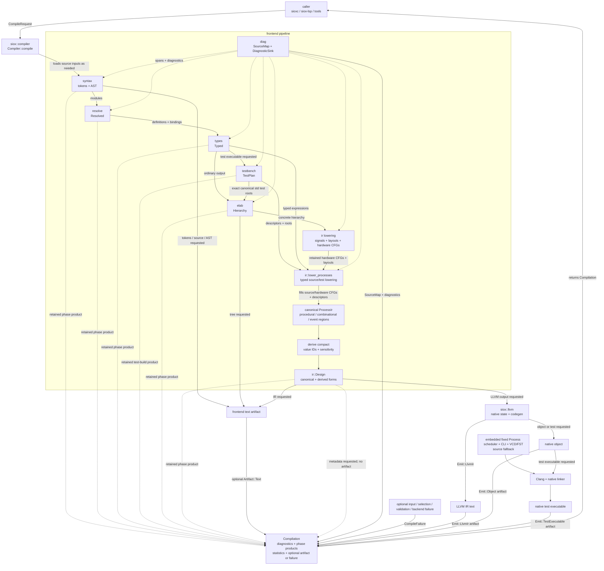
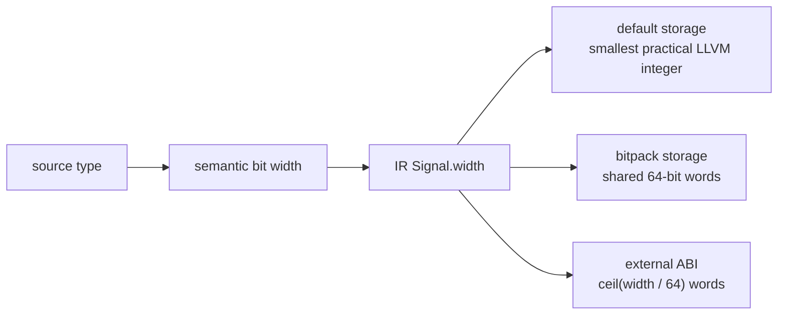

# Architecture

The siox compiler is one regular Cargo package with a library target (`siox`)
and compiler binary (`sioxc`). The library contains the compiler pipeline as
modules (`src/*.rs`) forming **one strict top-to-bottom pipeline** — each
module consumes the output of the module above it, the only module everything
may use is `diag` — plus the LLVM backend:

- **`siox`** (root) — the core: `diag` → `syntax` → `resolve` → `types` →
  `elab` → `ir`.
- **`siox::compiler`** — the embedding interface that loads one source input,
  composes the passes, and returns diagnostics, partial phase products, and an
  optional artifact without printing or executing it.
- **`siox::llvm`** — the LLVM native AOT backend (inkwell).
- **`siox::testbench`** — canonical native-test selection metadata.
- **`sioxc`** — the root package's thin command-line adapter.

The IR module is directory-backed and split by responsibility:

- `mod.rs` is the stable `siox::ir::*` facade, while `functions.rs` owns the
  resolver-backed function and nominal-owner index;
- `design.rs`, `layout.rs`, and `expr.rs` define language-neutral data, while
  `derive.rs` projects canonical hardware Process regions into the compact
  compatibility scheduler view;
- `process.rs` owns the canonical process CFG, value arena, and descriptors;
- `query.rs` owns validation, scheduler queries, and textual dumps;
- `passes.rs` owns representation-neutral normalization;
- `lower.rs` is the Siox frontend-lowering facade and shared state. Focused
  modules in `lower/` own collection, entity bodies, expressions, operators,
  calls, values, control flow, block locals, writes, resolution, initializers,
  layouts, metavalues, diagnostics, typed source/test Process CFG lowering,
  and source-owned canonical hardware CFG construction;
- `lower_helpers.rs` is the stable facade for the focused
  `lower_helpers/` utilities: expression/constant builders, type metadata,
  generate expansion, substitution, and source access. Together with
  `lower/`, these are the only Siox-AST-dependent IR modules;
- `tests.rs` contains shared fixtures and `tests/` groups the public IR
  contract by identity, diagnostics, behavior, value/layout, and control-flow
  concerns.

The type checker is directory-backed the same way:

- `mod.rs` is the stable `siox::types::*` facade (`Ty`, `Typed`, `check`) and
  owns the private `Checker` state, so its fields stay private to the stage;
- `collect.rs` builds the declaration registries before checking begins;
- `items.rs`, `impls.rs`, and `members.rs` check items, trait contracts and
  impl bodies, and field/method access;
- `statements.rs`, `assignments.rs`, `patterns.rs`, `calls.rs`, `indexing.rs`,
  `operators.rs`, `literals.rs`, and `expressions.rs` check each construct,
  with `inference.rs` computing expression types;
- `keys.rs`, `ast_types.rs`, and `helpers.rs` hold registry keys, AST-to-`Ty`
  mapping with diagnostic emission, and free helpers;
- `tests.rs` contains shared fixtures and `tests/` groups the checks by
  visibility, declarations, attributes, writes, operators, calls, matches, and
  statements.

Each file carries one `impl Checker` run; methods are `pub(super)` so siblings
can call them, and nothing outside `types` can.

The LLVM lowering of Process IR, `src/llvm/process/`, is split the same way:

- `mod.rs` holds the process ABI constants and re-exports the two entry
  points the rest of the backend calls, `declare_state` and `emit_metadata`;
- `names.rs`, `slices.rs`, `bindings.rs`, and `state.rs` cover the emitted
  state: global names and widths, layout slices, storage bindings and
  defaults, and state declaration, reads, stores, and range checks;
- `logic.rs` owns source-defined logic discriminants and packed companion
  planes; `aggregate_logic.rs` assembles recursive frame planes and their
  projections with matching fail-closed support checks;
- `value_types.rs`, `binary.rs`, and `values.rs` lower Process values:
  signedness and layout queries, binary operators and dynamic indexing, and
  value lowering itself;
- `tables.rs` emits constant tables and strings, and `support.rs` holds the
  fail-closed support checks;
- `hardware.rs` shares per-object value facts with Process metadata/entries
  and routes derived hardware references through the common value emitter;
- `places.rs`, `writes.rs`, and `flags.rs` handle assignment places, writes
  and schedule calls, and change/dirty flags with the emitted state helpers;
- `blocks.rs`, `instructions.rs`, `loops.rs`, and `entry.rs` lower control:
  suspension points, formatted output and runtime instructions, loops and
  `match`, and process entry points with their table;
- `metadata.rs` writes waveform and source-location metadata and the tables
  the runtime discovers.

These file splits are internal ownership boundaries, not additional pipeline
stages. Consumers continue to use the stable `siox::ir::*` and
`siox::types::*` paths rather than depending on implementation submodules.

The separate `Siox-lang/siox-lsp` repository references this compiler through
Cargo Git and depends only on the backend-independent `siox` crate.

The following diagram describes the current implementation. Process IR has one
owner and one native execution path. Source hardware and typed procedural/test
constructs lower there directly under `ir/lower`. Source normalization drafts
stay private to that pass; the finalized `Driver`/`EventBlock` view is derived
from canonical CFG regions. Public scheduler decomposition is never an input
to source CFG construction.

```mermaid
flowchart TB
    CALL["caller<br/>sioxc / siox-lsp / tools"] -->|CompileRequest| API["siox::compiler<br/>Compiler::compile"]
    API -->|loads source inputs as needed| SY

    subgraph FRONTEND["frontend pipeline"]
        SY["syntax<br/>tokens + AST"] -->|modules| RE["resolve<br/>Resolved"]
        RE -->|definitions + bindings| TY["types<br/>Typed"]
        TY -->|ordinary output| EL["elab<br/>Hierarchy"]
        TY -->|test executable requested| TESTPLAN["testbench<br/>TestPlan"]
        TESTPLAN -->|exact canonical std test roots| EL
        EL -->|concrete hierarchy| DIGITAL["ir lowering<br/>signals + layouts + hardware CFGs"]
        TESTPLAN -->|descriptors + roots| PROCESS_LOWER["ir::lower_processes<br/>typed source/test lowering"]
        TY -->|typed expressions| PROCESS_LOWER
        DIGITAL -->|retained hardware CFGs + layouts| PROCESS_LOWER
        PROCESS_LOWER -->|fills source/hardware CFGs + descriptors| PROCESSIR["canonical ProcessIr<br/>procedural / combinational / event regions"]
        PROCESSIR --> DERIVE["derive compact<br/>value IDs + sensitivity"]
        DERIVE --> DESIGN["ir::Design<br/>canonical + derived forms"]

        DIAG["diag<br/>SourceMap + DiagnosticSink"] -. spans + diagnostics .-> SY
        DIAG -.-> RE
        DIAG -.-> TY
        DIAG -.-> TESTPLAN
        DIAG -.-> EL
        DIAG -.-> DIGITAL
        DIAG -.-> PROCESS_LOWER
    end

    DESIGN -->|LLVM output requested| LL["siox::llvm<br/>native state + codegen"]
    PROCESS_RUNTIME["embedded fixed Process scheduler + CLI + VCD/FST<br/>source fallback"] --> LINK
    LL -->|Emit::LlvmIr| LLVM_TEXT["LLVM IR text"]
    LL -->|object or test requested| OBJ["native object"]
    OBJ -->|test executable requested| LINK["Clang + native linker"]
    LINK --> TEST["native test executable"]

    SY -->|tokens / source / AST requested| FRONT_TEXT["frontend text artifact"]
    EL -->|tree requested| FRONT_TEXT
    DESIGN -->|IR requested| FRONT_TEXT

    SY -. retained phase product .-> RESULT
    RE -. retained phase product .-> RESULT
    TY -. retained phase product .-> RESULT
    TESTPLAN -. retained test-build product .-> RESULT
    EL -. retained phase product .-> RESULT
    DESIGN -. retained phase product .-> RESULT
    FRONT_TEXT -->|optional Artifact::Text| RESULT["Compilation<br/>diagnostics + phase products<br/>statistics + optional artifact or failure"]
    DESIGN -. metadata requested; no artifact .-> RESULT
    DIAG -->|SourceMap + diagnostics| RESULT
    FAILURE["optional input / selection / validation / backend failure"] -->|CompileFailure| RESULT
    LLVM_TEXT -->|Emit::LlvmIr artifact| RESULT
    OBJ -->|Emit::Object artifact| RESULT
    TEST -->|Emit::TestExecutable artifact| RESULT
    RESULT -->|returns Compilation| CALL
```

Solid arrows show work or values moving to another compiler/output stage.
Dotted arrows do not invoke another stage: `Compilation` retains each product
that completed. `CompileRequest` enters through `Compiler::compile`; the final
`Compilation` return carries diagnostics even when a later phase or backend
fails. A request stops once its selected output is ready—for example, AST and
tree requests do not continue through IR. Frontend-only requests stop before
`siox::llvm` and native linking.

`siox::llvm` emits LLVM and compiles the `Design` ahead of time to native code.
For a test build, `siox::testbench` resolves enabled uses of the canonical
built-in `#[test]` directive once, elaborates exactly those roots, and binds
them into a `TestPlan`. `ir::lower_processes` fills the canonical
`Design::process_ir` with validated descriptors and CFGs directly from the
typed/elaborated source context; the compiler has no separate adapter module or
second software program. It runs for every lowered compiler output: source
hardware lowering already supplies reactive CFGs with
root/instance ownership, while a test plan additionally contributes storage,
clocks, and stimulus. Branch, suspend/resume, structured match/for
control, termination, assignment semantics, activation, labels, and spans
already live there. Operands are arena-owned once and referenced from CFG nodes
by stable `ProcessValueId`. Every statically packed operand, including an array
or struct, carries its checked width on `ProcessValue`; its optional
`SourceLayout` supplies recursive field/element shape and offsets, never a
fallback width. Process IR validation rejects a missing or contradictory width
before LLVM emission. Assignments are transactional at the same boundary: the
right-hand packed value and every runtime-selected target index are captured
from the pre-write state, then each destination root is updated or staged.
Validation rejects non-place targets and operands without a capturable packed
representation; LLVM separates capture from its root-mutation helper so an
aggregate copy cannot observe one of its own partial writes. The LLVM object
exports immutable test, process,
activation, sensitivity, waveform, and source-location tables plus callable
process entries. One fixed scheduler consumes them, owns ready batches and
delta commits, and edits delayed writes as driver/scalar-subelement projected
waveforms with VHDL default-inertial rejection. LLVM supplies driver/root
families and immutable scalar-lane descriptors. Each queued write owns its
physical target offset plus narrow value and packed X/Z payloads; static and
dynamic projections therefore share one waveform identity without retaining
live selectors. Inertial comparison/rejection includes companion values, and
masked apply sites preserve unselected value/companion lanes. Overlapping
whole/slice targets compose without teaching the runtime concrete design
layouts. Native Process ABI version 15 retains the selected offset through
enqueue/expiry and adds initialization activation before normal bootstrap.
The object links with a
fixed descriptor-driven CLI and the pinned libfst waveform runtime. These
design-independent C sources are compiled once
with `sioxc` and embedded as host objects; a source fallback is retained when
host precompilation is unavailable. No source statement or Process instruction
is translated to per-design C. A native test build therefore needs Clang and
zlib but neither GTKWave nor an installed libfst. A `default-features = false`
editor build needs neither LLVM nor the native-output toolchain.

## Unified process pipeline (Phase 1 endpoint)

`process { ... }` (optionally labelled `name: process { ... }`) supplies the
common scheduling boundary that the earlier architecture lacked. Explicit
hardware processes, implicit reactive
processes created for concurrent statements, clocks, and test stimulus can all
lower once into one CFG-capable Process IR. `#[test]` contributes root and
descriptor metadata; it does not select another IR.

```mermaid
flowchart LR
    SOURCE["source + std"] --> AST["syntax<br/>AST"]
    AST --> RESOLVED["resolve<br/>Resolved"]
    RESOLVED --> TYPED["types<br/>Typed"]
    TYPED --> HIERARCHY["elab<br/>Hierarchy + selected roots"]
    HIERARCHY --> PROCESSIR["ir<br/>Design + process CFGs"]
    PROCESSIR --> VALIDATE["target validation<br/>simulation / elaboration"]
    VALIDATE --> OPTIMIZE["process + value optimization"]
    OPTIMIZE --> OUTPUT["output backend"]
    OUTPUT --> ARTIFACT["object / test executable / RTL / dump"]
```

This is one semantic track even though frontend-only requests may stop early
and the final output format is selectable. Functions and methods are sequential
subroutines within a caller; only a process creates an independently scheduled
context. The current `Driver` and `EventBlock` forms become derived
optimizations of Process IR rather than a separate hardware input path.

### Current Process IR ingress boundary

The canonical `ProcessIr`, CFG, value, storage, descriptor, validation, and
typed source lowering code all live under `src/ir/` and are owned by
`ir::Design`. `Compiler::compile` invokes
`src/ir/lower/source_processes.rs` directly after `ir::lower_in`; the former
public `test_ir` adapter module has been deleted. Typed expressions, control
flow, storage, clocks, stimulus, and `TestPlan` descriptors therefore enter the
canonical arena through its owning layer.

Hardware source lowering collects ordered guarded writes in a private
`HardwareDraft` while specializing instances, resolving source contexts, and
normalizing metavalue planes and std expressions. `hardware.rs` finishes that
draft into canonical CFGs inside `ir::lower_in`; it never calls
`Design::processes()` or consumes a public scheduler product. Combinational
source contexts retain all their targets in one CFG, including companion
writes. Independent resolved targets receive independent synthetic contexts,
and constant implementation helpers retain their source owner even when their
expressions have no signal reads.

After driver-context/metavalue propagation, every executable draft write and
guard is bound in `SourceValues` before representation normalization and
reachability compaction. Hardware CFG construction
then reads canonical handles only; its separate digital-expression importer is
removed. Compaction therefore includes the finalized roots and retains shared
dependencies, sensitivity and assignment/context spans. Natural-width annotation
still runs once over the dependency-ordered arena. Reconstruction, literal
resolution and lookup compaction operate only on that arena; their production
fragment walks have been removed.

`source_processes.rs` retains those CFGs and their value arena while attaching
procedural/test state. It places procedural entries before existing hardware
entries, updating hardware process IDs and test membership without re-lowering
their values or CFGs. Each CFG carries an explicit `ProcessRegion`, so reactive
testbench clocks cannot be mistaken for combinational or event hardware.
`derive.rs` reconstructs compatibility scheduler forms from those hardware
regions and rejects procedural CFG/value shapes. The normalized-hardware
importer is deleted. Compound frontend expressions construct arena nodes
directly. Flat literals/reads bind without recursion, and captured handles
retain their existing formats. Native execution never traverses frontend syntax
or translates it into C.

The derived scheduler view stores `Expr::Canonical` roots, not copies of
those value graphs. Each root carries its `ProcessValueId` and a compact
sensitivity list validated against the arena. IR dumps print `%vN` references
to the canonical value declarations below them. Projection and sensitivity
validation walk shared identities once, including deeply shared DAGs.
Hardware helpers delegate these roots to the same exact-width Process value
emitter as procedural CFGs, sharing per-object support/check/metavalue facts.
Contextually widened arithmetic has a separate width/signedness-aware cache;
checked subgraphs still distinguish activity predicates, and foreign calls
invalidate state-dependent caches. This prevents backend projection from
undoing source sharing.

Production validation checks that scheduler roots, targets, guards, source
contexts and spans exactly match the projection of canonical hardware CFGs.
It rejects independent legacy trees, substituted arena roots and removed
writes before object creation; the legacy expression emitter is test-only.
Checked accesses and host/foreign effects propagate activity through if/match
and short-circuit values. Calls execute on selected LLVM branches with values
that dominate the join, not eagerly under an LLVM select. Bounded compatibility
helpers exchange captured calls through internal exact-width object state;
readiness resets for each combinational pass and event-staging phase. This
preserves one evaluation per canonical call even across helper boundaries,
without exposing new ABI tables or enlarging helpers. Overwritten signal
writes retain their selected effects while omitting destination range checks
on values which never reach the signal. The fixed runtime's Process entries
retain their existing per-CFG capture behavior.

Several selected foreground processes can suspend independently alongside
background clocks. Each owns a resume block and local frame; the fixed runtime
dispatches ready entries in stable process-ID order on one host thread. The old
frontend one-foreground limit has been removed. `concurrent_process_test.siox`
in the sibling corpus verifies that the second-declared process resumes at
1 ns while the first is suspended until 2 ns, with exact DUT waveform checks in
both storage modes. This is cooperative concurrency, not worker-thread support.

Phase 1 acceptance evidence is recorded in the
[exit audit](phase1-audit.md), including the five pipeline invariants, eleven
language deliverables, twelve named examples and historical stage/CLI criteria.
Native recursion, non-packed conversions, general runtime-sized arrays/computed
file paths and direct DWARF remain separate extensions rather than fallback
execution paths. The multithreading proposal extends these same CFGs and LLVM
entries; it does not introduce a new compiler track.

`lower/source_values.rs` owns canonical bindings while hardware source is
normalized. Inlined function locals retain value IDs instead of copied trees;
straight-line let chains iterate with one scoped environment. Block-local
declarations and every immediate write bind shared values with the declared
recursive leaf layouts. Narrow signed ranges, packed families, real values,
enum literals and Unicode characters therefore retain their representation
without turning locals into staged signals. Inlined arguments, receivers and
return selections share values even without intermediate source lets.
Reachability compaction moves canonical nodes and remaps their operand IDs
directly, preserving widths, layouts, spans and shared dependencies without
an expression-tree roundtrip. Source if-expressions construct their Select node
directly in that arena; no recursive production expression ingress remains.
Common unary/binary builders now construct canonical nodes too, across scalar,
inlined and aggregate-element paths, including packed logical operations.
Selected signed/unsigned/float domains and operator spans stay on those nodes.
Logic-literal normalization updates canonical leaves in place using std's
discriminants; unchanged identities and formats no longer pass through the
expression adapter. Lookup compaction likewise recognizes its fixed packed
pattern directly in canonical nodes, interns decoded tables and replaces only
matching slices in place. Typed intermediate boundaries and failed matches
remain intact; widths, layouts, spans and shared indices retain their IDs.
Metavalue reconstruction moves and remaps canonical dependencies once and
constructs comparison guards and companion slices directly. Current/old planes,
checked offsets, full formats and shared operands survive; unchanged nodes are
not projected/imported. This removes the general source-arena rewrite adapter.
Its focused implementation is in `lower/source_values/reconstruct.rs`.
The earlier fragment reconstruction and lookup algorithms remain only as
test-only differential oracles. Handcrafted oracle fixtures use an explicitly
named `import_test_fragment` constructor excluded from compiler builds; the
production binding function rejects compound private fragments even in tests.
Whole aggregate `'old` reads use the same captured-place projection as current
reads, selecting old storage leaves while retaining current dynamic-index
guards. The source layout survives array relabeling; nested/multiword X/Z
snapshots use ordinary canonical signal-state nodes and companion planes,
not a second historical-value representation.
`lower/source_values/build.rs` constructs source slices, checked indices and
muxes directly in the arena. Persisted/local packed reads, dynamic aggregate
selection, ascending/descending slices, captured-place reads, conditional local
stores and scalar/aggregate `if`/`match` results use those constructors. Aggregate
selection binds its condition once and pairs leaves by name; the former
tree-building `select_val` helper is deleted. Operand formats and dependency
identities remain authoritative, and selections retain access/index spans.
Explicit kernel scalar bindings wrap canonical operands too: wide packed
consumers must resize the bound result rather than widen its index arithmetic.
These explicit boundaries are distinct from inferred type hints when capturing
generic function values; a hint must not override an arena-owned format.
Raw metadata helpers and compile-time constant expressions use the same arena
builders. Literal companion planes bind there before normalization too.
`lower/source_bindings.rs` owns scoped concrete argument/local/return shapes
and aggregate projection over those leaves. Pure free/method array arguments
no longer substitute a caller AST into every parameter use. Returned arrays,
runtime-selected structs/subarrays, packed bit projections and directed slices
use the same bindings; checked accesses retain written bounds and activity.
`lower/source_aggregates.rs` owns contextual arrays, strings, positional struct
literals, spreads and matches, plus recursive source-to-target leaf mapping.
Combinational, clocked and immediate local aggregate stores share that mapping;
different array labels/directions map in written position order at every
dimension. Runtime-selected aggregate reads and subarray stores retain checked
activity. Function returns consume their original bodies and concrete layouts;
the return-body rewrite and returned-call AST substitution helpers are deleted.
Nested array initializers recurse through their layouts, and literal/constant
multiword leaves retain all ABI words instead of only their low word. Scalar,
array and struct constant storage leaves share initialization of value words
and literal X/Z companions. Procedural arrays/structs retain those companions
in exact-width frame planes: each value bit has a four-bit metadata position,
and non-packed fields are zero padding because scalar enum values already
store their full discriminants. Whole copies, field/element projections,
conditional/match values, struct spreads and immediate projected writes share
the value layout's offsets scaled by four. Clean replacements clear only their
selected region. Persistent old-value snapshots and suspended array-loop
snapshots retain both planes. Connected test inputs reserve companions before
hardware resolution/normalization, even with binary initial values, so hardware
drivers can consume later runtime X/Z values. The LLVM boundary rejects a companion
frame exceeding its actual integer-type limit before declaring state.
Hardware companion discovery queries canonical values for metadata presence
without constructing and discarding expanded expressions. Materialized
metadata operands inherit their write, event and select-branch activity;
memoization includes that guard identity so an inactive temporary cannot be
reused by another active write. Checked projections therefore stay inside the
same activity boundary as their corresponding value operations.
Process-local declarations restore their written ranges recursively through
ordinary array dimensions, packed leaves and transparent aliases; checked
types supply lengths, while those layouts retain labels and direction.
`lower/source_array_ops.rs` lowers array operands once and pairs canonical
elements recursively in written position order. Negative labels, different
directions, returned arrays and runtime-selected subarrays need no synthetic
element AST. Contextual packed literals bind their discriminant planes to the
same value identities. `lower/source_operators.rs` shares overload selection
and original implementation bodies between scalar and array-element ingress;
user enum/struct behavior remains source-defined, including wide packed leaves.
`lower/source_calls.rs` binds hardware statement procedures without rewriting
their bodies. Arguments are either canonical values or captured places;
`lower/source_places.rs` owns storage identities, recursive projections,
selection guards and physical bit maps. Nested calls forward those identities
instead of reevaluating caller selectors. Callee locals shadow parameters, and
pure function shape scopes isolate caller procedure bindings. Writes to caller
locals update their scoped value immediately; signal writes remain staged and
later signal reads still observe pre-commit state. Combinational and clocked
calls use the same binding path, including custom index assignment.
Literal discriminant planes accompany value IDs through normalization and
reachability compaction. A captured foreign call result is retained within one
straight-line LLVM helper/block even when a call invalidates mutable state
loads. These caches do not cross CFG blocks. Procedural receiver/free calls in
`lower/source_processes.rs` use the existing statement lowerer for branches,
matches, loops and suspension, with a caller continuation for early returns.
Computed arguments and dynamic place selectors are captured in ordinary Process
locals before the callee runs, in source order; subsequent reads/writes through
place aliases retain their immediate or staged semantics. Repeated inline sites
select their own local declarations. Recursive/unknown calls roll back
the entire inline before entry captures or callee effects can become observable.
`lower/source_processes/cfg_calls.rs` expands remaining value calls inside the
canonical CFG, reusing the ordinary statement lowerer, captured places and
result locals. `return value;` assigns the result frame and jumps to the caller
continuation. Conditional value nodes become branches with a result join;
their inactive calls are never executed. Call-containing loop iterables expand
in the preheader, outside the iteration back-edge. Operand/format remapping
preserves written positions even when several reads share one parameter ID;
read snapshots must never replace its mutable place identity.
Concrete declaration layouts are retained on `Design::type_layouts` by resolved
type identity using the existing source-layout builder. Lexical-only structs
therefore have the same representation as types occurring in ports or storage;
generic returns reuse caller layouts rather than invent another layout builder.
Reset-time impl declarations lower through lower_ordered_storage_initializer
and the same value-call CFG expander. Host/foreign values are captured at their
CFG evaluation boundary; conditional file reads and foreign calls execute only
in the selected arm. Checked scalar aliases complete opaque declaration layouts
before executable assignments, while literal empty strings retain metadata
without a packed write. Initialization activation runs once per
root in object/declaration order before hardware bootstrap and stimulus, using
the ordinary ready/continuation/event queues even across suspension. Reset
installs default frames; retained initializer roots supply source/type metadata
but are not re-executed in LLVM's reset helper. The fixed runtime publishes
initializer bindings without exposing intermediate defaults as wave samples.
Runtime recursion and guarded hardware evaluation remain unfinished work.
Procedural signal reads retain their declaration-owned layout before projection,
so entity-qualified packed ports use the same labelled slices as local aliases.
Normalization rewrites each dependency once and compacts reachable values
before constructing hardware CFGs. Typed scalar aliases retain their evaluation format through
`RawResize` boundaries, so a wider consumer does not reevaluate a whole alias
chain at successively wider widths. Metavalue presence and representation
queries are cached, and lookup compaction inspects only its fixed pattern.
Unsuccessful lookup recognition leaves the original canonical dependencies
intact, rather than rebuilding a foreign call beneath each ordinary slice.
Library lexical integer/real types outrank same-spelled caller ports; negative
range attributes retain signed arithmetic rather than unsigned word constants.
The old tree-inlining size guard is deleted. Binary32 hardware multiply/add/sub
now pass the same 44 reference pairs as procedural arithmetic. Concatenations,
real-context arithmetic/conditional coercions and block-local width boundaries
construct canonical nodes through the shared arena builders rather than build
new expression trees. Concatenation parts retain their individual source spans;
real coercion reuses canonical child values and anchors transformed operations
at their original source locations. Existing numeric evaluation rules remain
unchanged. Logical/unary/arithmetic companions, source encoding-table lookups,
element-wise resolution and packed-write encoding projections also construct
canonical values. Physical single-bit projections carry temporary normalization
intent through arena remapping: reconstructing a source logic-element read must
not decode a raw value-plane bit used to build a companion. That intent does not
add a runtime operation or public IR format; final bit slices retain ordinary
bit semantics. Static/dynamic partial-write masks and source-order selections
also use arena builders, as do branch/match/index guards and captured
procedure-place projections. Constant index hits remain unconditional for
coverage and write merging; canonical guard operands retain their own formats.
The old private guard constructors are removed. Foreign calls, numeric
conversions, marked vector comparisons, signed range attributes and constant
expressions construct canonical nodes too. Calls retain callee/argument source
anchors and ABI flags; negative labels retain signed arithmetic, including
`i64::MIN`. Constant roots are shared across their consumers instead of being
imported once per use. The production `push_digital_expr` importer is deleted.
Implicit real promotion of an already evaluated integer call/read/conversion
keeps its original arena ID and inserts an integer-to-real conversion. It must
not reimport a shallow fragment or reinterpret integer storage as f64 bits.
Full pipeline exit verification remains tracked in TODO.

**Layering rule:** a module may use only the modules above it in this list
(plus `diag`). The layering is a convention enforced by module discipline; do
not introduce upward or sideways `use`s.

## Modules

The core `siox` crate lives in `src/`, one file (or directory) per module below.
The backend is `src/llvm/`; the compiler entry and driver are `src/main.rs` and
`src/driver/`.

| Module | Layer | Role |
| ------ | ----- | ---- |
| `diag` | shared | `Span`, `SourceMap`, diagnostics, and stable codes. |
| `syntax` | AST | Lexer, tokens, AST, parser, canonical printer, and named/anonymous process blocks. |
| `resolve` | AST | Definitions, visibility, imports, paths, and use-site → `DefId`. |
| `types` | AST | Type/kind/operator checking and persistent expression `Ty` facts. |
| `elab` | AST | Parameters, roots, instances, connections, concrete instance-array build facts, and `Hierarchy`. `elab::GenPath` names generated instances (`s_0` in an unlabelled loop, `stages[0].s` in a labelled one) for both elaboration and the IR's generate walk. |
| `testbench` | AST/plan | Canonical std test discovery, exact test-root elaboration, and backend-neutral `TestPlan`. |
| `ir` | IR | Source/process lowering, signals, layouts, canonical process CFGs/test descriptors, normalized drivers/event blocks, initializers, validation, and semantic lints. |
| `compiler` | API | `Compiler`, disk/in-memory `SourceInput`, `CompileRequest`, retained `Compilation` phase products, structured failures, and artifacts. |

Resolution is the owner of nominal identity. Both declaration sites and use
sites map to `DefId`; type checking uses those IDs (or a qualified key derived
from one) for semantic registries. A leaf spelling is only presentation, not a
safe lookup key. Hierarchy instances carry both a display name and their entity
`DefId`; elaboration and recursive IR lowering use the ID, while tree output and
signal paths retain concise source names. When separate modules contribute
equal-named roots to one compilation, `Hierarchy::root_path` qualifies only
those roots; IR paths, tree output, waveform scopes, and native test lookup all
share that collision-free spelling. Native C test functions use a separate
injective symbol, and explicit compiler root selection requires a qualified
name when a bare entity leaf is ambiguous. A vendor `top` attribute remains
ordinary metadata and never participates in this selection. Module constants follow the same rule:
their declared types, folded values, range/array/struct entries, and native
expressions use a qualified key derived from the resolver, while constants local
to an `impl` remain lexical leaf bindings. Struct declarations likewise carry
the selected identity through field/privacy tables, recursive layouts and
defaults, constructors, methods, constants, flattened paths, and native
aggregate storage. A standard-library vector struct keeps its canonical short
IR key when user code declares a namesake; the user declaration receives a
qualified key. Applied views carry the resolved view declaration together with
the resolved backing type through direction layouts, inherent/trait ownership,
and native lowering. Views with the same leaf may overload by backing type in
one module, and equal view leaves in separate modules qualify at the IR/output
boundary when needed. Custom trait contracts, defaults, implementations, and
operator operand types use resolver-selected identity as well. The exact
builtin and `core::ops` hook declarations such as `Add` are the deliberate
exception: they keep one canonical language key while their user-defined
operand types remain identity-preserving. A same-named trait declared in any
other module is an ordinary qualified contract and never enters hook tables.

Package components:

| Component | Layer | Role |
| --------- | ----- | ---- |
| `siox::llvm` | LLVM | LLVM lowering, optimization, native state, and word ABI. |
| `sioxc` | CLI | Parses command-line options and renders one `siox::compiler` result. |

## rustc-shaped compiler boundary

The compiler follows rustc's separation of responsibilities:

| rustc concept | siox counterpart |
| --- | --- |
| `rustc` executable | `sioxc`'s minimal `main.rs`, which delegates one invocation |
| `rustc_driver` / `rustc_interface` | `siox::compiler`, the library-owned request/result boundary used by every host |
| frontend queries and MIR | `siox::{syntax, resolve, types, elab, ir}` |
| codegen backend | `siox::llvm`, consuming only `siox::ir::Design` |
| synthesized libtest harness | `sioxc --test`, which emits a native executable |
| Cargo | a future project tool for dependency graphs, caching, compiling many inputs, running tests, simulation, and waveform workflows |

The command line therefore has no phase subcommands. `sioxc input.siox`
performs one compilation; `--emit object|metadata|source|expanded|tokens|ast|tree|ir|
llvm-ir` chooses the requested artifact, while `--test` changes the generated
artifact into a test executable. The compiler never executes that artifact.

SIOX remains pass-oriented internally. Rustc's memoized, demand-driven query
system is a useful direction once incremental compilation needs it. Consumers
already use one stable orchestration boundary: `Compiler::compile` accepts a
disk or in-memory source and an explicit `Emit`, then returns a `Compilation`
with its `SourceMap`, entry tokens/modules, `Resolved`, `Typed`, `Hierarchy`,
`Design`, structured diagnostics, host failure, statistics, and artifact. A
failed source keeps every product completed before the failure.

`src/lib.rs` opens with the module map, and each module's own file opens with a
doc-comment summarising its responsibility and spec acceptance criteria — read
it first when entering a module. Within the `siox` crate, refer to other modules
as `crate::<module>`; the binary imports the library as `siox::<module>`.

## Data that flows between stages today

This diagram records the current values. The standalone software program,
public `test_ir` adapter, and AST-to-C execution branch are gone. Typed source
processes fill canonical Process IR inside its owning `ir/lower` layer. Source
hardware CFG construction precedes public scheduler decomposition; test
attachment preserves the existing CFGs rather than importing that view.

```mermaid
flowchart LR
    SOURCE["source text"] --> TOKENS["Vec&lt;Token&gt;"]
    TOKENS --> MODULES["Vec&lt;ast::Module&gt;"]
    MODULES --> RESOLVED["Resolved"]
    RESOLVED --> TYPED["Typed"]
    TYPED -->|ordinary output| HIERARCHY["Hierarchy"]
    TYPED -->|test build| TESTPLAN["TestPlan<br/>canonical std tests + bound roots"]
    TESTPLAN --> HIERARCHY
    HIERARCHY --> DIGITAL["digital IR lowering"]
    PROCESSIR["canonical ProcessIr<br/>CFGs + values + region metadata"] --> DERIVED["derived Driver / EventBlock view"]
    DERIVED --> DESIGN["ir::Design<br/>signals + canonical / derived behavior"]
    TESTPLAN --> PROCESS_LOWER["ir::lower_processes<br/>typed source/test CFGs"]
    TYPED --> PROCESS_LOWER
    DIGITAL -->|retained hardware CFGs + layouts| PROCESS_LOWER
    PROCESS_LOWER -->|fills owned ProcessIr| PROCESSIR

    TOKENS -->|Emit::Tokens| TEXT["Artifact::Text"]
    MODULES -->|Emit::Source / Ast| TEXT
    HIERARCHY -->|Emit::Tree| TEXT
    DESIGN -->|Emit::Ir| TEXT
    DESIGN -->|LLVM output requested| BACKEND["siox::llvm"]
    BACKEND -->|Emit::LlvmIr| LLVM_TEXT["Artifact::Text<br/>LLVM IR"]
    BACKEND -->|object or test requested| OBJECT["native object"]
    PROCESS_RUNTIME["embedded fixed Process scheduler + CLI + VCD/FST"] --> LINK
    OBJECT -->|Emit::TestExecutable| LINK["Clang + native linker"]
    LINK --> EXECUTABLE["Artifact::File<br/>test executable"]

    TEXT --> ARTIFACT["optional Artifact"]
    LLVM_TEXT --> ARTIFACT
    OBJECT -->|Emit::Object| ARTIFACT
    EXECUTABLE --> ARTIFACT
    TOKENS -.-> PRODUCTS["completed phase products"]
    MODULES -.-> PRODUCTS
    RESOLVED -.-> PRODUCTS
    TYPED -.-> PRODUCTS
    TESTPLAN -.-> PRODUCTS
    HIERARCHY -.-> PRODUCTS
    DESIGN -.-> PRODUCTS
    PRODUCTS -. retained .-> COMPILATION["Compilation<br/>products + diagnostics + statistics<br/>optional artifact + failure"]
    DESIGN -. Emit::Metadata; no Artifact .-> COMPILATION
    DIAGNOSTICS["SourceMap + diagnostics"] --> COMPILATION
    FAILURE["optional CompileFailure"] --> COMPILATION
    ARTIFACT --> COMPILATION
    COMPILATION -->|returned by Compiler::compile| CALLER["sioxc / siox-lsp / tools"]
```

This diagram names the concrete values rather than control flow. A request may
stop after any requested text product, after metadata analysis (with no
artifact), or after native output. `Compilation` is the envelope returned in
all cases: completed products remain available independently of whether its
optional artifact was produced or a `CompileFailure` occurred.

`diag::Span` (a byte range plus `FileId`) is attached to AST nodes and most
later-stage data, and is used both for diagnostics and as the key that links a
name-use site to the declaration it resolves to. `Hierarchy` also carries each
concrete parent instance's declared and built entity-array slots into IR, so a
reference to a conditionally omitted child can name both the slot and its
declaration instead of becoming an anonymous unknown expression. Every scalar
`ir::Signal` retains its owning port or `let` declaration span; flattened
aggregate leaves and synthetic metavalue companions inherit that same anchor,
so normalized-design lints do not lose their source location. Aggregate roots
do not have storage signals, so `Design::source_layouts` separately preserves
their complete concrete shape. Its language-neutral `SourceLayout` tree stores
struct/applied-view identity and view-field directions, ordered recursively-substituted
fields, ordinary versus packed arrays, written range direction, scalar domains,
value constraints, and source spans. IR signal flattening traverses this
tree rather than reconstructing shape from AST declarations; checked recursive
width and leaf-count queries validate the concrete shape at the IR boundary.
Testbench locals retain layouts without becoming hardware signals, so Process
IR and LLVM use the already-specialized tree for native storage and positional
aggregate writes. The packed width of each canonical Process value lives on
that value; LLVM consults `SourceLayout` only for structure, projections, and
offsets. LLVM obtains flattened signal widths through
the corresponding leaf layouts; IR validation rejects a stale duplicated
signal width or an aggregate layout attached directly to a leaf signal. A
names-only nominal field-order index remains for positional syntax in constants
and synthetic inlined expressions that have no concrete value path; it is not
a storage or sizing model.

File inputs follow the phase that owns their storage. Hardware/top
initializers are elaboration-time ROM images in `Design::Signal::init`;
`#[test]` locals are excluded from hardware signals and Process runtime storage
owns their runtime byte/code-point buffers. Both resolve relative paths against
the source directory recorded in `Design::base_dir`. The single `read<T>`
construct selects UTF-8 for `string`; numeric types share the raw integer path
and then use their normal integer representation/conversion.

## Cross-cutting conventions

- **Spans everywhere.** Every AST node—and increasingly later-stage
  metadata—carries a `diag::Span`. New semantic data should retain its source
  span so IR/output diagnostics can point back to code.

- **Diagnostics flow through `DiagnosticSink`.** Stages take `&mut
  DiagnosticSink`, `emit` into it, and the CLI renders/counts at the end. Use
  the stable codes in `diag::codes` (e.g. `WRITE_TO_INPUT_PORT`); add new
  codes to that catalogue rather than scattering string literals. Every
  warning code is also a lint (`diag::lints::LINTS`, mirrored by
  the compiler's lint list): once the compiler has parsed the program it gives the
  sink the `-A`/`-W`/`-D`/`-F` levels and every `#[allow(...)]`-style
  directive, and `emit` applies them as warnings arrive, so a denied lint is an
  error before the next stage checks `has_errors`. A new warning needs a lint
  name in both places; a test enforces it.

- **Best-effort, keep going.** A stage returns a usable result even on error
  (e.g. `parse_module` returns a partial AST, the parser guarantees forward
  progress, resolve/types never bail on the first error) so later stages still
  run and surface more diagnostics in one pass.

- **No false positives over completeness.** Where a stage cannot yet decide
  something soundly (e.g. value identifiers before full scoping, or widths
  before elaboration), it stays silent rather than emitting a wrong error. The
  strict checks are the ones that are correct today.

- **Process is the canonical execution boundary.** Statements inside one source
  `process` preserve source-order priority; separate processes and implicit
  processes created for concurrent statements resolve and run in parallel.
  Process IDs, optional instance-qualified labels, activation conditions,
  locals, staged signal writes, suspension points, and source spans must
  survive lowering. The finalized combinational `Driver` and sequential
  `EventBlock` forms are derived from explicitly classified Process regions.
  Representation-normalization drafts stay inside source lowering; the public
  scheduler view is never an input to canonical CFG construction.

- **Reject Phase-2 syntax, don't implement it.** Analogue constructs (`domain`,
  `across`/`through`, `'ddt`, layout attrs) must produce errors
  (`codes::PHASE2_SYNTAX`), not silent acceptance.

## The type kernel and the std shim

The kernel's base types are **`integer` and `real`** only — and only they have
built-in operators. `Bit`, `Logic`, `Bool` are canonical `enum`
declarations in `std/logic.siox`; **`unsigned`/`signed` are ordinary `struct
unsigned(Logic[])` / `struct signed(Logic[])` declarations in `std/bits.siox`** —
no longer seeded compiler names. Their nominal array representation follows
directly from the `Logic[]` base; derived families inherit that representation
without a marker trait.
Signed interpretation is not compiler metadata: it comes from the type's
operator implementations. Constrained `impl<T: Trait> Trait for T[]`
declarations are forwarded through a packed family's array representation only
when its element satisfies the constraint; direct nominal impls override them.
This supplies element-wise Logic resolution and core logical operators without
general trait inheritance. They accept `integer` on assignment (spec,
"type kernel") and get their operators from `std/bits.siox` as Rust-style
operator-trait impls (`Add`, `Sub`, …), with comparisons as `Eq`/`Ord` impls — including
`signed`'s sign-aware `Ord` (signed comparison is library source, not compiler
code). The CLI loads ordinary modules transitively relative to the entry file
and loads `std::` modules from `--std <dir>` (default
`./std`); the **prelude** (`std/prelude.siox`) is auto-loaded into every
compile, so the core types always carry their std semantics — the kernel
word fallback only applies when the std root has no prelude at all. `resolve`
seeds only the kernel scalars (`integer`, `real`, and Unicode `Char`);
`Bit`, `Logic`, `Bool`, `unsigned`, and `signed` come from std declarations.
Before the full Pratt parse, `compiler` lexically follows that exact transitive
import graph and collects every operator impl's `attr precedence = N;`. Imported
operators therefore group expressions correctly in their users, while an
unrelated `.siox` file cannot alter the active grammar.
Macro expansion, `syntax::macros::expand`, runs first over every loaded
module: it replaces each user `name!(…)` with its expansion, parsed where the
call stood, and removes the `macro` declarations (language §3.30). The parser
keeps every bang call's argument tokens in `Module::macro_args` for it.
The import pass `syntax::imports::desugar` runs next over every loaded
module. It rewrites the Rust import forms the resolver does not model — globs,
module aliases, `self::`/`super::` paths, enum variant imports, block-level
`use`, and generic `type` aliases — into plain imports and qualified paths,
reporting glob ambiguity where a name is used. Imported variants keep the
`Enum::Variant` form later stages expect, with a hidden import of the enum
when needed, and generic aliases are substituted away.
The binding pass `syntax::attributes::attach` then runs just before resolution: it copies each `attr … for … = …;` binding onto its
target as an applied attribute (the form later stages read) and folds each
`x'name` read of a declared attribute into its bound or default value.
The compiler's own declarations live in `core`, compiled into `sioxc` and
loaded with `core::prelude` into every compilation; [std.md](std.md) documents
the exported surface.
Each tells the compiler its role with a lang item, `attr lang for Add =
"add";`, which only `core` and `std` may bind; the resolver keeps a
table from role to declaration (`Resolved::lang`, `Resolved::lang_of`),
seeded by builtin fallbacks for compilations that load no library. Hook
selection asks that table, never a path, so a same-leaf user trait remains an
ordinary namespaced trait.
Stage-4 typing represents all indexed collections with one `Ty::Array` shape.
Array-derived newtypes retain their family name for trait dispatch, but there
is no separate semantic vector type or `Vector` trait.

Multi-valued packed logic is source-directed as well. Elaboration evaluates
the canonical `std::logic::LogicEncoding` impl over every enum variant and
evaluates scalar logical operator impls over every operand pair. The resulting
value-bit, binary/metavalue, high-impedance, X01, and operator tables live in
`Design::logic_encodings`; IR and native output consume them instead of testing
enum positions or duplicating `std_logic_1164` tables. Final IR normalization
interns expanded operator tables in `Design::lookup_tables`; expressions refer
to them by stable id, and LLVM emits one compact constant array rather than
reconstructing a wide packed-integer shift for every lookup.

When a per-element metavalue operation would copy a non-leaf operand once per
element, normalization materializes that operand as an internal combinational
signal and reuses the leaf read. This bounds nested dirty-vector IR growth and
also gives LLVM a smaller function; dependency ordering places each synthetic
producer before its consumers. `Design::metavalue_temps` identifies these
implementation-only signals so waveform output does not expose them.

LLVM partitions dependency-ordered combinational work into small, single-block
helpers. Within one such helper, code generation reuses dominating state loads,
direct slices, comparisons, integer operations, selects, and casts instead of
emitting duplicates for a later generic pass to rediscover. A signal write
invalidates cached values derived directly from that signal; an external C call
clears observable state loads because foreign code may invoke the public state
accessors. Canonical Process roots also share emitted values within a helper
and within the straight-line event-update staging region of `sx_settle`.
Every state write conservatively invalidates those canonical values, while
foreign calls retain captured call results but invalidate state-dependent
expressions. A basic-block boundary drops the entire cache. Checked values
retain the active predicate in their cache keys, so disabled accesses cannot
borrow a diagnostic emitted for a different execution path. Physical signal
reads share assembled ABI words across distinct canonical leaves, keyed by
signal identity, Current/Old/Event version and exact result width. Recursive
metadata planes additionally retain the full source layout in their cache key;
equal bit counts do not imply equal element encodings or projection contracts.
Both caches obey the same state-write, foreign-call and block boundaries.
Bounds-diagnostic
lowering also scans for
`CheckedIndex` before constructing path predicates, so an expression without a
dynamic access creates no diagnostic-only LLVM values.

A runtime-selected packed-bit write lowers to one masked read-modify-write per
packed signal, not one full-frame update per possible bit. The checked source
label maps to `index - low` regardless of declared direction, and is evaluated
at kernel-integer width before wider consumers resize it. Its companion update
inserts one source-encoded discriminant nibble at four times that position.
Both planes merge preceding staged partial writes in source order; bounds,
inactive guards, multiword masks, and clean replacements keep their semantics.
An unconditional checked packed write supplies a whole contribution on every
valid path; an invalid index aborts rather than forming a latch path. Explicit
conditional writes still participate in inferred-latch diagnostics.

Persisted packed reads use the same numeric label mapping but extract one bit
with a checked shift rather than building a selector for every possible label.
Scalar reconstruction selects the matching companion nibble at four times the
offset; source-owned binary and weak/metavalue discriminants remain intact.
Contiguous nonnegative index domains use two unsigned bounds comparisons,
which also reject negative integer indices. Negative and sparse domains retain
their equality predicates; storage-free block-local read selectors and
captured-place candidate expansion remain optimization follow-ups.

Canonical Process code generation computes immutable value-support,
checked-index, and metavalue-free facts once per object, in arena dependency
order. Reset helpers, support preflight, and every process/block emitter share
those tables. Unknown-plane queries are table lookups rather than recursive
walks of shared subgraphs; runtime writes invalidate emitted LLVM values, not
these static representation facts. A returned value that inherits its
receiver's packed format is explicitly resized before the layout is attached,
so wider arithmetic intermediates retain their own widths.

IR signals retain kernel scalar identity independently from packed-family
signedness: `real`, `integer`, `Char`, and enum identity survive flattening.
The `integer` marker lets native consumers sign-extend a constrained value from
its actual storage width before signed comparison, division, shifting, or
formatting. IR also carries signed arithmetic, division,
arithmetic-right-shift, and ordering operations so LLVM cannot reinterpret an
elaborated kernel integer—or a nested select/arithmetic result—as an unsigned
bit pattern. Integer-valued driver and event-update targets recursively
sign-extend constrained inputs to their destination width. This does not make
`std::bits::signed` compiler-special; that family's behavior still comes from
its std operator implementations, and lowering keeps those library vector
operations separate.

Range polarity determines extension from storage: a negative-capable range
uses two's-complement sign extension, while `integer<0..N>` zero-extends its
full magnitude bits. Signed kernel operations use an extra compute guard bit,
so the top value of a nonnegative range cannot become negative. Ranged
assignments are also compared against their bounds before destination
truncation; LLVM latches the first violating signal id and the native scheduler
checks it after every settle, preventing both wrapped and transient violations
from disappearing. The same pre-truncation hook is used by the public
`sx_set`/`sx_set_word` stimulus ABI, so a wider testbench value cannot wrap
while entering a constrained input port.

Dynamic packed and aggregate indices carry a `CheckedIndex` IR node containing
the value, its declared-domain predicate, written range direction, and source
span. LLVM latches the first active violation before evaluating the mux's
internal recovery arm. Check activation follows source control flow, so an
access in an untaken conditional branch is not reported. The native Process
runtime uses the same failure wording and source contract for testbench locals
and runtime-sized strings.

Foreign C calls retain ABI kind metadata independently for each parameter and
the return value. Kernel `integer` crosses as signed `int64_t`, `real` as C
`double`, and packed values as unsigned words; aliases are resolved before this
classification. LLVM call results are always fitted to the requested expression
width, including inside staged clocked updates.

Exact `type` aliases are resolved transitively and cycle-safely before IR
signal flattening. The terminal type therefore supplies storage width, numeric
range, scalar identity, vector family, struct layout, and array element shape;
a multi-hop alias cannot degrade into an unknown-width signal. Alias tables and
cycle edges use resolver-selected declaration identity, so equal alias leaves
in separate modules remain distinct through IR, native execution, and foreign
ABI classification.

Enum declarations use the same resolver identity for inheritance,
discriminants, representation widths, first-variant defaults, match lowering,
and native/waveform symbol tables. Ordinary unique enum names stay short in IR
and output metadata; when separate modules declare the same leaf, their keys
become qualified so consumers cannot merge the two symbol domains.
Compiler-created scalar results select the canonical standard declaration by
identity, so an unrelated user enum named `Bool`, `Logic`, or `Ordering` cannot
retarget standard-library expressions.

## Signal widths

LLVM represents each value at its own semantic bit width. The ABI exchanges
wider values as low-word-first machine-word chunks, with the required word
count derived from that type. There is no global maximum word count:
`unsigned[128]` uses two 64-bit ABI words and `unsigned[512]` uses eight,
without widening unrelated values. Native state also keeps the exact semantic
width (`i65` stays `i65`; it is not rounded to `i128`).

The current LLVM output backend accepts LLVM integer widths through
`IntegerType::MAX_INT_BITS` (8,388,608 bits). This is an LLVM capability, not
a word-ABI or language limit: a design beyond it receives a normal codegen
error and can be consumed by a future backend with a different value model.

Integer literals and match-pattern masks use the same low-word-first
arbitrary-width representation. LLVM preserves each Process value's own width
and exports every required ABI word. Native test executables write requested
VCD and compressed FST changes directly while scheduling; waveform values do
not round-trip through the compiler. Both writers observe the same settle
points. Scalar logic renders as one waveform bit using its source-defined
discriminant table, regardless of the enum's internal storage width. Only
packed vectors consume a companion plane; incidental scalar companions remain
hidden and do not participate in waveform change detection. The corpus checker
rejects binary changes wider than their VCD wire declaration.
Structural inheritance walks terminate by detecting actual cycles, so a valid
deep type hierarchy is not rejected at an arbitrary depth.

Floats are f64: no mainstream CPU has scalar f128/f256 hardware (AVX widths are
SIMD lanes, not precision), so wider floats would mean software emulation —
deferred until something needs precision beyond f64.

### Storage layout

Logical width belongs to each signal and type, never to the whole design.

```mermaid
flowchart LR
    TY["source type"] --> BITS["semantic bit width"]
    BITS --> IR["IR Signal.width"]
    IR --> DEF["default storage<br/>smallest practical LLVM integer"]
    IR --> PACK["bitpack storage<br/>shared 64-bit words"]
    IR --> ABI["external ABI<br/>ceil(width / 64) words"]
```

- Default LLVM state uses width-sized integer fields (`i8`, `i16`, `i32`,
  `i64`, then LLVM `iN` for wider values).
- `bitpack` packs sub-word signals into shared 64-bit words without letting a
  field straddle a word. Wide values are word-aligned and reserve consecutive
  words. Event flags become a separate one-bit-per-signal bitset, so their
  storage is independent of value width.
- Enums use enough bits for their actual discriminants, including explicit
  non-dense values.
- Structs and hardware arrays flatten into leaf signals, so each leaf gets its
  own minimal representation. `Design::source_layouts` retains the
  pre-flattening recursive shape: `SourceLayout` distinguishes scalar, packed,
  array, struct/view and unresolved shapes, preserves view directions, written
  ranges and spans, and computes aggregate width and leaf count with checked
  arithmetic. Testbench locals keep layouts without becoming hardware signals.

**Storage is unobservable.** Packing may not change a value, delta ordering,
event detection, initialization, or waveform output — which is why the default
and `bitpack` builds run the same semantic tests, including arbitrary-width and
X/Z cases, rather than a reduced set.

Cargo features name implemented build boundaries only: `cli`/`llvm` select the
compiler executable and LLVM dependency, `simd` targets the build host's CPU
features, and `bitpack` selects the alternate packed state layout. Arbitrary-
width integers are part of the normal compiler and need no `wide` flag. Quad
precision has no `f128` flag until its lowering, ABI, formatting, and fallback
runtime all exist.

## Compiler API and CLI

`siox::compiler` composes the stages. It accepts one `CompileRequest`, loads a
disk `SourceInput` or uses an editor-provided in-memory buffer, and returns a
`Compilation`; it never prints and never runs generated code. Textual outputs
are returned as `Artifact::Text`, while objects and test executables are
reported as typed file artifacts. Language errors remain source-anchored
diagnostics; input, selection, validation, and backend failures are separate
`CompileFailure` values.

`sioxc` parses flags, constructs that request, renders the result, and chooses
an exit status. Like `rustc`, it takes one input per invocation: `--emit`
selects the artifact and `--test` selects native test-executable compilation.
`-A`/`-W`/`-D`/`-F` become `CompileRequest::with_lint_levels`, in the order
written, as rustc applies them. Project graphs, directory traversal,
execution, and simulation tooling remain outside the compiler.
