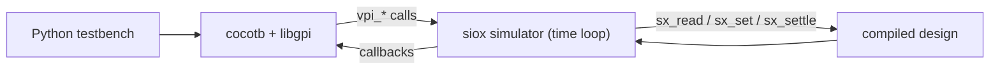

# Interoperability

How siox talks to the outside world: foreign C functions, file I/O, editors, and
driving a compiled design from cocotb.

## Foreign functions (`extern "C"`)

A design or testbench may call C functions declared `extern "C"`:

```siox
extern "C" fn sin(x: real) -> real;
```

Only the `"C"` ABI is supported. Its current contract is deliberately scalar:

- `real` maps to C `double`.
- `integer`, including aliases and constrained forms, maps to a signed 64-bit
  ABI word.
- A packed numeric type from 1 through 64 bits maps to an unsigned 64-bit ABI
  word; the result is converted to its declared storage width.

Every declaration must have a scalar return value. Generic declarations,
statement-only/void calls, structs, arrays, characters, and packed values wider
than 64 bits are rejected during type checking because the backends do not yet
have C layout or multiword-call rules for them. Wrap such an API in a C adapter
that accepts and returns the scalar types above. Calls are usable in
combinational expressions, clocked logic, and testbenches.

In the **native binary**, symbols resolve at link time. The math library is
linked by default, so the `std::math` surface — `sin`, `sqrt`, … — works out of
the box. Other symbols may be resolved by a consumer linking a compiler-emitted
object; the generated native test executable does not yet accept custom library
search paths or `-l` options.

## File I/O

Testbenches can read fixtures from disk with `read<T>` and `exists` (in
`std::fs`). Paths resolve **relative to the source file**, so a test
and its data travel together:

```siox
let rom: unsigned[16][256] = read<unsigned[16]>("rom.bin");
let raw: integer = read<integer>("word.bin");
let banner: string = read<string>("banner.txt");
```

In a native `--test` binary these reads happen when the generated executable
runs. `read<string>` decodes UTF-8. `read<integer>` reads raw little-endian
binary, and `read<T>` for a packed numeric type applies the ordinary
`T(integer)` construction to each value. Each numeric value consumes
`ceil(T'length / 8)` bytes. A fixed target keeps its declared length (short
files zero-fill; long files fail), while an unconstrained `string` owns a
dynamic Unicode code-point buffer. Missing files, invalid UTF-8, and capacity
failures fail the test with the operation and path. Hardware/top initializers
remain different by design: the same call is a compile-time ROM image baked
into the object.

## Editor support (`siox-lsp`)

The separate [`siox-lsp`](https://github.com/Siox-lang/siox-lsp) repository
speaks LSP over stdin/stdout and references the compiler core through Cargo Git:

```bash
git clone git@github.com:Siox-lang/siox-lsp.git
cargo build --manifest-path siox-lsp/Cargo.toml
siox-lsp/target/debug/siox-lsp --stdio --std /path/to/sioxc/std
```

Point your editor at that command for the `siox` language; `--std <dir>` locates
the standard library (default `./std`). It provides:

- Live lexer / parser / name-resolution / type-check diagnostics.
- Definition and type-definition navigation, references, highlights, safe rename.
- Hover, contextual completion, signature help, parameter hints.
- Semantic tokens, document/workspace symbols, folding and selection ranges.
- Quick fixes (suggested names, removable unused imports) and std import links.
- Canonical whole-document formatting for comment-free source.

**Limitations:** formatting returns no edit when comments are present (the
canonical printer does not yet retain comment trivia, so it declines rather than
delete them); cross-file user-module analysis follows the compiler's current
single-entry-file limitation (std modules load transitively).

### Compiler embedding API

Editors and future project tools should compile through `siox::compiler`, not
call the individual passes themselves. A frontend-only consumer can avoid the
LLVM dependency:

```toml
[dependencies]
siox = { git = "https://github.com/Siox-lang/sioxc", default-features = false }
```

Then compile a disk file or an unsaved editor buffer through the same request
boundary:

```rust
use siox::compiler::{CompileRequest, Compiler, Emit, SourceInput};

let compiler = Compiler::new("/path/to/sioxc/std");
let request = CompileRequest::new(
    SourceInput::memory("/workspace/design.siox", current_editor_text),
    Emit::Metadata,
);
let compilation = compiler.compile(request);

for diagnostic in compilation.diagnostics() {
    // Map diagnostic.primary through compilation.sources into an LSP range.
}
```

`SourceInput::Path` reads a disk file; `SourceInput::Memory` preserves the
document path while using unsaved text. A `Compilation` retains the source map,
entry tokens and modules, and each completed `Resolved`, `Typed`, `Hierarchy`,
and `Design` product. Language errors are structured diagnostics and do not
discard earlier products. Host failures such as an unreadable file, ambiguous
top selection, invalid codegen IR, or unavailable backend are represented by
`CompileFailure`. The API writes no terminal output and never executes an
artifact, so a host remains responsible for presentation, caching, process
execution, and project discovery.

`Emit::Metadata`, `Source`, `Tokens`, `Ast`, `Tree`, and `Ir` work in the
frontend-only build. `Emit::LlvmIr`, `Object`, and `TestExecutable` return a
backend-unavailable `CompileFailure` unless the `llvm` feature is enabled.
File artifacts require an output path when the host wants to control their
location; `CompileRequest::with_output` sets it. The compiler writes the
artifact but still never launches it.

## cocotb

A design can be driven from Python by cocotb:

```sh
pip install cocotb
cargo build --features cocotb        # off by default
sioxc --cocotb counter.siox -o counter.sim
COCOTB_TEST_MODULES=test_counter COCOTB_TOPLEVEL=Counter ./counter.sim
```

The `cocotb` Cargo feature is opt-in: it is only useful with cocotb installed,
and it carries a VPI layer no other build needs. A `sioxc` built without it
answers `--cocotb` by saying so.

`--cocotb` builds the `#[top]` entity, not `#[test]` entities: with cocotb the
Python module *is* the testbench, so asking for both is rejected rather than
silently producing one of them.

```python
import cocotb
from cocotb.triggers import Timer

@cocotb.test()
async def counts(dut):
    dut.rst.value = 1
    dut.en.value = 1
    await Timer(1, unit="ns")
    for _ in range(7):
        dut.clk.value = 0
        await Timer(5, unit="ns")
        dut.clk.value = 1
        await Timer(5, unit="ns")
    assert int(dut.count.value) == 7
```

### How it fits together

cocotb is not a library a simulator calls. It ships `libcocotbvpi_*.so`, which
registers itself through `vlog_startup_routines_bootstrap` and then calls back
into the `vpi_*` symbols the *simulator* exports — sixteen of them. So the
artifact `--cocotb` produces is an executable that owns the time loop and
answers those calls, with the compiled design linked in behind the same
`sx_reset`/`sx_read`/`sx_set`/`sx_settle` ABI everything else uses. Nothing in
the VPI layer knows how a design is lowered.



cocotb owns time. The design has no self-timed events of its own once it is a
`#[top]` rather than a testbench, so when nothing is scheduled the run is over.

Where cocotb lives is discovered by running `cocotb-config`, so a virtualenv
works with no configuration beyond having its `bin` on `PATH`; set
`SIOX_COCOTB_CONFIG` to point elsewhere. The interpreter cocotb was installed
into is baked into the executable, so `PYGPI_PYTHON_BIN` need not be set.

### What a handle means

- **Names** are siox paths. `dut.count` is the root's port; `dut.sub.a` reaches
  into a child instance. The scope tree is reconstructed from the flat dotted
  signal paths.
- **Bit order.** siox counts element 0 as the *least* significant, so a vector
  is reported to cocotb as `[width-1 : 0]`. That makes `dut.count.value[0]` and
  siox's `count[0]` the same bit while keeping `int()` correct — the opposite
  choice yields a plausible-looking integer that is bit-reversed.
- **Width** is the storage width, and values wider than 64 bits cross the ABI a
  word at a time.
- **Direction** is real for the root's ports; everything internal is reported
  as an output, since only a port is drivable from outside.
- **A `Logic` port** is an enum, and its value is the variant's discriminant —
  `0` and `1` are `'0'` and `'1'`, the rest follow `std/logic.siox`.

### Limits

- Only the first `#[top]` root is exposed.
- `vpi_put_value` applies immediately; the inertial/`NBA` distinction is not
  modelled, so cocotb's write scheduling is honoured by phase but not by delay.
- Force and release are not implemented.
- No waveform is written from a cocotb run; use `sioxc --test` with `-o` for
  that.
