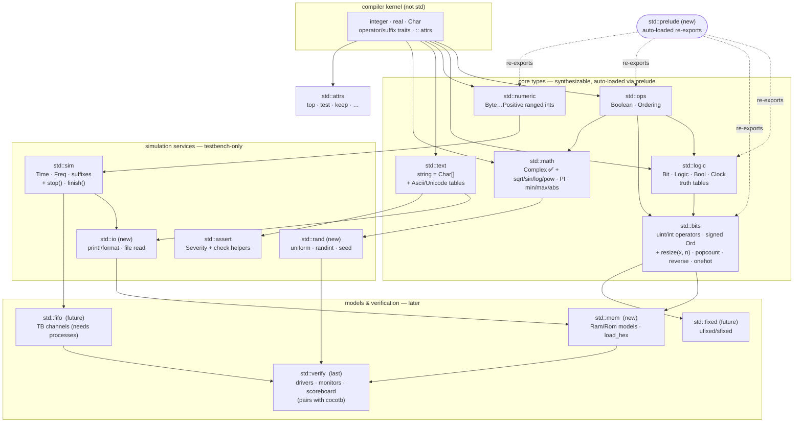

# The siox standard library — proposal

Status: **proposal** (2026-07-10). Companion to [std.md](../std.md), which
documents what exists today; this note is the target picture and build order.

## Design principles

1. **The kernel stays minimal.** The compiler owns three base types
   (`integer`, `real`, `Char`) and the *mechanisms* — operator/suffix trait
   inlining, `::` metadata attributes, enums/structs/arrays. Everything with
   domain semantics is std source. Proven pattern: `Logic` truth tables,
   `Complex`, and `int`'s signed `Ord` are already library code.
2. **One concept, one module.** Small files named by what they define, like
   VHDL packages — not a kitchen-sink `util`.
3. **Simulation-first, synthesis-aware.** Everything in the *types* layer must
   be synthesizable later (pure functions, no state); the *simulation* layer
   (io, rand, time) is testbench-only, like VHDL's textio or SV's `$display`.
4. **A prelude ends import drift.** Today a file that never imports
   `std::bits` silently falls back to kernel word semantics. A tiny
   auto-loaded `std::prelude` (like VHDL's implicit `std.standard`, Rust's
   prelude) makes the core types and their operators always mean one thing.

## What the ancestors teach

| Concern | VHDL | Verilog / SV | SystemC | siox home |
| --- | --- | --- | --- | --- |
| Scalar logic | `std_logic_1164` (9-value `std_ulogic`) | `logic` (4-value, builtin) | `sc_logic`/`sc_lv` (4-value) | `std::logic` (4-value ✅) |
| Vector numerics | `numeric_std` (`unsigned`/`signed`) | packed vectors (builtin) | `sc_int`, `sc_bigint` | `std::bits` ✅ |
| Conversions/resize | `numeric_std` (`resize`, `to_integer`) | `$unsigned`, casts | constructors | language `T(x)` form (**gap**) |
| Ranged scalars | subtypes (`natural`, `positive`) | — | — | `std::numeric` ✅ |
| Real math | `math_real` (sqrt, sin, log, uniform) | `$sqrt`… (SV) | `<cmath>` | `std::math` (**gap**) |
| Complex | `math_complex` | — | — | `std::math` ✅ |
| Fixed point | `fixed_pkg` (2008) | — | `sc_fixed` ★ | `std::fixed` (**future**) |
| Time/units | `std.standard` `time` | timescale directive | `sc_time` | `std::sim` ✅ |
| Text/strings | `std.standard` `string` | `string` (SV) | `std::string` | `std::text` (partial) |
| TB output | `textio` (`write`/`report`) | `$display`/`$monitor` ★ | `cout`/`sc_report` | `std::io` (**gap**) |
| Memory load | `textio` file read | `$readmemh` ★ | user code | `std::mem` (**gap**) |
| Randomization | `math_real.uniform` | `$random`, `randomize()` ★ | `rand()` | `std::rand` (**gap**) |
| Assertions | `assert … severity` | SVA, `$fatal…` | `sc_assert`/`sc_report` | `std::assert` (partial) |
| Sim control | `std.env` (`stop`/`finish`) | `$stop`/`$finish` | `sc_stop` | `std::sim` (**gap**) |
| TB channels | — | mailbox/semaphore (SV `std`) | `sc_fifo` ★ | `std::fifo` (**future**) |
| Verification framework | — (OSVVM external) | UVM (external) | — | `std::verify` (**last**, with cocotb) |
| Metadata | attributes (`'foo`) | `(* attr *)` | — | `std::attrs` ✅ |

★ = the feature siox should copy from that ancestor specifically: SV's
`$display`/`$readmemh`/`$random` ergonomics, SystemC's `sc_fixed` and
`sc_fifo` shapes.

## Module map

Arrows are `using` dependencies (a module imports the one above it). The
layers are load-bearing: **core** must stay pure/synthesizable, **simulation
services** may touch the runner (time, io, randomness), **models** build on
both. `std::attrs` stands alone (metadata only). Nothing in a lower layer may
import from a higher one — same layering rule as the compiler crates.

## Per-module contents (target)

**`std::prelude` ✅.** Re-exports what every file wants: `Bit`, `Logic`,
`Bool`, `Clock`, `uint`, `int`, `Boolean`, `Ordering`, `string`, the time
suffixes. Auto-loaded by the compiler (a std root without `prelude.siox` is
skipped silently — bare-kernel setups keep working); `--no-prelude` escape
hatch later if wanted.

**`std::ops`.** As today: `Boolean`, `Ordering`. Future: the reserved
`ops::custom<"sym", Rhs>` hook for user operators.

**`std::logic`.** As today (4-value `Logic` is deliberately reduced from
VHDL's 9 — 'U'/'W' fold into 'X'). Add: `to_bit(Logic) -> Bit`, `is_defined`,
and **`impl Resolve for Logic`** (below).

**Resolution (`Resolve` trait, in `std::ops`).** VHDL's resolved-signal model,
as a trait instead of a language feature: `fn resolve(self, other: Self) ->
Self`, an associative+commutative fold. When one signal has **multiple driver
contexts**, the compiler folds them with the type's `resolve`
(`resolve(d1, resolve(d2, …))`, inlined like any operator impl); a type
*without* the impl makes multiple drivers an **elaboration error** — VHDL's
unresolved-type safety rule, replacing today's silent last-wins. This is the
prerequisite for `inout` port semantics and tristate buses ('Z' finally does
something). Strength levels (weak 'H'/'L', pull-ups/open-drain) stay out
until Phase 2/3 board modelling; widening `Logic` later only grows the
`resolve` body. Slot: after S2.

**`std::bits`.** Operators ✅. **No `to_integer`/`to_unsigned`** — those are
VHDL toll booths for a type wall siox didn't build (uint/int already accept
`integer`; mixed arithmetic coerces). The fundamental conversion mechanism
is the language-level form **`T(x)`**: `uint[16](x)` resizes, `integer(x)`
crosses to the kernel, and zero- vs sign-extension falls out of the target
type. **`resize(x, n)` stays** as std sugar over `T(x)`, VHDL-spelled — because
the language is fully static, a value argument in width position *is* a
generic argument (`n` must be const-evaluable at elaboration, same engine as
`uint[W+1]` widths), so no generic-fn machinery is needed. And it is
*family-preserving*: it changes width while keeping uint/int-ness (and thus
the right extension) — parameterized code writes `resize(x, W + 1)` without
re-stating the type family the way `uint[W+1](x)` must. Plus the genuinely
computational: `popcount`, `reverse`, `onehot`, and the bitwise masking
helpers. Signed `Div`/arithmetic `Shr` ✅ (std source, via `resize` + `self::width`).

**`std::numeric`.** As today. Add `clog2(n)` (address-width helper — SV's
`$clog2`, used constantly for parameterized designs).

**`std::math`.** `Complex` ✅. Add `math_real`'s core over kernel `real`:
`sqrt`, `sin`, `cos`, `exp`, `log`, `pow`, `floor`, `ceil`, `round`,
constants `PI`/`E`, and `abs`/`min`/`max` for `integer` + `real`. (Needs
plain function calls in expressions — the main language gap this layer
exposes.)

**`std::text`.** `string` ✅. Add the promised encoding tables (`Ascii`,
`Unicode`: `encode(Char) -> integer`, `decode(integer) -> Char`),
`to_string(integer)`, string equality via `Ord`.

**`std::sim`.** `Time`/`Freq` ✅. Add `stop()` (pause with status) and
`finish()` (end simulation) — `std.env`/`$finish`; runner-implemented.

**`std::io` (new).** Testbench printing — SV's killer ergonomics:
`print!("count={}", count)` (runner-implemented like `assert!`), plus
`read_lines(path)` for stimulus files. Testbench-only.

**`std::rand` (new).** `uniform() -> real`, `randint(lo, hi)`, `seed(n)` —
deterministic default seed so tests reproduce; the seed is printed on
failure (SV-style repro).

**`std::assert`.** `Severity` ✅. Add `check!(cond)` variants with severity,
`expect_eq!(a, b)` printing both values on failure (needs std::io).

**`std::mem` (new).** `Ram<W, DEPTH>` / `Rom<W, DEPTH>` entities +
`load_hex(path)` initialization (`$readmemh`). First real *library
hardware*, exercising generics + memories end to end.

**`std::fixed` (future).** `ufixed`/`sfixed` after SystemC's `sc_fixed` /
VHDL's `fixed_pkg` — valuable for DSP, but gated on the width/typing work
maturing; do not start before `std::bits` conversions are done.

**`std::fifo` (future).** `sc_fifo`-shaped testbench channels; needs
processes (`loop { await … }`) first.

**`std::verify` (last).** Drivers/monitors/scoreboards — designed together
with the cocotb bridge so one verification model serves both native and
Python testbenches.

## Build order (the gap-filling roadmap)

| Phase | Items | Unblocks / needs |
| --- | --- | --- |
| **S1** ✅ | `std::prelude` + auto-load | done — bare files get signed int, Logic tables, `10ns` |
| **S2a** ✅ | `T(x)` conversions + `resize(x, n)` + signed `Div`/arith `Shr` for `int` in std | done — sign/zero-extension from families; std source only |
| **S2c** | free functions in expressions (fn-call lowering) | the keystone for math/popcount/clog2 |
| **S2b** | `Resolve` trait + `impl Resolve for Logic`; multi-driver contexts fold or error | IR multi-context detection; unblocks `inout` |
| **S3** | `std::io.print!` + `std::sim.stop/finish` | runner builtins, like `assert!` |
| **S4** | `std::math` real functions + `clog2`, `abs/min/max` | same fn-call lowering; JIT maps to libm |
| **S5** | `std::rand`, `std::assert` helpers | S3 |
| **S6** | `std::mem` (Ram/Rom + `load_hex`) | S2 + S3 |
| **S7** | `std::text` encodings, `to_string` | S2 |
| **S8** | `std::fixed`, `std::fifo`, `std::verify` | processes; cocotb timing |

The through-line: **S2's "functions callable in expressions" is the keystone**
— nearly every module past the prelude wants ordinary `fn` calls (not just
operator-trait inlining) working in hardware and testbench expressions. That
should be the next compiler feature, driven by the std's needs.
