# Siox Runtime Process-Slice Scheduler

**Status:** Proposal  
**Component:** Siox Runtime / Simulator  
**Target:** Multicore CPU execution  
**Primary goal:** Efficiently execute large numbers of Siox processes across a bounded number of OS threads while preserving deterministic HDL semantics.

---

## 1. Summary

Siox processes should not map one-to-one onto operating-system threads.

A hardware design may contain thousands or potentially millions of independent processes. Creating one OS thread per process introduces excessive scheduling overhead, memory usage, context switching, and poor scalability.

Instead, the Siox runtime should represent each HDL process as a lightweight runtime object. These processes execute in **process slices** on a bounded pool of worker threads.

A process slice runs from the point at which a process becomes runnable until it reaches a semantic suspension or synchronization point, such as:

- `wait`
- clock edge wait
- signal event wait
- timed delay
- explicit synchronization
- process completion

The runtime scheduler distributes runnable slices across a configurable number of OS threads.

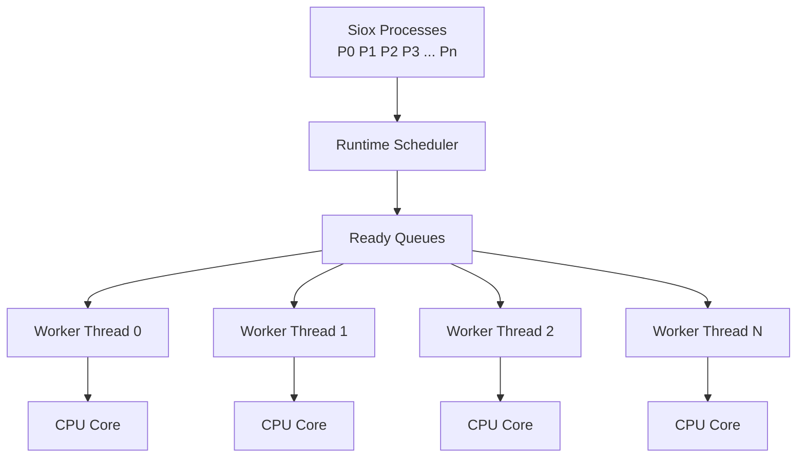

The number of Siox processes is therefore independent of the number of operating-system threads.

For example:

```text
50,000 Siox processes
        ↓
8 worker threads
        ↓
up to 8 CPU cores
```

---

# 2. Motivation

A direct mapping such as:

```text
1 Siox process = 1 OS thread
```

is undesirable.

OS threads are relatively heavyweight resources. Each thread introduces:

- stack allocation
- operating-system scheduler state
- synchronization overhead
- context switching
- cache disruption
- kernel scheduling overhead

Large HDL simulations commonly contain far more processes than the number of available CPU cores.

For example:

```text
Processes:      100,000
CPU cores:           16
```

Creating 100,000 threads to ultimately execute work on 16 cores would provide little benefit while substantially increasing runtime overhead.

Instead:

```text
100,000 lightweight processes
             ↓
        Siox scheduler
             ↓
       16 worker threads
             ↓
        16 CPU cores
```

This is conceptually closer to asynchronous runtimes, green threads, fibers, or task schedulers than traditional process-per-thread execution.

---

# 3. Design Goals

The scheduler should satisfy the following goals.

## 3.1 Lightweight Processes

A Siox process should primarily contain:

- execution state
- program counter or continuation
- local variables
- sensitivity information
- wait state
- pending signal updates
- process metadata

A process should not own an operating-system thread.

---

## 3.2 Bounded Parallelism

The runtime must allow the number of worker threads to be configured independently of the design.

Example:

```bash
siox sim design.siox --threads 8
```

The same design should be able to run using:

```bash
siox sim design.siox --threads 1
```

or:

```bash
siox sim design.siox --threads 32
```

without changing the semantics of the simulated design.

---

## 3.3 Deterministic Simulation

Simulation results must not depend on:

- host thread timing
- operating-system scheduling
- CPU core assignment
- work-stealing order
- execution speed of individual workers

The following must therefore produce identical logical results:

```text
--threads 1
--threads 4
--threads 16
```

---

## 3.4 Efficient Multicore Scaling

Independent processes should execute concurrently whenever possible.

The runtime should minimize:

- global locks
- shared mutable state
- cross-thread contention
- operating-system context switches

---

## 3.5 HDL-Aware Scheduling

The runtime should schedule processes according to HDL simulation semantics rather than generic wall-clock scheduling.

A process should normally execute until it reaches a well-defined suspension boundary.

---

# 4. Process Slices

The fundamental scheduling unit is a **process slice**.

A process slice is defined as:

> The execution of a Siox process from a resume point until its next semantic suspension, synchronization, or completion point.

Conceptually:

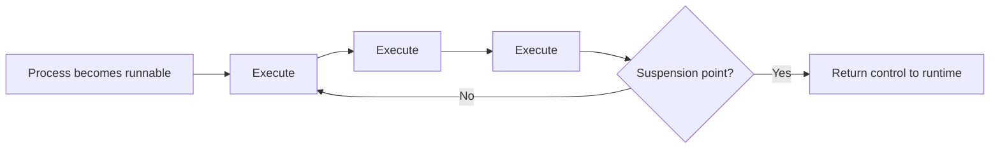

Possible suspension points include:

```text
wait clk.rising()
wait signal.changed()
wait 10 ns
barrier
process completion
```

This avoids arbitrary preemptive time slicing.

The runtime therefore does not need to interrupt processes after arbitrary time intervals such as:

```text
run for 2 ms
preempt
resume later
```

Instead, scheduling follows natural HDL execution boundaries.

---

# 5. High-Level Runtime Architecture

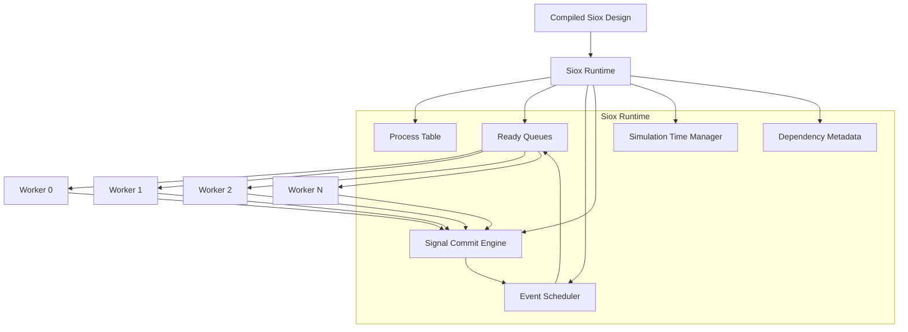

The primary runtime components are:

1. process table
2. worker pool
3. ready queues
4. event scheduler
5. signal update buffers
6. deterministic commit engine
7. simulation-time manager
8. optional dependency information

---

# 6. Process Representation

A process may conceptually be represented as:

```rust
struct Process {
    id: ProcessId,

    state: ProcessState,

    continuation: Continuation,

    locals: LocalStorage,

    sensitivity: EventSet,

    pending_writes: WriteBuffer,
}
```

Possible process states:

```rust
enum ProcessState {
    Ready,
    Running,
    WaitingEvent,
    WaitingTime,
    Blocked,
    Finished,
}
```

The exact representation depends on the compiler/runtime ABI.

Possible execution implementations include:

- explicit state machines
- stackless coroutines
- compiler-generated continuations
- fibers
- LLVM coroutine lowering
- custom IR continuation points

A stackless continuation model is likely preferable because it minimizes memory usage per process.

---

# 7. Worker Thread Pool

The runtime starts a fixed number of worker threads.

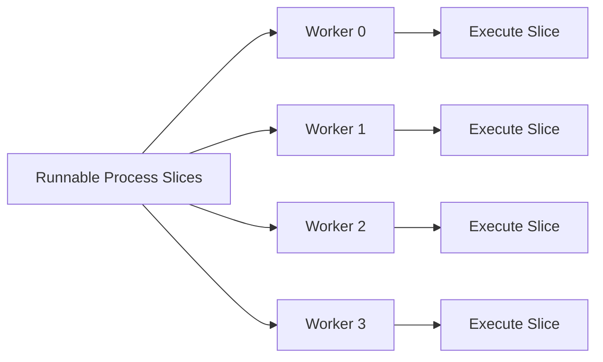

Each worker repeatedly performs approximately:

```rust
loop {
    let process = scheduler.next_ready();

    let result = process.run_until_suspend();

    scheduler.handle_result(process, result);
}
```

A worker does not permanently own a process.

For example:

```text
Worker 0:
    P7 slice
    P42 slice
    P2 slice
    P91 slice

Worker 1:
    P3 slice
    P18 slice
    P77 slice

Worker 2:
    P11 slice
    P13 slice
    P42 slice
```

A process may therefore execute on different workers at different points in simulation.

---

# 8. Process Lifecycle

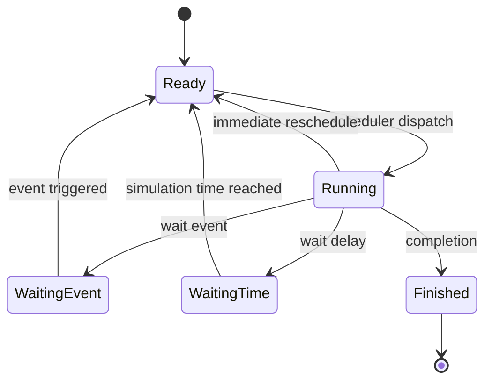

A process only enters the worker pool when it is runnable.

Waiting processes consume effectively no CPU resources.

---

# 9. Deterministic Signal Updates

Directly modifying globally visible signal state from worker threads creates race conditions and scheduling-dependent behavior.

Consider:

```text
P0 writes A
P1 reads A
```

If both execute simultaneously, the result must not depend on which CPU happens to execute first.

The runtime should therefore separate:

1. evaluation
2. write collection
3. commit

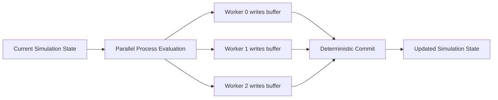

Conceptually:

```text
read stable state
      ↓
parallel process execution
      ↓
buffer signal writes
      ↓
synchronization
      ↓
commit updates
      ↓
generate events
      ↓
schedule dependent processes
```

This model helps ensure that:

```text
threads = 1
```

and:

```text
threads = 32
```

produce the same simulated behavior.

---

# 10. Delta-Cycle Execution

A simulation phase may operate approximately as:

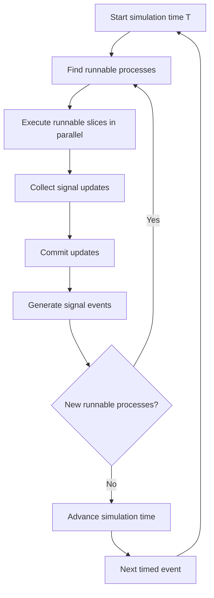

Multiple delta cycles may occur at the same simulation time.

Example:

```text
T = 10 ns
  Delta 0
  Delta 1
  Delta 2
  Delta 3

T = 15 ns
  Delta 0
```

Simulation time only advances when no further immediate events remain.

---

# 11. Parallel Execution Model

Suppose four runnable processes exist:

```text
P0
P1
P2
P3
```

The scheduler may execute:

```mermaid
gantt
    title Example Parallel Process Slice Execution
    dateFormat X
    axisFormat %L

    section Worker 0
    P0 :0, 4
    P3 :4, 7

    section Worker 1
    P1 :0, 3

    section Worker 2
    P2 :0, 5
```

The exact wall-clock order does not matter as long as logical simulation ordering remains deterministic.

---

# 12. Dependency-Aware Scheduling

The compiler may provide process read/write metadata.

For example:

```text
P0:
    writes A

P1:
    writes B

P2:
    reads A

P3:
    writes C
```

This forms a dependency structure:

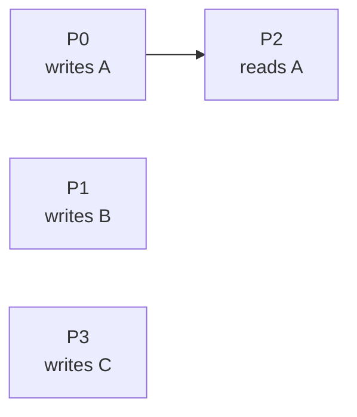

Processes without conflicting dependencies may execute simultaneously.

For example:

```text
Parallel:
P0
P1
P3

Dependent:
P2
```

However, dependency analysis should be considered an optimization rather than a fundamental correctness requirement.

Buffered writes plus deterministic phase boundaries already provide a safe execution model.

Dependency metadata can later improve:

- scheduling locality
- avoiding unnecessary barriers
- parallel region formation
- static task grouping

---

# 13. Ready Queues

The initial implementation may use a single global ready queue.

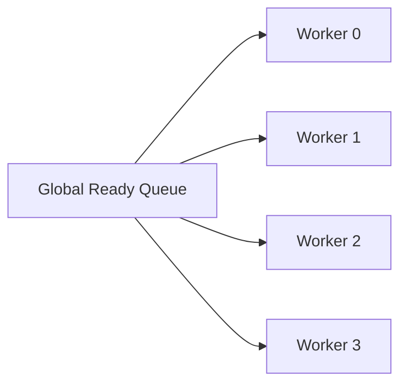

This is simple but may become contended for large simulations.

A scalable implementation should eventually use per-worker queues.

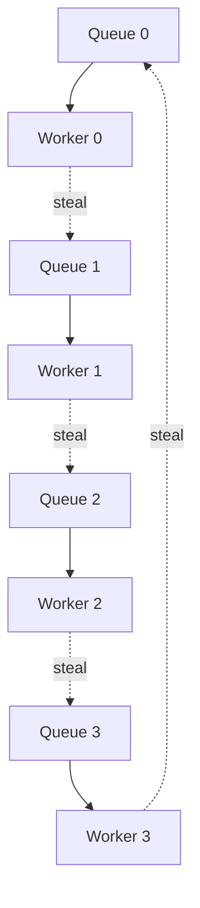

---

# 14. Work Stealing

When a worker has no local work, it may steal process slices from another worker.

Example:

```text
Worker 0 queue: P1 P2 P3 P4
Worker 1 queue: empty
```

Worker 1 may steal:

```text
P3 P4
```

resulting in:

```text
Worker 0:
P1 P2

Worker 1:
P3 P4
```

This improves load balancing without requiring a heavily contended global queue.

The logical execution order must remain independent of stealing behavior.

---

# 15. Scheduler Data Flow

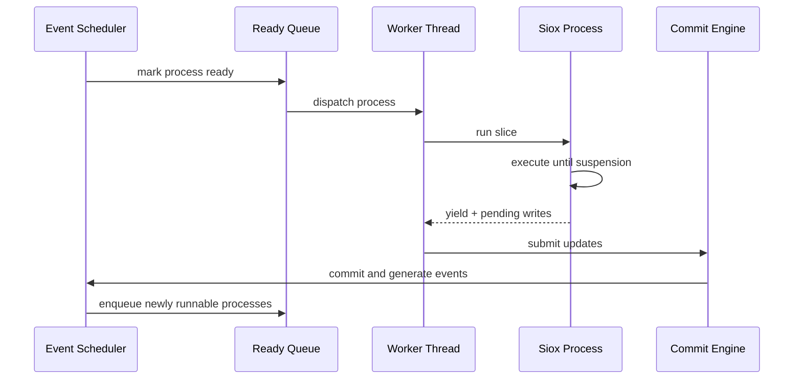

---

# 16. Runtime Scheduling Result

Process execution should return a structured result.

Conceptually:

```rust
enum SliceResult {
    WaitEvent(EventId),
    WaitTime(SimTime),
    ReadyAgain,
    Finished,
}
```

Worker behavior:

```rust
match process.run_slice() {
    SliceResult::WaitEvent(event) => {
        scheduler.register_event(process, event);
    }

    SliceResult::WaitTime(time) => {
        scheduler.register_timer(process, time);
    }

    SliceResult::ReadyAgain => {
        scheduler.enqueue(process);
    }

    SliceResult::Finished => {
        scheduler.complete(process);
    }
}
```

---

# 17. Compiler Responsibilities

The Siox compiler should lower processes into a runtime-compatible continuation form.

For example:

```siox
process {
    foo();

    wait clk.rising();

    bar();

    wait ready.changed();

    baz();
}
```

could conceptually become:

```text
state 0:
    foo()
    wait clk.rising()
    continuation = state 1
    yield

state 1:
    bar()
    wait ready.changed()
    continuation = state 2
    yield

state 2:
    baz()
    finish
```

This avoids requiring an independent native stack for every HDL process.

---

# 18. Compiler/Runtime ABI

The compiler and runtime need a stable process ABI.

Possible interface:

```rust
trait RuntimeProcess {
    fn resume(
        &mut self,
        context: &SimulationContext,
    ) -> SliceResult;
}
```

The runtime must also expose operations for:

```text
read signal
schedule signal write
wait event
wait time
emit event
finish process
```

Conceptually:

```rust
ctx.read(signal);

ctx.write(signal, value);

ctx.wait_event(event);

ctx.wait_until(time);
```

Actual implementation should avoid dynamic dispatch where possible.

---

# 19. Thread Count Configuration

The runtime should expose worker configuration independently of source code.

Example:

```bash
siox sim design.siox --threads 8
```

Possible options:

```text
--threads N
--threads auto
--threads physical
```

Meaning:

```text
--threads 1
    deterministic single-thread execution

--threads 8
    eight runtime workers

--threads auto
    runtime chooses suitable worker count

--threads physical
    use physical CPU core count
```

---

# 20. CPU Affinity

CPU affinity may optionally be supported.

Example:

```bash
siox sim design.siox \
    --threads 8 \
    --cpu-affinity 0-7
```

This may improve:

- cache locality
- benchmarking consistency
- NUMA behavior
- high-core-count workstation performance

However, affinity should be a runtime optimization rather than part of simulation semantics.

---

# 21. Single-Thread Mode

A single-thread execution mode is important for:

- debugging
- deterministic reproduction
- profiling
- scheduler validation
- correctness testing

```bash
siox sim design.siox --threads 1
```

The execution architecture remains identical.

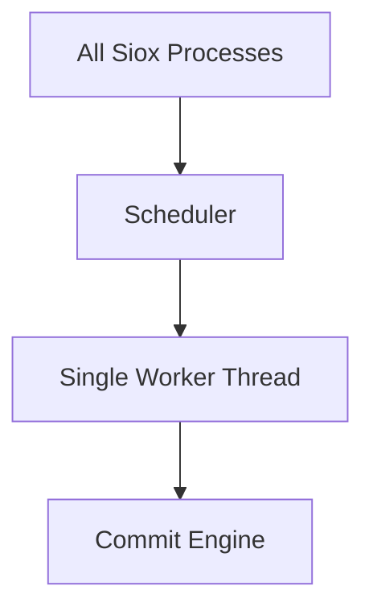

The only difference is the number of workers.

---

# 22. Runtime Invariants

The scheduler should maintain the following invariants.

## 22.1 One Active Slice per Process

A process may not execute simultaneously on multiple workers.

```text
P3 on Worker 0
AND
P3 on Worker 2
```

must never occur.

---

## 22.2 Stable Read Phase

Processes within the same evaluation phase observe a consistent committed signal state.

---

## 22.3 Buffered Writes

Signal modifications are not immediately globally visible during parallel evaluation.

---

## 22.4 Deterministic Commit

Write resolution and signal updates must follow deterministic HDL semantics.

---

## 22.5 Thread-Independent Semantics

The logical result must remain invariant with worker count.

Formally:

\[
Simulation(D, 1)
=
Simulation(D, N)
\]

for any valid worker count \(N\), ignoring performance characteristics.

---

# 23. Locking Strategy

Global locking should be minimized.

Potential shared components include:

```text
event queues
timer queues
signal commit queues
scheduler state
statistics
```

Prefer:

- per-worker queues
- lock-free structures where beneficial
- batched writes
- thread-local buffers
- phase barriers
- atomic state transitions

Avoid:

```text
mutex around every signal access
```

because this would severely reduce parallel scalability.

---

# 24. Thread-Local Write Buffers

Each worker may maintain a local write buffer.

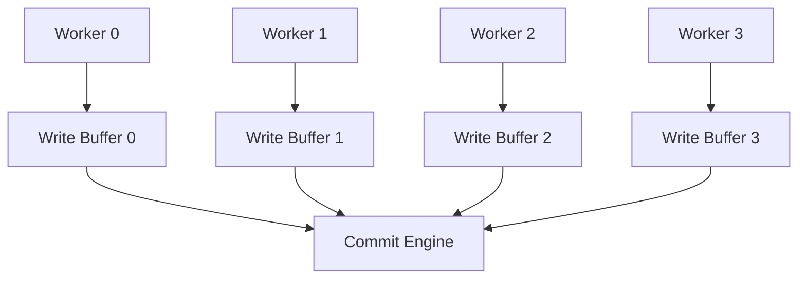

Benefits include:

- fewer locks
- better cache locality
- batched commits
- lower contention

---

# 25. Barrier Model

A simple implementation may use a phase barrier.

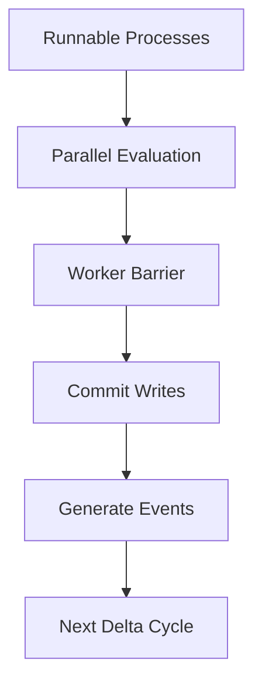

This is straightforward and deterministic.

Later implementations may reduce barrier frequency if profiling shows it to be a scalability bottleneck.

---

# 26. Scheduling Granularity

The scheduler should avoid slices that are too small.

Excessively small slices introduce:

- queue overhead
- atomic operations
- synchronization
- cache misses

Likewise, extremely long slices may reduce load balancing.

HDL suspension points naturally provide a good default granularity.

Compiler optimizations may later combine extremely small processes into larger scheduling units.

---

# 27. Process Grouping

The runtime or compiler may optionally group small processes.

For example:

```text
P0
P1
P2
P3
```

could become:

```text
Task Group A:
    P0
    P1
    P2
    P3
```

when static analysis determines this is profitable.

This should be an optimization only.

The semantic model remains process-based.

---

# 28. Comparison with One-Thread-per-Process

## One Thread per Process

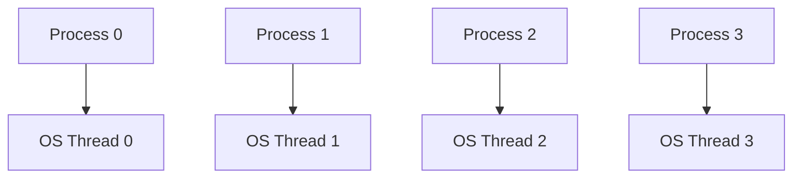

Problems:

- expensive
- high memory usage
- poor scalability
- excessive context switching
- operating-system scheduler controls execution behavior
- impractical for large designs

---

## Siox Process-Slice Model

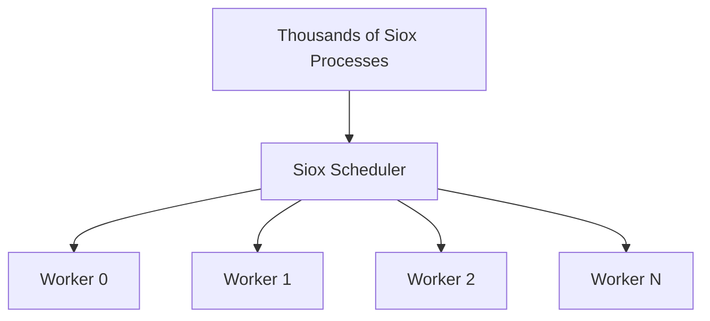

Advantages:

- lightweight process representation
- bounded number of native threads
- runtime-controlled scheduling
- deterministic semantics
- scalable multicore execution
- lower context-switch overhead

---

# 29. Similar Runtime Models

The design shares concepts with several existing runtime approaches.

## Async runtimes

Similar to:

```text
async task
↓
executor
↓
worker threads
```

but Siox uses HDL simulation events rather than asynchronous I/O readiness.

---

## Green threads

Processes are lightweight runtime-managed execution contexts rather than native OS threads.

---

## Work-stealing runtimes

Runnable work is dynamically distributed across worker queues.

---

## Discrete-event simulators

Execution proceeds according to logical simulation time and event dependencies rather than wall-clock time.

---

# 30. Conceptual Execution Example

Consider:

```siox
process {
    wait clk.rising();
    counter = counter + 1;
}

process {
    wait enable.changed();
    output = calculate(enable);
}

process {
    wait 10ns;
    watchdog();
}
```

The runtime may initially have:

```text
P0 → waiting for clk
P1 → waiting for enable
P2 → waiting until 10 ns
```

At time `10 ns`:

```text
P2 becomes ready
```

A clock edge may simultaneously make `P0` ready.

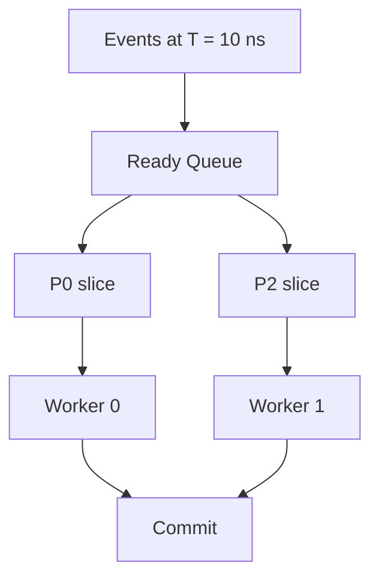

Both processes may execute concurrently.

---

# 31. Error Handling

Worker threads should not directly terminate the simulation process when encountering runtime errors.

Errors should propagate through the runtime.

Conceptually:

```rust
enum SliceResult {
    WaitEvent(EventId),
    WaitTime(SimTime),
    ReadyAgain,
    Finished,
    RuntimeError(RuntimeError),
}
```

The central runtime can then provide:

- source location
- process identity
- simulation time
- delta cycle
- backtrace
- worker identity

---

# 32. Debugging

Parallel execution makes debugging more difficult.

The runtime should therefore support:

```bash
siox sim design.siox --threads 1
```

and potentially:

```bash
siox sim design.siox --scheduler-trace
```

A trace may include:

```text
T=10ns Δ0 READY P14
T=10ns Δ0 RUN   P14 worker=2
T=10ns Δ0 WAIT  P14 clk.rising
T=10ns Δ0 RUN   P27 worker=1
T=10ns Δ0 WRITE P27 signal=data
T=10ns Δ0 COMMIT signal=data
```

---

# 33. Scheduler Statistics

The runtime may expose profiling information.

Example:

```text
Simulation threads:        8
Processes:             42,314
Slices executed:    8,912,771

Worker utilization:

Worker 0: 92%
Worker 1: 91%
Worker 2: 88%
Worker 3: 94%
Worker 4: 90%
Worker 5: 89%
Worker 6: 93%
Worker 7: 87%

Queue steals:         182,144
Commit phases:        913,214
Average ready depth:       41
```

This will be valuable for runtime optimization.

---

# 34. NUMA Considerations

Large server systems may contain multiple NUMA nodes.

Future implementations may improve locality by associating:

- processes
- signal state
- worker queues

with particular NUMA nodes.

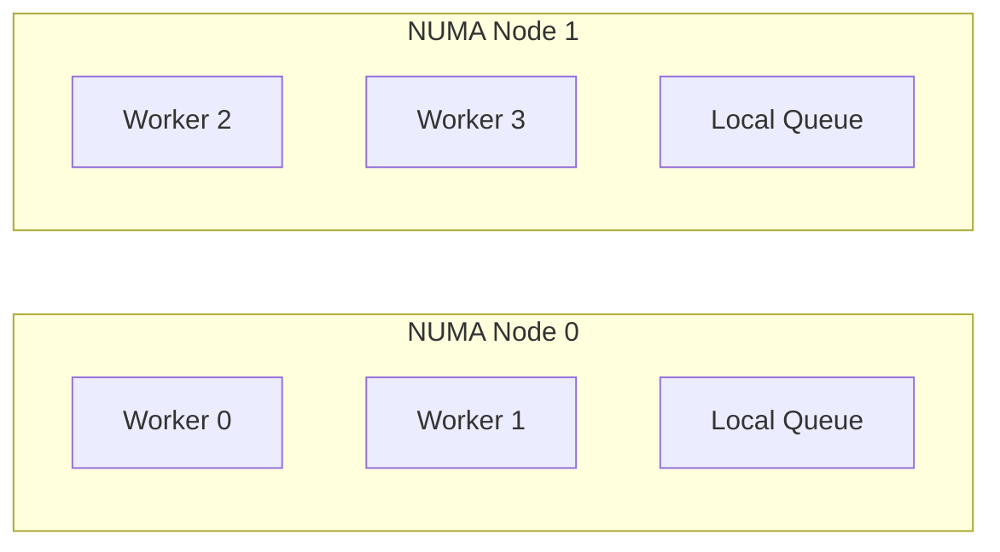

Cross-NUMA work stealing should occur less frequently than local stealing.

This is not required for the initial implementation.

---

# 35. Proposed Implementation Phases

## Phase 1 — Lightweight Process Runtime

Implement:

- process continuation representation
- process states
- event wait system
- timed wait system
- single-thread scheduler

Target:

```bash
siox sim design.siox --threads 1
```

---

## Phase 2 — Fixed Worker Pool

Add:

- configurable worker count
- global ready queue
- parallel slice execution
- synchronization barrier

Target:

```bash
siox sim design.siox --threads N
```

---

## Phase 3 — Deterministic Parallel Commit

Implement:

- thread-local write buffers
- deterministic signal commit
- parallel-safe event generation
- delta-cycle synchronization

---

## Phase 4 — Per-Worker Queues

Replace the global ready queue with:

- local worker queues
- queue balancing
- reduced contention

---

## Phase 5 — Work Stealing

Allow idle workers to steal runnable processes from busy workers.

---

## Phase 6 — Compiler Scheduling Metadata

Expose:

- process read sets
- process write sets
- event dependencies
- static process relationships

Use these for scheduler optimizations.

---

## Phase 7 — Advanced Runtime Optimization

Potential optimizations:

- process fusion
- NUMA scheduling
- affinity control
- adaptive worker counts
- priority queues
- scheduler profiling
- dependency-aware batching

---

# 36. Initial Scheduler Algorithm

A first implementation may use:

```text
while simulation_active:

    determine runnable processes

    enqueue runnable processes

    workers execute process slices

    wait until evaluation phase completes

    collect buffered writes

    deterministically commit signal updates

    generate resulting events

    if new immediate events exist:
        begin next delta cycle
    else:
        advance simulation time
```

In pseudocode:

```rust
while runtime.active() {
    runtime.populate_ready_queue();

    worker_pool.execute_ready();

    worker_pool.barrier();

    runtime.commit_signal_updates();

    runtime.generate_events();

    if !runtime.has_immediate_work() {
        runtime.advance_time();
    }
}
```

---

# 37. Architecture Overview

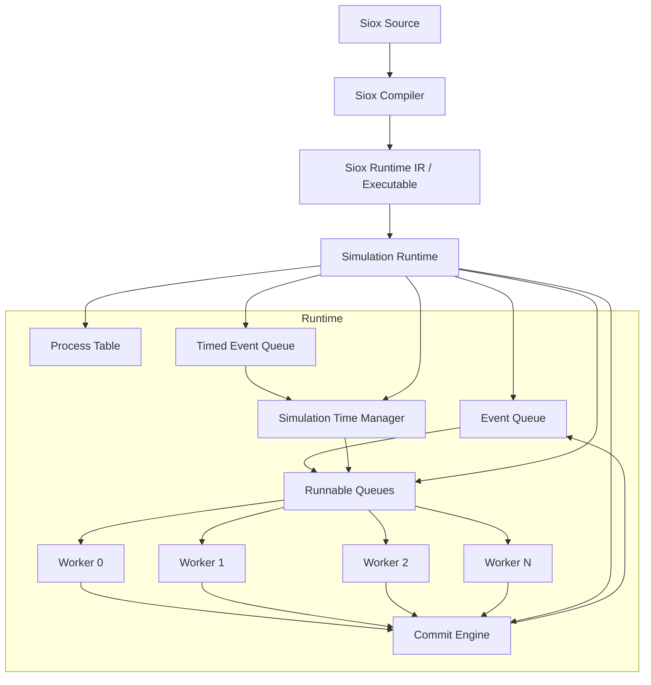

---

# 38. Key Architectural Principle

The distinction between **processes** and **threads** must remain explicit.

A Siox process represents:

> A logical hardware execution process.

A runtime worker thread represents:

> A host CPU execution resource used to evaluate Siox processes.

They are fundamentally different abstractions.

```text
Siox Process
    ≠
OS Thread
```

Instead:

```text
Siox Process
    ↓
Process Slice
    ↓
Runtime Scheduler
    ↓
Worker Thread
    ↓
CPU Core
```

---

# 39. Expected Benefits

This architecture provides:

- efficient simulation of large process counts
- bounded memory usage
- controllable CPU utilization
- deterministic parallel execution
- scalable multicore performance
- natural HDL event semantics
- low OS scheduling overhead
- future compatibility with advanced scheduling algorithms

Most importantly, it allows Siox source code to remain independent of host-machine parallelism.

A design may contain:

```text
100,000 processes
```

while the runtime may execute it using:

```text
1 worker
8 workers
32 workers
64 workers
```

without changing the design itself.

---

# 40. Recommendation

The Siox runtime should adopt a **bounded worker-pool process scheduler** rather than a one-thread-per-process model.

Processes should compile into lightweight resumable execution contexts.

The runtime should execute these contexts in semantic process slices bounded by synchronization points such as:

```text
wait
event
delay
barrier
completion
```

Parallel workers should evaluate slices against a stable simulation state and place signal updates into local buffers.

Updates should then pass through a deterministic commit stage before dependent processes are scheduled.

The resulting architecture is:

```mermaid
flowchart LR
    P["Siox Processes"] --> S["Process Slices"]
    S --> Q["Runtime Scheduler"]
    Q --> W["Bounded Worker Pool"]
    W --> E["Parallel Evaluation"]
    E --> C["Deterministic Commit"]
    C --> EV["Event Generation"]
    EV --> Q
```

This provides the desired abstraction:

> **Many Siox processes, few OS threads, scalable multicore execution, deterministic HDL semantics.**
