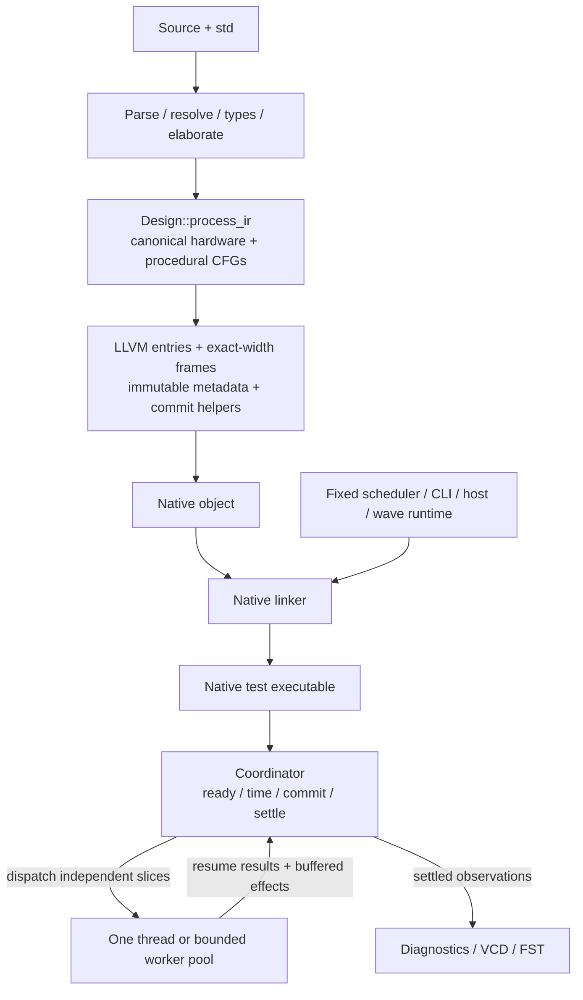

# Cooperative and parallel Process runtime

Status: proposal; multithreading is not implemented. Updated 2026-10-06.
Scope: the Phase 2 runtime optimization in [TODO.md](../../TODO.md#output),
not a replacement for the Phase 1 compiler pipeline.

## Decision

Keep many lightweight language processes on a bounded number of host threads.
With one thread, the runtime acts like a small cooperative RTOS: a process runs
until suspension, settling, completion or termination, then the scheduler runs
other ready processes. Simulation time is logical time, not a wall-clock time
slice. This is not a hard-real-time system or an OS-thread-per-process model.

With more threads, execute only proven-independent process slices concurrently.
Use the same canonical Process IR, LLVM entries and fixed scheduler in both
modes. Preserve one-thread behavior, including results, diagnostics, host effects
and VCD/FST output. Keep workers opt-in until correctness and measured throughput
justify them.

No new language keyword, coroutine system, interpreter, JIT, design-specific
generated C, or compiler-owned simulation runner is required.

## Existing implementation to extend

The compiler already has the continuation model this proposal needs:

| Existing boundary | Role |
| --- | --- |
| [src/ir/process.rs](../../src/ir/process.rs) | `Design::process_ir` owns `ProcessCfg`, block/value IDs, locals, persistent storage, activation, sensitivity, suspension and test descriptors. |
| [src/ir/lower/source_processes.rs](../../src/ir/lower/source_processes.rs) | Lowers procedural source into canonical CFGs alongside hardware CFGs; calls use ordinary CFG continuations. |
| [src/llvm/process/entry.rs](../../src/llvm/process/entry.rs) | Emits native entries resumed by `ProcessBlockId`; the runtime does not interpret source or IR. |
| [src/llvm/process/state.rs](../../src/llvm/process/state.rs) | Emits exact-width local/storage/loop frames, currently as object-owned mutable globals. |
| [src/llvm/process/metadata.rs](../../src/llvm/process/metadata.rs) | Exports immutable process/test tables, activations, sensitivities, layouts and source metadata under a versioned ABI. |
| [runtime/process.c](../../runtime/process.c) | Owns ready/resume state, event ordering, time, suspension, settling and host services; invokes emitted commit/change helpers. |
| [runtime/process.h](../../runtime/process.h) | Declares the fixed service ABI used by emitted entries. |
| [runtime/main.c](../../runtime/main.c) and [runtime/wave.c](../../runtime/wave.c) | Own executable test selection/reporting and waveform output. |

The existing native entry has this ABI shape:

```c
uint8_t entry(uint32_t resume_block);
```

Its status distinguishes completed, suspended, stopped, finished, settling and
unsupported execution. Timed, condition and settle resumes register through
runtime hooks. Completion does not permanently stop a reactive process: a later
sensitivity change can activate it again. Do not replace this with a speculative
Rust `RuntimeProcess` trait, fibers or LLVM coroutine lowering.

The scheduler currently invokes ready entries serially in process-ID order and
publishes staged changes through `sx_process_commit`. That helper is emitted in
the design object; the runtime remains design-independent. Delayed transactions
retain event-owned payloads, captured target offsets, driver/waveform identity,
masks and optional packed companion planes.

Reset-time initialization uses source-ordered CFGs and the same scheduler for
resumes before hardware bootstrap and foreground stimulus. The ABI 15 startup
boundary and the subsequent API/effect fixes are verified by full
default/bitpack corpus and native waveform gates. The completed Phase 1
requirement audit is [recorded separately](../phase1-audit.md); this proposal
does not claim worker threads are implemented.
Preserve this ordered startup boundary when introducing workers.

## One compiler pipeline



Worker count changes runtime dispatch, not source lowering or the executable
representation. Scheduling facts come from canonical CFGs and layouts, not from
re-reading the AST or reviving the removed test IR adapter. Derived hardware
driver metadata is useful but is not a second execution track.

`#[test]` registers roots; it does not create a distinct process engine.
`sioxc` compiles objects and native test executables. A future project tool can
compile/select/run tests, but execution configuration belongs to the emitted
executable or embedding runtime API.

## Process slices and startup

A slice starts at an existing resume block and follows CFG edges until the
emitted entry returns to the scheduler. Branches, loops and inlined calls are
not automatically scheduler boundaries. Locals and loop snapshots survive
suspension in their frames; processes need no dedicated native stack. Migration
between workers happens only between slices. A process can never run on two
workers simultaneously.

Use current syntax, including labels and `await`, not removed `wait`/`tick`
syntax or a proposed source-level `barrier`:

```siox
stimulus: process {
    await 10ns;
    await clk.rising();
    await ready == '1';
}
```

Preserve these coordinator-owned boundaries:

- Reset frames and publish initial port bindings before observers run.
- Initialization CFGs run in root/declaration order before
  reactive bootstrap and ordinary foreground stimulus. They use the same
  scheduler across suspension and may advance time; stimulus need not start at
  timestamp zero. Preserve existing filtered-test reset behavior.
- Reactive bootstrap reaches a fixed point before foreground observations.
- At a shared timestamp, due writes and reactive consequences settle before
  timed foreground observers continue, as in the existing scheduler.
- A settle continuation resumes after reactive quiescence, not as an
  interchangeable zero-delay timer.
- Advance time only after immediate work, publication and settling are exhausted.
  Drain foreground transactions at completion without letting support clocks
  keep a completed test alive forever.

Workers never advance time, select tests, release settling continuations or
write waveform files independently.

## Why buffering signal writes is not sufficient

The current implementation has immediate and shared effects beyond signals:

1. Immediate storage assignments mutate impl-owned state, old snapshots, dirty
   flags and port bindings. Multiple processes may access that storage.
2. Staged writes can update the same pending root, mask or driver bookkeeping.
   Disjoint source fields may share a packed read-modify-write location.
3. Emitted bounds/range errors and runtime suspension/error/format state are
   shared. Even a checked read can mutate an error slot on failure.
4. RNG, dynamic string handles, files, printing and `extern "C"` calls have
   effects outside a signal-write buffer.
5. LLVM frames and signal state are mutable object globals. Moving only the C
   scheduler globals into a context does not make the design reentrant.

A mutex prevents a data race but can still let host timing choose semantic
order. Correctness needs ownership, ordered publication and conservative
dispatch, not just locking.

## Parallel eligibility

Initially, unknown independence means serial fallback. Derive conservative
effect summaries from reachable CFGs, expanded calls and value operands:

- committed signal reads and staged signal/driver writes;
- immediate storage reads/writes, aliases and frame ownership;
- packed companions, pending masks and dirty/error bookkeeping;
- schedules, resumes, diagnostics, host services and termination.

Sensitivity metadata is a wakeup set, not a complete read/write/effect summary.
Dynamic selectors initially count as access to the entire root, including its
companions and bookkeeping. Unknown aliasing or host behavior remains serial.

Allow initial parallel batches only for slices with exclusive local frames,
stable shared reads and disjoint mutable destinations, after shared runtime/error
state is isolated. Keep shared-root writes serial until safe per-process staging
exists, even when source ranges appear disjoint. Resolution across drivers uses
source-owned type/Resolve metadata, never last-worker-wins merging.

Dependency checks are a correctness prerequisite for the current immediate
effects. More precise analysis, locality grouping and work stealing are later
optimizations.

## Ownership and ABI migration

Separate immutable design descriptors, coordinator-owned per-run state, and
exclusively owned process/slice state. The coordinator owns time, ordered queues,
committed state, host resources and output. Each slice owns its continuation,
lexical frames, captured operands, suspension result and effect buffer.

Replace process-global runtime variables with explicit run/slice contexts passed
through entry/service calls, not one global `sx_current_process` or suspension
record. A future entry may receive run/frame and slice-context pointers alongside
its resume block. Design that ABI with the emitted frame layout; its final shape
is not specified here. Update compiler helpers/tables, runtime headers, waveform
readers and ABI tests together. Bump the ABI on layout/encoding changes and
explicitly reject incompatible objects.

Initially permit only one active simulation per linked design object while
object-owned mutable globals remain. Exclusive frame/root ownership can permit
disjoint slices within that run; it does not permit concurrent tests or two runs
of the same object. True reentrancy requires moving *all* mutable emitted state
into per-run design frames: signals, pending/old values, dirty/error flags,
locals and companions. Preserve exact widths, alignment and recursive
`SourceLayout` offsets.

Use ordinary mutexes/condition variables for dispatch and completion where
needed. Keep committed signal data immutable during a parallel batch and
coordinator-owned during commit; avoid a mutex per signal read. Protect host
resources or keep their users serial initially. No lock-free queue, fibers,
async framework dependency or affinity API is required.

## Ordered epochs and effects

An epoch is ready work at a particular time and publication boundary. Preserve
the serial scheduler's process-ID order as the reference. Inside an entry,
preserve dynamic execution order, including repeated loop/call visits; static
instruction indices alone cannot order effects.

Partition the ordered ready list into independent batches. Immediate
read-after-write dependencies and impure slices split a batch and execute in
reference order. Do not add commits, deltas or settles between batches unless
the original semantics require them. Immediate storage visibility and staged
signal visibility must remain distinct.

Workers return status and owned effects. The coordinator joins each batch and
merges effects in reference order, then performs the existing publication,
event and settle steps at the original epoch boundary. Order buffered effects by
`(epoch, process order, dynamic effect ordinal)`; assign global event sequence
numbers during merge, never on worker arrival. Preserve simultaneous-event
tie breaking and the saturating unsigned 64-bit femtosecond timeline.

Retain source-order overrides within drivers and resolution between drivers.
Delayed events retain captured values/selectors, physical subelement identity,
inertial rejection rules, masks and companions. Workers never re-read selectors
at expiry or cancel each other's projected waveforms; the coordinator owns event
insertion and rejection.

Do not copy full signal/frame state per worker. Share stable committed values
and buffer only effects/payloads needed across boundaries. Keep copies required
for scheduled writes, old/assignment snapshots and suspension. Redundant-copy
optimization stays a separate deferred task, not a prerequisite here.

## Host effects, failure and output

Initially keep file I/O, impure foreign calls, RNG, string allocation and unknown
effects on the serial lane. Buffering a foreign call's output cannot defer the
call if its return value controls the slice. A lock cannot define which process
gets the next random draw. Keep reference ordering; explicit purity/replay
contracts would be separate work.

Isolate runtime and emitted checked-read errors per slice before admitting those
slices to workers. Select the first error in reference order, not the fastest
worker's error. Later speculative effects must not become visible where serial
execution would have stopped. If that cannot be guaranteed, potentially failing
slices stay serial. Preserve baseline stop/finish behavior and process/span
identity; unsupported lowering must still fail explicitly.

One owner orders printing, diagnostics, formatting and waveform sampling.
VCD/FST observe settled values, not worker completions or initialization defaults.
Worker IDs and performance telemetry belong in a separate optional trace, not
normal deterministic output. Source-level DWARF remains a separate TODO task.

Reuse buffer capacity and release strings/events and workers at their defined
test/run lifetimes. Buffer limits cannot silently drop effects or introduce
semantic suspensions. Handle exhaustion explicitly, or choose safe serial
dispatch before execution when appropriate.

## Configuration

Current, supported compiler/executable separation:

```bash
sioxc --test design.siox --out design-tests
./design-tests --list
./design-tests module::Test -o trace.vcd
```

Proposed executable option, **not implemented**:

```bash
./design-tests --threads 1 module::Test -o single.vcd
./design-tests --threads 8 module::Test -o parallel.vcd
```

Default to one execution thread. Define `N` as total process-execution lanes,
including any coordinator lane executing serial slices; do not turn
`--threads 8` into nine simultaneously executing slices. Reject zero/invalid
counts; small batches may use fewer lanes. An embedding API should express the
same policy without a compiler/project configuration file.

Automatic sizing, CPU affinity, NUMA, adaptive batching and work stealing wait
for evidence. This does not introduce `siox sim`, `sioxc run`, or a compiler
test-running subcommand.

## Delivery order

These are steps within the runtime optimization, not new roadmap phases.
Thread safety and deterministic effects must precede parallel dispatch.

1. **Freeze the serial reference.** Complete canonical-pipeline/initialization
   verification. Record native results, diagnostics, timing, VCD/FST and resource
   baselines in default and `bitpack`.
2. **Isolate state while staying serial.** Introduce run/slice contexts, exclusive
   continuation ownership and isolated checked-error/suspension records. Document
   the single-active-run restriction for remaining emitted globals. Validate ABI
   changes through object and native-executable tests.
3. **Establish eligibility and ordered effects.** Derive conservative summaries
   and required per-process staging/buffers. Exercise ordered merge with one
   thread; unknown/conflicting slices remain serial. Verify immediate reads,
   resolution, delays and host ordering before workers.
4. **Add an opt-in bounded pool.** Reuse entries and coordinator with ordered
   batches and a simple join barrier, no work stealing. Add executable
   thread-count parsing and compare several counts against serial execution.
5. **Optimize after measurement.** Refine batching, locality or conflict analysis
   where measured throughput warrants it. Concurrent tests/reentrant runs require
   full per-run emitted-frame migration, not just a worker-count option.

No slice preemption or process fusion is initially required. Workers cannot make
a non-suspending infinite source loop safe; cancellation/checkpoints need a
separately specified boundary.

## Acceptance gates

Run Rust tests, the sibling corpus and emitted native executables in default and
`bitpack`. Compare one thread with multiple counts and repeated parallel runs.
Require matching exit status, assertions, diagnostics, stdout and normalized
waveform content; require byte-identical VCD/FST files where existing writers
are deterministic.

Add focused cases for:

- initialization order/suspension, bootstrap, filtering and per-test resets;
- same-time writes/resumes, condition rechecks and settle continuations;
- shared immediate storage/aliases, packed shared-root writes and unknown
  dynamic targets falling back to serial execution;
- resolved/unresolved multi-driver signals, overlapping inertial transactions,
  delayed dynamic offsets, multiword values and X/Z companions;
- RNG, formatting, files and foreign calls in reference order;
- multiple failures/finish requests without leaked later host effects, and
  incompatible ABI rejection;
- frame/buffer/handle cleanup and repeated-run memory use.

Use race/sanitizer checks on the fixed runtime and suitable emitted-code builds;
timing repetition is not a race proof. Benchmark wall time, RSS, buffer bytes,
batch sizes, serial fallback, merge/barrier cost and worker utilization. More
threads or fewer locks alone do not demonstrate a speedup. Prefer one thread
for workloads that regress.

## Recommendation

Extend the existing cooperative scheduler rather than rebuilding it. Make
immediate effects and ABI ownership explicit first, then parallelize safe slices
with deterministic merge and serial fallback. This preserves many concurrent
processes sharing one thread, scaling to several threads, without changing the
language or splitting the compiler pipeline.
