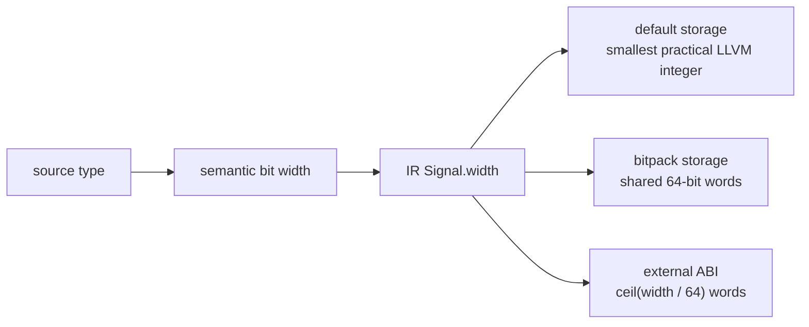

# Signal container sizing

Status: **implemented design record**.

This proposal is complete. The current implementation lives in `src/ir.rs`,
`src/target.rs`, and `src/llvm/emit.rs`; active follow-ups are tracked under
the IR and LLVM headings in [`TODO.md`](../../TODO.md).

## Implemented layout

Logical width belongs to each signal/type, never to the whole design:

- Default LLVM state uses width-sized integer fields (`i8`, `i16`, `i32`,
  `i64`, then LLVM `iN` for wider values).
- `bitpack` packs sub-word signals into shared 64-bit words without letting a
  field straddle a word. Wide values are word-aligned and reserve consecutive
  words.
- Event flags use a separate one-bit-per-signal bitset under `bitpack`; their
  storage is independent of value width.
- The external ABI exchanges low-word-first 64-bit chunks. No global maximum
  word count exists.
- Enums use enough bits for their actual discriminants, including explicit
  non-dense values.
- Structs and hardware arrays flatten into leaf signals, so each leaf receives
  its own minimal representation.

## Exactness rule

Storage is unobservable. Packing may not change a value, delta ordering,
event detection, initialization, or waveform output. Default and `bitpack`
builds run the same semantic tests, including arbitrary-width and X/Z cases.

## Remaining related work

- Persist complete recursive source layouts in IR metadata instead of
  reconstructing some named/repeated shapes.
- Use those layouts if non-flattened aggregate IR values are introduced.
- Add repeatable memory/runtime benchmarks for default and packed state.
