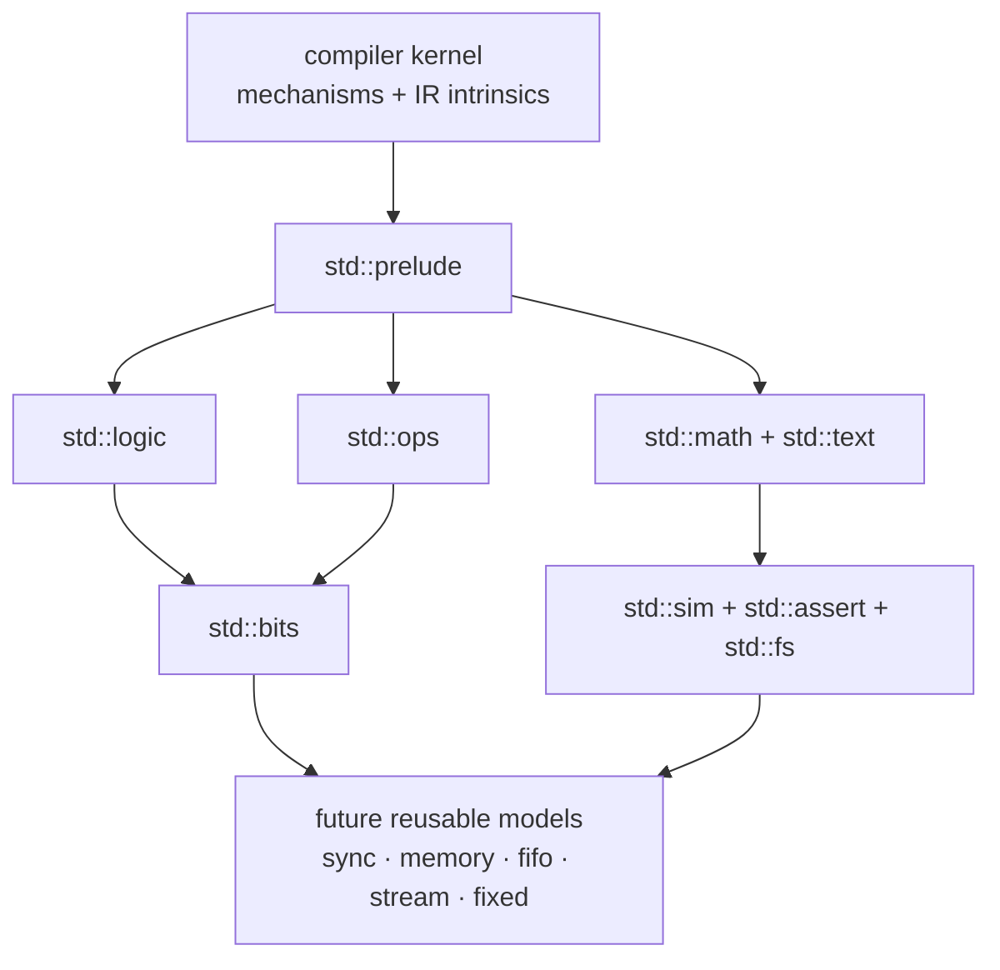

# Standard-library build-out

Status: **active proposal**. Existing exports are documented in
[`std.md`](../std.md); open work is tracked under `std` in
[`TODO.md`](../../TODO.md).

## Boundary

The compiler owns mechanisms and representation:

- parsing, types, traits, operator dispatch, attributes, elaboration;
- digital IR, event semantics, native ABI, and runtime intrinsics.

The standard library owns domain meaning:

- visible scalar/vector types and traits;
- operator and resolution implementations;
- conversions, math, text, time, assertions, and reusable hardware models.

Core type/operator modules must remain pure and suitable for later synthesis.
Simulation services may call runtime intrinsics. Reusable models may depend on
both but should state whether they are intended for hardware or testbenches.

## Existing modules

- `std::prelude` — auto-loaded core surface.
- `std::ops` — `Operator`, Boolean/order contracts, literal hooks, `New`, and
  related traits.
- `std::logic` — `Bit`, nine-value `Logic`/`ULogic`, `Bool`, clock helpers,
  truth tables, and resolution.
- `std::bits` — `unsigned`/`signed`, numeric operators, comparisons,
  conversions, and resizing.
- `std::attrs` — compiler/tool metadata declarations.
- `std::sim` — time/frequency units and simulation helpers.
- `std::assert` — severity and assertion-facing types.
- `std::math` — real/complex math surfaces backed by native functions.
- `std::text` — `Char` arrays/string-facing helpers.
- `std::fs` — fixture reads and existence checks.

## Build order

1. **Synchronizers and reset helpers**
   - two-flop synchronizer;
   - reset synchronizer;
   - edge/pulse helpers with explicit clock domains.
2. **Memories**
   - synchronous single/dual-port RAM shapes;
   - initialization from arrays/files;
   - collision behavior documented and tested.
3. **Streams and FIFOs**
   - canonical ready/valid backing structs and views;
   - skid buffer, pipeline register, width adapter;
   - synchronous FIFO first, asynchronous FIFO after CDC coverage.
4. **Numeric families**
   - fixed-point `ufixed`/`sfixed`;
   - saturation/rounding policies as explicit types or template parameters;
   - conversions to/from integer and real.
5. **Verification helpers**
   - deterministic random generation;
   - scoreboards and monitors only after the external scheduler/API boundary is
     stable.

Every new public declaration needs:

- source-level documentation in `std.md`;
- focused compiler/unit coverage where it exercises a language mechanism;
- at least one runnable program in `siox-tests`;
- no compiler special case based only on the library type’s spelling.

## Deliberate exclusions

- Vendor primitives and generated IP belong to project/vendor packages.
- VHDL/Verilog package loading belongs to the future project/API layer.
- A UVM-sized verification framework waits for cocotb integration rather than
  growing inside the compiler repository.
