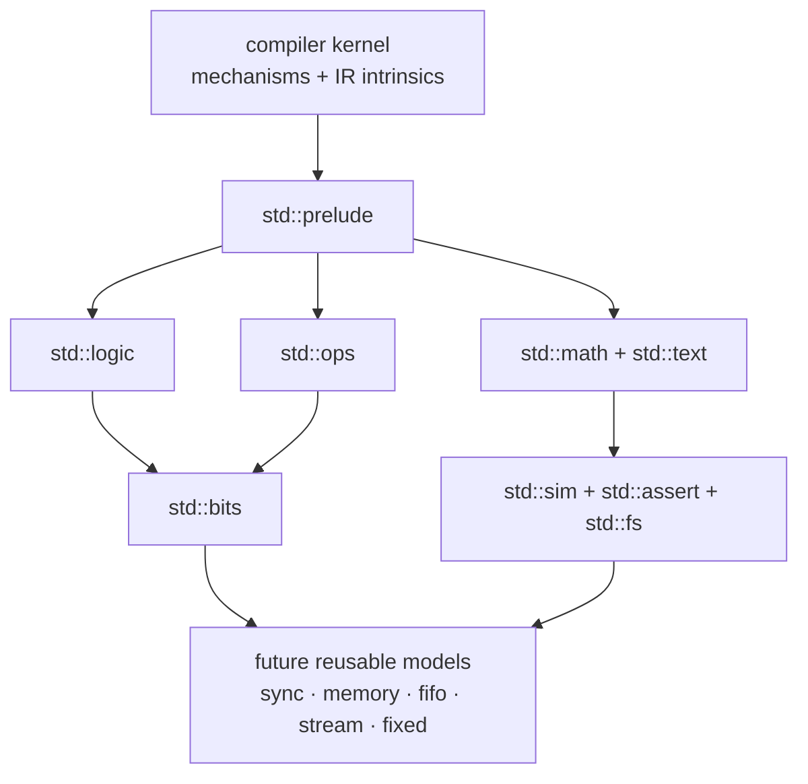

# Standard-library build-out

Status: **active proposal**. Existing exports are documented in
[`std.md`](../std.md); open work is tracked under `std` in
[`TODO.md`](../../TODO.md).

## What std is

std is the mandatory, vendor-independent base every design can rely on:
data types (logic values, numeric vectors, fixed point, complex numbers,
vectors and matrices), the conversions between them, time, text, the base
metadata, and small helpers that exist in every technology (the `std::sync`
synchronizers). It is not a component library: memories, FIFOs, stream
adapters, bus protocols and verification frameworks are IP, and belong to
vendor packages or third-party libraries, where each can follow its target.

## Boundary

The compiler owns mechanisms and representation:

- parsing, types, traits, operator dispatch, attributes, elaboration;
- digital IR, event semantics, native ABI, and runtime intrinsics.

The standard library owns domain meaning:

- visible scalar/vector types and traits;
- operator and resolution implementations;
- conversions, math, text, time, assertions, and reusable hardware models.

```mermaid
flowchart TD
    K["compiler kernel<br/>mechanisms + IR intrinsics"]
    P["std::prelude"]
    OPS["std::ops"]
    LOGIC["std::logic"]
    BITS["std::bits"]
    CORE["std::math + std::text"]
    SIM["std::sim + std::assert + std::fs"]
    MODEL["future reusable models<br/>sync · memory · fifo · stream · fixed"]

    K --> P
    P --> OPS
    P --> LOGIC
    LOGIC --> BITS
    OPS --> BITS
    P --> CORE
    CORE --> SIM
    BITS --> MODEL
    SIM --> MODEL
```

Core type/operator modules must remain pure and suitable for later synthesis.
Simulation services may call runtime intrinsics. Reusable models may depend on
both but should state whether they are intended for hardware or testbenches.

## Existing modules

`core` (compiled into `sioxc`, proposals/core-std.md) holds what the compiler
gives meaning to: `Bool`, the hook traits, `Range`, `Ordering`, `string`, the
directives, `Severity` and the built-in macros. std re-exports each.

- `std::prelude` — auto-loaded surface: `Bit`, `Logic`, `unsigned`, `signed`,
  `time`, `frequency`, and the `core` names again.
- `std::ops` — `Bit`'s operators and condition; re-exports the `core::ops` hooks.
- `std::logic` — `Bit`, nine-value `Logic`/`ULogic`, clock helpers, truth
  tables, and resolution.
- `std::bits` — `unsigned`/`signed`, numeric operators, comparisons,
  conversions, and resizing.
- `std::attrs` — tool metadata; re-exports the `core::attrs` directives.
- `std::sim` — time/frequency units and simulation helpers.
- `std::assert` — re-exports `Severity`.
- `std::math` — real/complex math surfaces backed by native functions.
- `std::text` — encoding tables over `Char`.
- `std::fs` — fixture reads and existence checks.

## Build order

1. **Synchronizers and reset helpers** — `std::sync`, implemented:

   | entity | ports | behaviour |
   | --- | --- | --- |
   | `Sync2` | `clk`, `d` in; `q` out | two-flop synchronizer for a level crossing into `clk`'s domain |
   | `ResetSync` | `clk`, `rst_in` in; `rst_out` out | active-high reset: asserts at once (asynchronously), releases two `clk` edges after `rst_in` falls |
   | `EdgeDetect` | `clk`, `d` in; `rise`, `fall` out | one-cycle pulses when `d` (already in `clk`'s domain) changes |
   | `PulseSync` | `src_clk`, `pulse_in`, `dst_clk` in; `pulse_out` out | carries single-cycle pulses between domains: a toggle in the source, `Sync2`, and an edge detector in the destination |

   All are `Bit`-typed, as internal signals and clocks are. The flops of a
   synchronizer are bound `keep`, so a synthesis flow leaves them alone.
   Multi-bit values do not cross with `Sync2`; they need a handshake or a
   Gray-coded FIFO, which belong to libraries.

   `std::attrs` holds only base metadata (`keep`, `top`, `clock`, `library`,
   `name`); vendor settings belong in vendor packages.
2. **Fixed-point numbers** — `ufixed`/`sfixed` with explicit integer and
   fraction widths, saturation and rounding as explicit choices, and
   conversions to and from integer and real.
3. **Linear algebra** — `Vector<T, N>` and `Matrix<T, R, C>` over any `T`
   with the needed operators: element-wise operations, dot and matrix
   products, transpose.

Every new public declaration needs:

- source-level documentation in `std.md`;
- focused compiler/unit coverage where it exercises a language mechanism;
- at least one runnable program in `siox-tests`;
- no compiler special case based only on the library type’s spelling.

## Deliberate exclusions

- Vendor primitives and generated IP belong to project/vendor packages.
- Memories, FIFOs, stream adapters and bus protocols are IP, not std: their
  best shape depends on the target, so they belong to vendor packages or
  third-party libraries.
- Verification components (scoreboards, monitors) belong to libraries too.
- VHDL/Verilog package loading belongs to the future project/API layer.
- A UVM-sized verification framework waits for cocotb integration rather than
  growing inside the compiler repository.
