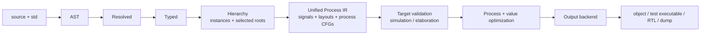

# Unified process pipeline

Status: **accepted direction; migration not yet complete**. The current
generated-C test harness remains the compatibility backend until direct LLVM
lowering has feature parity.

## Decision

`process [name] { ... }` is the language's scheduling and sequential-execution
boundary. Processes run concurrently; statements within one process run in
source order. Functions and methods are sequential subroutines called from a
process, but do not create an independently scheduled context.

That gives the compiler one representation for executable behavior:

- an explicit source process becomes one process;
- a bare continuous assignment becomes an implicit reactive process;
- a conditional concurrent statement becomes an implicit reactive process;
- a clock is an ordinary process that reads a signal and schedules its next
  value with `after`;
- a test stimulus is an ordinary suspending process containing `await`,
  assertions, file operations, and foreign calls.

Hardware and testbench code therefore must not enter separate semantic
pipelines. They differ only in the operations they contain and which output
target accepts those operations.

## Target pipeline

This is one semantic track. A request may stop early to return an AST, tree, or
IR dump, and the final output backend naturally depends on the requested
artifact, but no source construct is re-lowered through a separate testbench
path.

`#[test]` does not introduce an IR branch. The canonical std attribute only
adds a qualified root and descriptor to the elaborated design. `sioxc --test`
lowers that same design and its processes, then links the native test runtime.

## Attribute and tool boundary

`test` and `top` have different owners:

- `test` is the canonical standard-library attribute. `sioxc` resolves it by
  declaration identity and registers every enabled `#[test] entity` in the
  executable's test descriptor table. `#[test]` means `#[test = true]`, while
  `#[test = false]` is not registered. A user attribute with the same leaf name
  is ordinary metadata.
- `top` is not a std or compiler attribute. Vendor, RTL, project, and Cocotb
  integrations may declare and interpret it. `sioxc` preserves the metadata
  but does not use its spelling for test discovery or ordinary root selection.

The existing resolved `TestPlan` remains useful during migration, but only as
selection metadata: qualified test identity, entity `DefId`, hierarchy root,
and source span. It must not own a copied behavior tree, layouts, or a separate
executable program. Once those fields live directly on the elaborated design,
`TestPlan` may become a lightweight view rather than a retained phase product.

## Unified Process IR

The unified IR should be owned by `ir::Design` and contain:

- concrete signals, ports, initial state, enum/Logic encodings, and recursive
  source layouts;
- elaborated instance and root identity;
- test descriptors for roots selected by the canonical `test` attribute;
- one process record per explicit or implicit process;
- process-local values and storage;
- basic blocks with source spans;
- explicit scheduler and runtime operations.

A process record needs a stable ID, optional instance-qualified label, owning
instance, entry block, blocks, local layouts, and its source span. Reactive,
event-controlled, clock, and suspending behavior are derived properties of the
process CFG, not different compiler pipelines.

Minimum operations include:

- signal reads: current value, old value, and event state;
- signal writes with end-of-step/next-state semantics;
- delayed signal writes (`after`);
- local allocation, load, store, field/index projection, and checked indexing;
- arithmetic, comparisons, conversions, aggregate construction, and calls;
- assertions, warnings, printing, file services, random services, and
  `extern "C"` calls;
- branches, loops, return, stop, and finish;
- suspension on time, event, or condition for every `await` form.

The existing normalized `Driver` and `EventBlock` forms remain valuable as
analysis or optimized lowering products. They must be derived from Process IR,
not form a second input path. A backend may specialize a proven reactive
process into a combinational driver or an event block without losing the
process ID, label, source order, or source spans.

## Execution semantics

Every elaborated entity instance contributes its processes to one scheduler:

1. Processes made runnable at time zero execute until completion or suspension.
2. Reads observe the current process step; local writes take effect
   immediately, while signal writes are staged according to signal assignment
   semantics.
3. End-of-step signal writes are resolved across process driver contexts and
   committed together.
4. Changed signals wake inferred reactive/event-sensitive processes and begin
   another delta cycle.
5. If the design is quiescent, the time wheel advances to the earliest delayed
   write or time-based suspension.
6. A resumed process continues at its saved CFG block and local state.

This covers combinational hardware, registered hardware, derived clocks, and
test stimulus without switching execution models. Driver resolution remains
between processes; source-order override remains within one process.

## Target validation

One IR does not mean every operation is legal for every output:

- **Simulation** accepts suspending test processes, assertions, runtime file
  I/O, random services, and `extern "C"` simulation models.
- **RTL elaboration/synthesis** accepts the synthesizable subset after constant
  folding and model selection. It rejects any reachable suspension, runtime
  file operation, foreign simulation call, dynamic allocation, or other
  simulation-only operation that remains.

The future compile-time `std::target: std::Target` value (`simulation` or
`elaboration`) is folded before reachability and target validation. It selects
code within the same pipeline; it does not select another frontend or IR.

## Runtime and backend boundary

A small linked runtime should own services rather than compiler
transformations:

- the process ready queue, delta cycles, and time wheel;
- test filtering, result accounting, and stable output;
- assertion/warning and source-location reporting;
- file buffers, UTF-8 decoding, and deterministic random state;
- VCD/FST writers and waveform lifetime;
- the first-failure record for bounds, constrained values, I/O, and assertions.

The compiler lowers every process CFG through Inkwell into the same LLVM
module as signal storage and generated Siox functions. Suspension points become
explicit process states/resume blocks. The test descriptor table refers to
ordinary generated process entry points. Linking the runtime and choosing an
executable entry symbol are packaging steps after code generation, not another
language-lowering path.

## Migration plan

1. **Complete: freeze discovery and process boundaries.** Canonical std test
   identity, Boolean enablement, exact test-root elaboration, structural default
   roots, vendor-metadata isolation, explicit `process [name]`, driver-context
   ownership, and instance-qualified labels are implemented.
2. **Complete as a temporary scaffold:** the existing `test_ir::Program`
   validates descriptors, layouts, locals, assignments, runtime operations,
   `await`, and spans. It proves the information needed for direct lowering,
   but is no longer the target architecture.
3. **Define the unified process CFG.** Move reusable value/layout/control nodes
   from `test_ir` under the main IR. Specify signal versus local assignment,
   suspension terminators, process activation, source spans, and validation.
4. **Lower every source process once.** Explicit processes and implicit
   continuous processes enter the same CFG lowering. Derive current
   `Driver`/`EventBlock` optimizations from that representation and verify
   identical delta-cycle behavior.
5. **Make the compatibility harness consume Process IR.** Remove its direct AST
   statement/expression translation first. This creates one semantic lowering
   even while generated C remains available for differential testing.
6. **Add direct LLVM process lowering and the linked runtime.** Start with
   straight-line reactive/event processes, then branches/loops, suspension and
   delayed writes, aggregates and checked indices, strings/file I/O, formatting,
   foreign calls, clocks, wide values, and waveforms.
7. **Run both native backends differentially.** Require identical test results,
   diagnostics, time progression, resolved values, and VCD/FST samples across
   the full default and bit-packed corpus.
8. **Remove the compatibility path.** Delete the generated-C translator and
   standalone `test_ir::Program`; keep one `Design`/Process IR to LLVM path.
   Clang may remain a native linker driver, but is no longer a source-language
   translator.
9. **Add later output consumers after the common validation boundary.** RTL and
   vendor artifacts consume the same elaborated Process IR after synthesis
   validation and target-specific normalization.

Each migration slice must leave the current compiler usable. Correctness fixes
to the compatibility backend receive a regression that the unified path must
inherit; new language semantics are implemented in Process IR rather than
copied into both backends.

## Acceptance criteria

The pipeline is unified only when:

- every explicit and implicit source process has one canonical IR process ID;
- hardware and testbench expressions, locals, control flow, conversions,
  bounds checks, and calls are lowered once;
- the scheduler runs multiple independently suspending processes and clocks;
- signal resolution and source-order override retain current semantics;
- the full default and bit-packed corpus pass through Process IR;
- file I/O, UTF-8 strings, arbitrary-width values, foreign calls, assertions,
  filtering, multiple clocks, and VCD/FST have focused coverage;
- hardware and testbench failures share messages and source spans;
- `test` only contributes descriptors and same-named custom attributes remain
  inert;
- vendor attributes remain preserved without changing compiler semantics;
- frontend-only builds remain LLVM/runtime independent;
- `sioxc --test` builds but never runs the executable;
- no generated C is required for any supported native output.

## Non-goals

- Making `sioxc` a project manager or test runner.
- Treating simulation-only operations as synthesizable.
- Giving `top` compiler semantics.
- Removing user `extern "C"` support.
- Replacing LLVM.
- Designing DAP transport; stable process IDs, spans, and LLVM debug locations
  are prerequisites, while debugger protocol support remains a separate tool.
