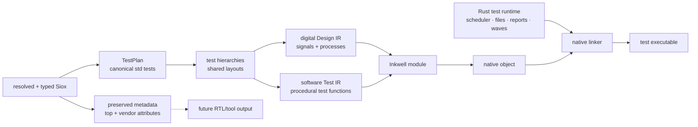

# Native testbenches without generated C

Status: **proposal**. The current generated-C harness remains the supported
backend until this replacement reaches feature parity.

## Motivation

Siox currently has two native lowering paths:

```text
entity behavior  -> digital IR -> Inkwell/LLVM -> object
#[test] behavior -> generated C -> Clang       -> object
```

The split was useful for bringing up executable testbenches quickly, but it now
duplicates expression semantics, aggregate layout, bounds checks, conversions,
foreign calls, and diagnostics. Adding a language rule requires auditing both
the LLVM emitter and a growing Rust-to-C string generator. The C source is also
an implementation artifact that users did not write and that Siox must debug.

Rustc does not translate tests to C. It synthesizes a test harness in its own
compiler representation, lowers that through the normal backend, and links a
runtime library. Siox should use the same boundary while retaining the
different execution models of hardware and procedural test code.

## Attribute and tool boundary

Freeze discovery semantics before introducing another backend. `test` and
`top` serve different owners and must not share root-selection machinery:

- `test` is the canonical standard-library attribute. `sioxc` resolves that
  declaration by identity, registers each enabled `#[test] entity` in the
  native test map, and compiles the map into one filterable executable.
  A same-named user attribute is ordinary metadata and must not register a
  test. `#[test]` is shorthand for `#[test = true]`; `#[test = false]` is not
  registered.
- `top` is neither a standard-library declaration nor a compiler hook. It is
  ordinary declared metadata that the compiler preserves for an RTL exporter,
  Vivado/Quartus project integration, or a Cocotb flow. Those consumers may use
  it to choose a design-under-test or implementation root. `sioxc` itself must
  not discover native tests, choose elaboration roots, or change entity
  semantics from the textual name `top`.

The frontend therefore provides one resolved `TestPlan` containing each test's
qualified identity, entity `DefId`, bound hierarchy root, and source span. Test
bodies and layouts remain in the ordinary module, hierarchy, and `Design`
products and are reached through those stable IDs rather than copied into the
plan. The compatibility C backend consumes this plan now; software IR lowering
will consume the same product. Discovery is not reimplemented inside either
emitter. Other declared attributes, including `top`, remain attached to their
declarations for future output backends without entering `TestPlan`.

Canonical test identity/value handling, module-qualified attribute ownership,
exact test-root elaboration, and compatibility-harness consumption are now
implemented. `top` has also been removed from std, compiler seeds, attribute
root discovery, and IR semantic exemptions. Ordinary compilation uses
structural roots or an explicit `--top`, while an integration-declared `top`
remains ordinary resolved metadata.

## Proposed pipeline



This is not one undifferentiated IR. Digital design behavior remains normalized
around signals, drivers, event blocks, delta cycles, and synthesizable values.
Testbench behavior needs a small software control-flow IR with locals, mutable
storage, calls, branches, loops, early returns, and runtime-owned arrays. Both
IRs share type/layout metadata and the native value ABI, then contribute
functions and globals to one LLVM module.

## Software test IR

The minimum representation should include:

- typed scalar, aggregate, and runtime-array values;
- local allocation, load, store, field/index projection, and checked indexing;
- basic blocks with branch, conditional branch, return, and loop lowering;
- calls to generated Siox functions, `extern "C"`, and runtime intrinsics;
- source spans on instructions that can fail;
- test descriptors containing the qualified name and entry function;
- explicit scheduler operations for settle, time advance, and `await`.

The IR should reuse `Design::source_layouts` or a shared extracted layout type.
It must not rediscover field order, widths, ranges, or enum encodings from AST
spelling. Checked index and constrained-range operations should use one failure
ABI in both IRs so hardware and testbench reports cannot diverge again.

## Rust runtime boundary

A small Rust crate, compiled as an ordinary static library, should own services
that are not compiler transformations:

- test filtering, result accounting, and stable output;
- assertion/warning formatting and source-location reports;
- file existence and `read<T>` buffers, including UTF-8 decoding;
- deterministic random state;
- VCD/FST writers and test-to-test waveform lifetime;
- scheduler entry points used by `await` and generated clock processes;
- the first-failure record for bounds, constrained values, I/O, and assertions.

The compiler declares a versioned C-compatible ABI for these runtime calls.
`extern "C"` remains user interoperability and does not become the internal
representation of Siox expressions.

## Harness synthesis

For every enabled entity in the resolved `TestPlan`, the compiler emits a
zero-argument test function and a static descriptor. It then synthesizes one
entry function that:

1. parses the name filter and waveform paths;
2. initializes the shared runtime and design state;
3. invokes each selected descriptor;
4. prints results and returns a process status.

This mirrors rustc/libtest structurally. A future Cargo-like Siox tool may run
the executable and choose filters, but `sioxc` remains a compiler that only
builds it.

## Migration plan

1. **Complete:** normalize attribute ownership and test discovery before
   changing codegen. Module-qualified attributes, canonical std test identity
   and Boolean handling, exact test-root elaboration, the shared resolved
   `TestPlan`, compatibility-C consumption, and attribute-free structural root
   selection are implemented. Vendor `top` metadata remains ordinary.
2. Extract and document the existing generated harness/runtime ABI and add
   differential tests for its supported constructs. Include same-name custom
   attributes, disabled tests, qualified duplicate test leaves, and preserved
   vendor `top` metadata so the boundary cannot regress.
3. **In progress:** `test_ir` now has rendering and structural validation, and
   retains test descriptors, concrete local layouts, assignments, assertions,
   runtime calls, `await`, and source spans. The compatibility harness consumes
   its descriptors. Expand deferred `if`/`match`/`for` nodes into CFG blocks
   before direct LLVM lowering.
4. Emit test functions through Inkwell and link the Rust runtime, while keeping
   generated C selectable internally for differential testing.
5. Add aggregates, checked indexing, strings/file I/O, formatting, foreign
   calls, clocks, wide values, and waveform output one capability at a time.
6. Run every corpus test through both backends and require identical pass/fail,
   messages, time progression, and waveform values.
7. Make software IR the only backend, remove Clang-as-harness-compiler and the
   Rust-to-C translator, then update the architecture documents.

The compatibility backend should not receive unrelated refactors during this
migration. Bug fixes needed for current correctness still land there and gain a
differential test that the replacement must inherit.

## Non-goals

- Merging procedural test code into synthesizable digital IR.
- Making `sioxc` execute tests or manage projects.
- Replacing LLVM or the digital scheduler.
- Removing user `extern "C"` support.
- Interpreting vendor/tool attributes such as `top` inside native test
  discovery or software IR lowering.
- Designing DAP/debugger integration; stable spans and LLVM debug locations are
  prerequisites, but debugger transport is separate.

## Acceptance criteria

Generated C can be removed only when:

- the full default and bit-packed corpus pass through software IR;
- native file I/O, UTF-8 strings, arbitrary-width values, extern calls,
  assertions, filtering, multiple clocks, and VCD/FST have focused coverage;
- hardware and testbench bounds/range failures share messages and source spans;
- native discovery recognizes only enabled uses of the canonical std `test`
  declaration, while same-named custom attributes remain inert;
- `top` and other vendor metadata survive through the output boundary without
  affecting sioxc test discovery, elaboration roots, or entity semantics;
- `cargo check --no-default-features --lib` remains LLVM/runtime independent;
- `sioxc --test` still produces an executable without running it;
- no C compiler is needed solely to translate the harness.
