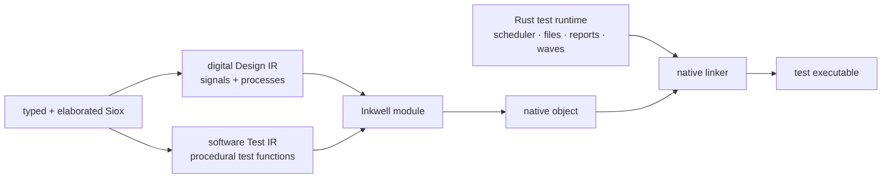

# Native testbenches without generated C

Status: **proposal**. The current generated-C harness remains the supported
backend until this replacement reaches feature parity.

## Motivation

Siox currently has two native lowering paths:

```text
entity behavior  -> digital IR -> Inkwell/LLVM -> object
#[test] behavior -> generated C -> Clang       -> object
```

The split was useful for bringing up executable testbenches quickly, but it now
duplicates expression semantics, aggregate layout, bounds checks, conversions,
foreign calls, and diagnostics. Adding a language rule requires auditing both
the LLVM emitter and a growing Rust-to-C string generator. The C source is also
an implementation artifact that users did not write and that Siox must debug.

Rustc does not translate tests to C. It synthesizes a test harness in its own
compiler representation, lowers that through the normal backend, and links a
runtime library. Siox should use the same boundary while retaining the
different execution models of hardware and procedural test code.

## Proposed pipeline



This is not one undifferentiated IR. Digital design behavior remains normalized
around signals, drivers, event blocks, delta cycles, and synthesizable values.
Testbench behavior needs a small software control-flow IR with locals, mutable
storage, calls, branches, loops, early returns, and runtime-owned arrays. Both
IRs share type/layout metadata and the native value ABI, then contribute
functions and globals to one LLVM module.

## Software test IR

The minimum representation should include:

- typed scalar, aggregate, and runtime-array values;
- local allocation, load, store, field/index projection, and checked indexing;
- basic blocks with branch, conditional branch, return, and loop lowering;
- calls to generated Siox functions, `extern "C"`, and runtime intrinsics;
- source spans on instructions that can fail;
- test descriptors containing the qualified name and entry function;
- explicit scheduler operations for settle, time advance, and `await`.

The IR should reuse `Design::source_layouts` or a shared extracted layout type.
It must not rediscover field order, widths, ranges, or enum encodings from AST
spelling. Checked index and constrained-range operations should use one failure
ABI in both IRs so hardware and testbench reports cannot diverge again.

## Rust runtime boundary

A small Rust crate, compiled as an ordinary static library, should own services
that are not compiler transformations:

- test filtering, result accounting, and stable output;
- assertion/warning formatting and source-location reports;
- file existence and `read<T>` buffers, including UTF-8 decoding;
- deterministic random state;
- VCD/FST writers and test-to-test waveform lifetime;
- scheduler entry points used by `await` and generated clock processes;
- the first-failure record for bounds, constrained values, I/O, and assertions.

The compiler declares a versioned C-compatible ABI for these runtime calls.
`extern "C"` remains user interoperability and does not become the internal
representation of Siox expressions.

## Harness synthesis

For every `#[test] entity`, the compiler emits a zero-argument test function and
a static descriptor. It then synthesizes one entry function that:

1. parses the name filter and waveform paths;
2. initializes the shared runtime and design state;
3. invokes each selected descriptor;
4. prints results and returns a process status.

This mirrors rustc/libtest structurally. A future Cargo-like Siox tool may run
the executable and choose filters, but `sioxc` remains a compiler that only
builds it.

## Migration plan

1. Extract and document the existing generated harness/runtime ABI and add
   differential tests for its supported constructs.
2. Introduce `test_ir` with rendering and validation, initially covering
   scalar locals, assertions, and settle/await.
3. Emit test functions through Inkwell and link the Rust runtime, while keeping
   generated C selectable internally for differential testing.
4. Add aggregates, checked indexing, strings/file I/O, formatting, foreign
   calls, clocks, wide values, and waveform output one capability at a time.
5. Run every corpus test through both backends and require identical pass/fail,
   messages, time progression, and waveform values.
6. Make software IR the only backend, remove Clang-as-harness-compiler and the
   Rust-to-C translator, then update the architecture documents.

The compatibility backend should not receive unrelated refactors during this
migration. Bug fixes needed for current correctness still land there and gain a
differential test that the replacement must inherit.

## Non-goals

- Merging procedural test code into synthesizable digital IR.
- Making `sioxc` execute tests or manage projects.
- Replacing LLVM or the digital scheduler.
- Removing user `extern "C"` support.
- Designing DAP/debugger integration; stable spans and LLVM debug locations are
  prerequisites, but debugger transport is separate.

## Acceptance criteria

Generated C can be removed only when:

- the full default and bit-packed corpus pass through software IR;
- native file I/O, UTF-8 strings, arbitrary-width values, extern calls,
  assertions, filtering, multiple clocks, and VCD/FST have focused coverage;
- hardware and testbench bounds/range failures share messages and source spans;
- `cargo check --no-default-features --lib` remains LLVM/runtime independent;
- `sioxc --test` still produces an executable without running it;
- no C compiler is needed solely to translate the harness.
