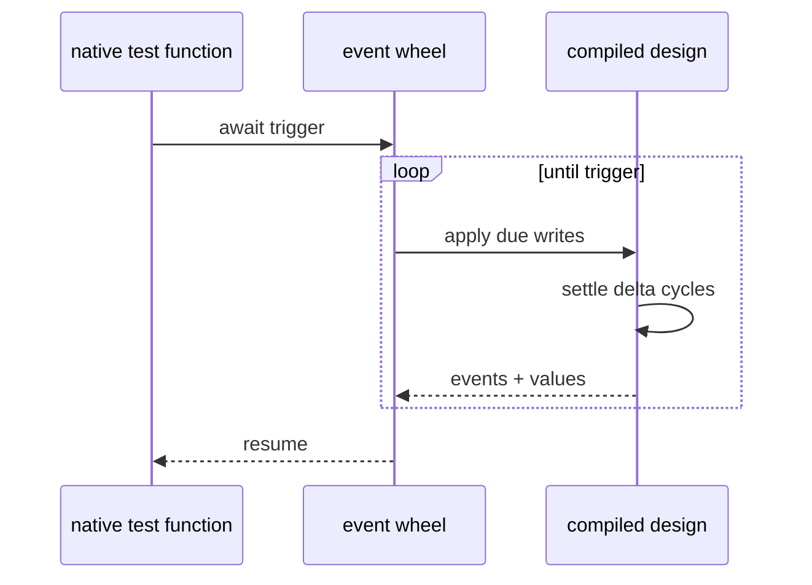
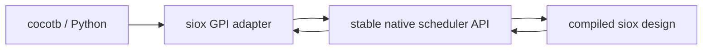

# Timing, `await`, and cocotb

Status: **timing and `await` implemented; external callback API proposed**.

The generated native test executable owns simulation time and stimulus. What
remains is an API that lets an external scheduler such as cocotb own control.

## Implemented timing model

The native harness keeps femtosecond simulation time and an event wheel:

- `clk = not clk after 5ns;` registers a periodic clock.
- `x = value after 2ns;` registers a one-shot write.
- `await 10ns` advances to a time.
- `await clk.rising()` / `.falling()` / `'event` waits for an event.
- `await condition` settles and advances until the condition becomes true.

Testbenches compile to ordinary C control flow, so loops and branches around
`await` use the C stack rather than a generated coroutine state machine.

## Existing native design ABI

The compiled design exposes reset, settle, and low-word-first signal access:

- reset all signals to declared/derived initializers;
- set/read one 64-bit word of a signal;
- settle the design through its required delta cycles.

The generated harness builds typed `_BitInt(N)` values over that word ABI.

## Proposed cocotb/VPI-GPI layer

An external integration should be a separate runtime/API layer, not syntax and
not part of `sioxc`. It needs:

1. **Discovery**
   - enumerate hierarchy and signals;
   - resolve a hierarchical name to an opaque handle;
   - query kind, width, direction, range, and enum symbols.
2. **Values**
   - get/put low-word-first values;
   - preserve Logic metavalue discriminants;
   - force and release a signal independently of ordinary drivers.
3. **Time and callbacks**
   - timer callbacks;
   - value-change callbacks;
   - rising/falling-edge callbacks;
   - read-write and read-only phase callbacks;
   - cancellation and deterministic callback ordering.
4. **Lifecycle**
   - initialize/reset;
   - run to the next scheduled callback;
   - stop/finalize with diagnostics.

The adapter may implement cocotb’s GPI directly or expose a C ABI consumed by
a thin bridge. Either way, handles and callbacks must not expose LLVM pointers
or compiler-internal IDs as stable public contracts.

## Ownership boundary

- The language defines events and `await`.
- IR defines deterministic delta semantics.
- LLVM implements native signal state and settle.
- Output generates standalone tests.
- The API layer exposes scheduling and values to cocotb.
- A future project tool chooses when to build and launch that integration.
