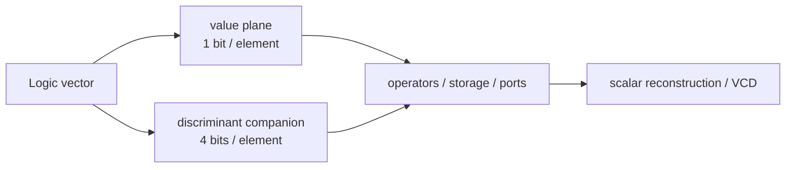

# X/Z propagation through vectors

Status: **implemented design record**.

Scalar and vector logic follow IEEE 1076-2019 `std_logic_1164` and
`numeric_std`. The implementation is in `std/logic.siox`, `std/bits.siox`,
`src/ir.rs`, and the LLVM/native output paths.

## Semantic model

`Logic` is the nine-value `std_ulogic` domain:

`'U', 'X', '0', '1', 'Z', 'W', 'L', 'H', '-'`

An array-derived Logic family such as `unsigned[N]` carries:

- The value plane keeps ordinary numeric operations efficient.
- A companion signal stores each element’s full Logic discriminant. It is
  created only where metavalues occur.
- Companions and their initializers are arbitrary-width low-word-first values;
  they do not stop at 16 elements or one ABI word.
- Indexing one element reconstructs the full scalar `Logic`.
- Copies, ports, muxes, driver literals, and initialized literals propagate
  both planes.

## Operator behavior

- Logical operators use the `std_logic_1164` truth tables per element, including
  forcing cases such as `0 and X = 0` and `1 or X = 1`.
- Numeric arithmetic with any metavalue produces an all-`X` result.
- Numeric relational operations with a metavalue operand produce false.
- Parallel drivers use the library resolution table.
- VCD renders binary elements as `0`/`1`, high impedance as `z`, and
  unknown-like metavalues as `x`.

## Coverage

The scalar tables are checked exhaustively against `nvc`. The corpus covers
storage, arithmetic poisoning, relational and logical behavior, connections,
driver-position literals, wide initialization, and metavalues crossing ABI
word boundaries.
