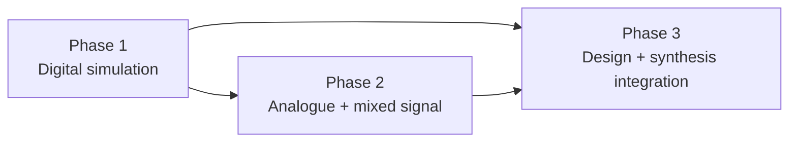

# siox roadmap

This is the long-range product roadmap. Accepted syntax and semantics live in
[`language.md`](language.md); concrete open compiler work lives in
[`TODO.md`](../TODO.md).

The organizing rule is:

> Digital and analogue define components. Design connects and realizes them.

## Phase 1 — digital simulation

Goal: a strict digital HDL that compiles to deterministic native simulation.

Implemented foundation:

- entities, structs, enums, traits, applied views, implementations, and custom
  operators;
- typed ports and generics, elaborated hierarchy, instances, arrays, and
  generate-time control;
- combinational drivers and event-driven state with `event`, `old`, clock
  helpers, delta cycles, and simulation time;
- nine-value IEEE 1076-2019 Logic, resolution, vector metavalues, and
  arbitrary-width numeric values;
- standard-library source, native `#[test]` executables, assertions, timing,
  fixture reads, diagnostics, generated VCD/FST output, LSP support, and CI
  corpus.

The first valid Phase-1 baseline is implemented. Further work is organized by
AST/IR/LLVM/Output/API/std in [`TODO.md`](../TODO.md). Major product growth
includes a stable scheduler API, cocotb integration, multi-file project
tooling, and broader reusable std models; those are not blockers for the
baseline compiler and simulator.

## Phase 2 — analogue and mixed signal

Goal: add continuous quantities without weakening the digital model.

Planned concepts:

- analogue domains and quantities;
- `across`/`through` relationships;
- derivatives/integrals such as `::ddt`;
- equation systems and solver selection;
- digital/analogue bridges with explicit conversion and event rules;
- tolerances, convergence diagnostics, and mixed-signal time coordination.

Phase 2 must use its own IR and solver boundary. Digital IR remains exact and
event-driven; analogue syntax must not be silently accepted by the Phase-1
compiler.

Acceptance direction:

- solve small linear and nonlinear networks;
- co-simulate a digital controller with an analogue plant;
- deterministic bridge/event ordering;
- solver failures point to source equations and domains.

## Phase 3 — design, foreign HDL, and synthesis

Goal: turn component models into tool-consumable designs.

Planned concepts:

- project/package graph and reusable libraries;
- language-neutral `use <library>` discovery;
- VHDL/Verilog/vendor-library metadata and linking;
- schematic/netlist composition and graphical tooling;
- constraints, clocks, pins, placement/layout attributes;
- vendor-neutral synthesis-facing output plus adapters for Vivado, Quartus,
  and other tools;
- optional internal foreign-HDL compilation only if existing compiled formats
  cannot supply the required semantic model.

The language should name libraries and entities without encoding whether their
implementation came from siox, VHDL, Verilog, or a vendor database. That choice
belongs to the project/backend API.

Acceptance direction:

- elaborate a design containing siox and foreign components;
- emit a stable vendor-neutral artifact;
- preserve hierarchy, names, widths, directions, clocks, and constraints;
- hand the artifact to at least two synthesis ecosystems;
- round-trip enough metadata for diagnostics and waveform/debug correlation.

## Non-goals

- `sioxc` will not become the package manager or test runner; it remains one
  compiler invocation, like `rustc`.
- Phase-1 digital semantics will not depend on an analogue solver.
- Vendor-specific primitives will not become compiler keywords.
- Foreign HDL syntax will not be embedded into ordinary siox source.
