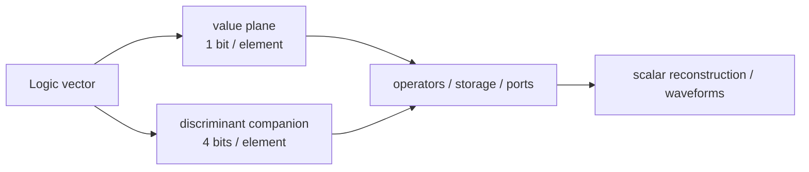

# Simulation

How siox runs a design: the delta-cycle model, native execution, simulation
time, and waveform output. For the language semantics these implement see
[language.md](language.md); for the compiler pipeline that produces the IR a
simulation consumes, [architecture.md](architecture.md).

## The model: delta-cycle, event-driven

A source `process name { ... }` is one concurrent driver context; its body is
ordered, and its optional name is retained for IR/runtime diagnostics. Bare
continuous assignments outside a process each form a concurrent context. The
normalized design then lowers (in `ir`) to two scheduler forms, kept strictly
apart:

- **Combinational `Driver`s** — a continuous assignment (`count = value;`), a
  wire that always equals its expression.
- **Sequential `EventBlock`s** — an event-controlled statement inside a
  process (`process update { if clk.rising() { … } }`), updated only on the
  trigger, with next-state semantics.

A **settle** evaluates one delta cycle over the signal state (`cur`, `old`, and
per-signal `event` flags):

1. Evaluate combinational drivers to a **fixpoint** (re-run until nothing
   changes; a non-converging loop is caught and warned, not hung).
2. Snapshot the settled values and mark `event[i]` where `cur != old`.
3. Fire event blocks—each computes its next state from the **pre-commit**
   values (so `x'old` and same-cycle reads see the value before the edge).
4. Commit next-state writes, advance `old` to the snapshot, and start another
   delta if the commit or a derived connection changed anything.

This is exact simulation: the value, the delta-cycle order, and every observed
event are the semantic contract. Nothing about *how* a value is stored may
change what is observed.

## Native execution

The `ir` layer emits the simulation model and the **LLVM backend** (`siox::llvm`)
compiles it ahead of time to native machine code. `sioxc <file>` emits the
sole structural root as an object; `--top` selects one when several independent
roots exist. `sioxc --test` generates a native testbench
harness and links it with that object. The compiler stops after producing the
executable; running and filtering it are separate operations.

Signal values cross the harness ABI in low-word-first 64-bit words, so values
such as `unsigned[128]` retain their per-type width. LLVM is the permanent
backend, so building `sioxc` needs LLVM 22. Emitting a native test executable
also needs Clang and zlib to compile its generated harness and embedded FST
writer.

## Simulation time and the event wheel

The runtime has real **simulation time** (`time_fs`, femtoseconds internally;
`ns`/`ps`/… on the surface), not just delta cycles. An **event wheel** holds the
earliest pending event and advances to it:

- **Background clocks.** `clk = not clk after 5ns;` registers a free-running
  clock with a `5ns` half-period — the canonical clock generator. Every clock
  process starts at time zero independently of source declaration order, and
  multiple clocks interleave on the one wheel with real timestamps.
- **Delayed assignments.** The native Phase 1 harness currently accepts the
  canonical self-toggle above. Other `x = v after d;` forms receive a build
  error until one-shot writes are represented on the event wheel.
- **`await`** is the single timing primitive in a testbench, in three forms:

  ```siox
  await 10ns;          // advance simulation time
  await clk.rising();  // wait for an edge   (also .falling(), 'event)
  await count == 7;    // wait until a condition holds
  ```

  Each yields to the scheduler until its trigger fires, and may appear inside
  `for`/`if`. (`wait`/`tick` were removed — both now error and point at
  `await`.) During the compatibility migration the wheel lives in the runner
  and, identically, in the emitted C of the native binary. `Design::process_ir`
  now represents `await` as a suspend terminator with an explicit resume block;
  direct process lowering will move the wheel behind one linked runtime. A
  future external-simulator adapter may own time through the same scheduler ABI.

Native time is an unsigned 64-bit femtosecond count. A literal whose unit
conversion cannot fit that timeline is a build error. Runtime additions
saturate at `18446744073709551615fs` instead of wrapping to time zero; the
event-wheel sentinel and multi-test waveform timestamps use the same rule.

## X/Z propagation through vectors

Scalar and vector logic follow IEEE 1076-2019 `std_logic_1164` and
`numeric_std`; the tables live in `std/logic.siox` and `std/bits.siox`, not in
the compiler. `Logic` is the nine-value `std_ulogic` domain (`'U'`, `'X'`,
`'0'`, `'1'`, `'Z'`, `'W'`, `'L'`, `'H'`, `'-'`).

An array-derived Logic family such as `unsigned[N]` is carried in two planes:



The value plane keeps ordinary numeric work efficient; a companion signal
stores each element's full discriminant and is created **only where metavalues
occur**, so a design that never uses them pays nothing. Companions are
arbitrary-width low-word-first values, so they do not stop at one ABI word.
Indexing an element reconstructs the full scalar `Logic`, and copies, ports,
muxes and driver literals propagate both planes. Every write to a value that
has a companion produces a source-ordered companion write as well; a clean
override writes zero to that plane instead of leaving an earlier metavalue
behind. Temporal reads also stay paired (`v'old` reads `v$meta'old`), including
clocked next-state updates.

The meaning of those planes comes from `std::logic::LogicEncoding`, not enum
positions. At elaboration, `to_bool` supplies each variant's numeric bit,
`is_binary` identifies the two values that need no companion entry,
`is_high_impedance` supplies waveform rendering, and VHDL-style `to_x01`
classifies definite versus unknown numeric inputs. The resulting maps live in
`Design::logic_encodings`. `ULogic` consequently follows VHDL declaration
order (`U, X, 0, 1, Z, W, L, H, -`) while retaining an explicitly declared,
stable packed ABI; reordering declarations cannot alter simulation.

Operator behaviour follows the library: logical operators use the
`std_logic_1164` truth tables per element (including forcing cases such as
`0 and X = 0`), arithmetic with any metavalue produces an all-`X` result,
relational comparisons against a metavalue are false, and parallel drivers fold
through the resolution table. VCD and FST render binary elements as `0`/`1`,
high impedance as `z`, and unknown-like metavalues as `x`, from the same
scheduler samples.

The per-element logical tables are also elaborated from the ordinary std
`Operator` bodies and retained in `Design`, so neither IR nor a simulator
backend carries a second Rust/C copy of the library truth tables.

The scalar tables are checked exhaustively against `nvc`, and the corpus covers
storage, arithmetic poisoning, relational and logical behaviour, connections,
driver-position literals, clean combinational and clocked overrides, computed
slices, wide initialization, and metavalues crossing ABI word boundaries.

## Waveforms

Waveform output supports text
[VCD](https://en.wikipedia.org/wiki/Value_change_dump) (Value Change Dump) and
compressed FST. The generated native test executable owns the files: while
running its scheduler it writes hierarchy declarations and timestamped value
changes directly. `sioxc` does not receive samples back, and the compiler
library does not retain a trace or waveform writer.

```bash
sioxc --test counter_test.siox -o counter-tests
./counter-tests -o counter.fst
./counter-tests -o counter.vcd
./counter-tests -o counter.vcd -o counter.fst
```

The path's extension selects the format: `.vcd` (any case) writes portable
text and anything else writes compressed FST, so FST is the default without
naming it. `--output=<path>` and `-o<path>` are equivalent spellings. A
test-name filter
may appear before or after either option. VCD and FST can be emitted together
to different paths and receive the exact same scheduler-side change points.
When several tests run, their traces are placed consecutively on one monotonic
timeline. siox does not ship a viewer; the resulting file is opened in an
external waveform application.

**How siox values appear:**

- **Buses** (`unsigned[8]`, `signed[16]`) are binary vectors.
- **Nine-value `Logic`** retains the IEEE discriminant internally. Waveforms map
  high-impedance states to `z`, unknown-like metavalues to `x`, and ordinary
  binary elements to `0`/`1`; `Bit` remains two-value.
- **Named enums** — an FSM `State`, `Bool` — dump as string variables, so
  the viewer shows `Idle`/`Run`/`Done`/`true`/`false` instead of a raw
  discriminant (the de-facto VCD string extension Surfer and GTKWave both read).
- **Struct and array signals** flatten to one trace per leaf (`p.valid`,
  `regs[2]`).

**Viewing:** [Surfer](https://surfer-project.org/) is a modern native/browser
viewer; [GTKWave](https://gtkwave.sourceforge.net/) is the long-standing
workhorse and provides the reference FST implementation.

**Notes:** the timescale is `1fs`, so a `10ns` period shows as `#10000000`
between edges; only signals that actually change are re-emitted, keeping traces
compact. FST is written through the pinned MIT-licensed libfst sources embedded
in `sioxc`; the resulting test executable needs ordinary zlib but does not need
GTKWave, `vcd2fst`, or a separately installed libfst.
